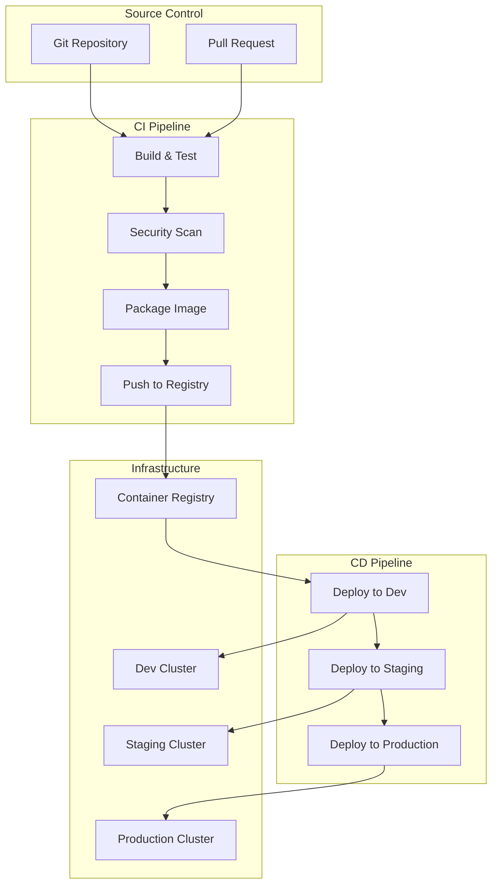

# CI/CD Pipelines for Containers

This guide covers implementing comprehensive CI/CD pipelines specifically designed for containerized applications, including Docker image building, security scanning, multi-environment deployments, and GitOps workflows.

## Container CI/CD Architecture

### Modern CI/CD Pipeline Overview



### CI/CD Best Practices for Containers

1. **Build Once, Deploy Everywhere**: Build container images once and promote through environments
2. **Immutable Infrastructure**: Never modify running containers, deploy new versions
3. **Environment Parity**: Use identical images across all environments
4. **Configuration Management**: Externalize configuration from images
5. **Security Integration**: Scan images at every stage
6. **GitOps Approach**: Use Git as source of truth for deployments

## GitHub Actions Container Pipeline

### Complete CI/CD Workflow

```yaml
# .github/workflows/container-cicd.yml
name: Container CI/CD Pipeline

on:
  push:
    branches: [main, develop]
  pull_request:
    branches: [main]

env:
  REGISTRY: ghcr.io
  IMAGE_NAME: ${{ github.repository }}

jobs:
  # Job 1: Build and Test Application
  test:
    runs-on: ubuntu-latest
    steps:
    - name: Checkout code
      uses: actions/checkout@v4

    - name: Setup Node.js
      uses: actions/setup-node@v3
      with:
        node-version: '18'
        cache: 'npm'

    - name: Install dependencies
      run: npm ci

    - name: Run linting
      run: npm run lint

    - name: Run unit tests
      run: npm test -- --coverage

    - name: Run integration tests
      run: npm run test:integration

    - name: Upload coverage reports
      uses: codecov/codecov-action@v3
      with:
        file: ./coverage/lcov.info

  # Job 2: Build and Push Container Image
  build-and-push:
    needs: test
    runs-on: ubuntu-latest
    outputs:
      image-digest: ${{ steps.build.outputs.digest }}
      image-uri: ${{ steps.build.outputs.image-uri }}
    steps:
    - name: Checkout code
      uses: actions/checkout@v4

    - name: Set up Docker Buildx
      uses: docker/setup-buildx-action@v3

    - name: Log in to Container Registry
      uses: docker/login-action@v3
      with:
        registry: ${{ env.REGISTRY }}
        username: ${{ github.actor }}
        password: ${{ secrets.GITHUB_TOKEN }}

    - name: Extract metadata
      id: meta
      uses: docker/metadata-action@v5
      with:
        images: ${{ env.REGISTRY }}/${{ env.IMAGE_NAME }}
        tags: |
          type=ref,event=branch
          type=ref,event=pr
          type=semver,pattern={{version}}
          type=semver,pattern={{major}}.{{minor}}
          type=sha,prefix={{branch}}-
        labels: |
          org.opencontainers.image.title=${{ github.repository }}
          org.opencontainers.image.description=Production-ready containerized application

    - name: Build and push Docker image
      id: build
      uses: docker/build-push-action@v5
      with:
        context: .
        file: ./Dockerfile
        platforms: linux/amd64,linux/arm64
        push: true
        tags: ${{ steps.meta.outputs.tags }}
        labels: ${{ steps.meta.outputs.labels }}
        cache-from: type=gha
        cache-to: type=gha,mode=max
        outputs: type=image,name=${{ env.REGISTRY }}/${{ env.IMAGE_NAME }},push=true

  # Job 3: Security Scanning
  security-scan:
    needs: build-and-push
    runs-on: ubuntu-latest
    steps:
    - name: Run Trivy vulnerability scanner
      uses: aquasecurity/trivy-action@master
      with:
        image-ref: ${{ needs.build-and-push.outputs.image-uri }}
        format: sarif
        output: trivy-results.sarif

    - name: Upload Trivy scan results
      uses: github/codeql-action/upload-sarif@v2
      with:
        sarif_file: trivy-results.sarif

    - name: Run Snyk Container Test
      uses: snyk/actions/docker@master
      env:
        SNYK_TOKEN: ${{ secrets.SNYK_TOKEN }}
      with:
        image: ${{ needs.build-and-push.outputs.image-uri }}
        args: --severity-threshold=high

  # Job 4: Deploy to Development
  deploy-dev:
    if: github.ref == 'refs/heads/develop'
    needs: [build-and-push, security-scan]
    runs-on: ubuntu-latest
    environment: development
    steps:
    - name: Checkout GitOps repository
      uses: actions/checkout@v4
      with:
        repository: myorg/gitops-configs
        token: ${{ secrets.GITOPS_TOKEN }}
        path: gitops

    - name: Update development manifest
      run: |
        cd gitops
        sed -i "s|image: .*|image: ${{ needs.build-and-push.outputs.image-uri }}|g" environments/dev/deployment.yaml
        git config user.name "GitHub Actions"
        git config user.email "actions@github.com"
        git add .
        git commit -m "Update dev image to ${{ needs.build-and-push.outputs.image-uri }}"
        git push

  # Job 5: Deploy to Staging
  deploy-staging:
    if: github.ref == 'refs/heads/main'
    needs: [build-and-push, security-scan]
    runs-on: ubuntu-latest
    environment: staging
    steps:
    - name: Deploy to staging
      uses: azure/k8s-deploy@v1
      with:
        manifests: |
          k8s/namespace.yaml
          k8s/deployment.yaml
          k8s/service.yaml
        images: |
          ${{ needs.build-and-push.outputs.image-uri }}
        kubeconfig: ${{ secrets.KUBECONFIG_STAGING }}

    - name: Run smoke tests
      run: |
        sleep 30  # Wait for deployment
        curl -f https://staging-api.example.com/health || exit 1

  # Job 6: Deploy to Production (Manual Approval)
  deploy-production:
    if: github.ref == 'refs/heads/main'
    needs: [deploy-staging]
    runs-on: ubuntu-latest
    environment: production
    steps:
    - name: Deploy to production
      uses: azure/k8s-deploy@v1
      with:
        manifests: |
          k8s/namespace.yaml
          k8s/deployment.yaml
          k8s/service.yaml
        images: |
          ${{ needs.build-and-push.outputs.image-uri }}
        kubeconfig: ${{ secrets.KUBECONFIG_PRODUCTION }}
        strategy: canary
        percentage: 20

    - name: Monitor deployment
      run: |
        # Wait and monitor metrics
        sleep 300
        # Check error rates, response times, etc.
        ./scripts/check-deployment-health.sh

    - name: Full rollout
      uses: azure/k8s-deploy@v1
      with:
        manifests: |
          k8s/namespace.yaml
          k8s/deployment.yaml
          k8s/service.yaml
        images: |
          ${{ needs.build-and-push.outputs.image-uri }}
        kubeconfig: ${{ secrets.KUBECONFIG_PRODUCTION }}
        strategy: canary
        percentage: 100
```

### Multi-Stage Dockerfile for CI/CD

```dockerfile
# Multi-stage Dockerfile optimized for CI/CD
# Stage 1: Build dependencies and compile
FROM node:18-alpine AS builder

# Set working directory
WORKDIR /app

# Copy package files
COPY package*.json ./

# Install all dependencies (including dev)
RUN npm ci

# Copy source code
COPY . .

# Build the application
RUN npm run build

# Run tests in build stage
RUN npm test

# Stage 2: Production dependencies only
FROM node:18-alpine AS deps

WORKDIR /app

# Copy package files
COPY package*.json ./

# Install only production dependencies
RUN npm ci --only=production && npm cache clean --force

# Stage 3: Final production image
FROM node:18-alpine AS runtime

# Create non-root user
RUN addgroup -g 1001 -S nodejs && \
    adduser -S nextjs -u 1001

# Set working directory
WORKDIR /app

# Copy built application from builder stage
COPY --from=builder --chown=nextjs:nodejs /app/dist ./dist
COPY --from=builder --chown=nextjs:nodejs /app/public ./public

# Copy production dependencies
COPY --from=deps --chown=nextjs:nodejs /app/node_modules ./node_modules

# Copy package.json for npm start
COPY --from=builder --chown=nextjs:nodejs /app/package.json ./package.json

# Switch to non-root user
USER nextjs

# Expose port
EXPOSE 3000

# Health check
HEALTHCHECK --interval=30s --timeout=3s --start-period=5s --retries=3 \
    CMD wget --no-verbose --tries=1 --spider http://localhost:3000/health || exit 1

# Start the application
CMD ["npm", "start"]
```

## GitLab CI/CD Pipeline

### Comprehensive .gitlab-ci.yml

```yaml
# .gitlab-ci.yml
stages:
  - test
  - build
  - security
  - deploy-dev
  - deploy-staging
  - deploy-prod

variables:
  DOCKER_TLS_CERTDIR: "/certs"
  DOCKER_HOST: tcp://docker:2376
  DOCKER_TLS_VERIFY: 1
  REGISTRY_IMAGE: $CI_REGISTRY_IMAGE
  KUBECONFIG: /etc/deploy/config

# Test Stage
test:
  stage: test
  image: node:18-alpine
  cache:
    key: ${CI_COMMIT_REF_SLUG}
    paths:
      - node_modules/
  script:
    - npm ci
    - npm run lint
    - npm test -- --coverage
    - npm run test:integration
  coverage: '/All files[^|]*\|[^|]*\s+([\d\.]+)/'
  artifacts:
    reports:
      coverage_report:
        coverage_format: cobertura
        path: coverage/cobertura-coverage.xml
    paths:
      - coverage/
    expire_in: 1 week

# Build Stage
build:
  stage: build
  image: docker:24.0.5
  services:
    - docker:24.0.5-dind
  before_script:
    - echo $CI_REGISTRY_PASSWORD | docker login -u $CI_REGISTRY_USER --password-stdin $CI_REGISTRY
  script:
    - |
      if [[ "$CI_COMMIT_BRANCH" == "$CI_DEFAULT_BRANCH" ]]; then
        tag=""
        echo "Running on default branch '$CI_DEFAULT_BRANCH': tag = 'latest'"
      else
        tag=":$CI_COMMIT_REF_SLUG"
        echo "Running on branch '$CI_COMMIT_BRANCH': tag = $tag"
      fi
    - docker build --pull -t "$REGISTRY_IMAGE${tag}" .
    - docker push "$REGISTRY_IMAGE${tag}"
    # Also tag with commit SHA
    - docker tag "$REGISTRY_IMAGE${tag}" "$REGISTRY_IMAGE:$CI_COMMIT_SHA"
    - docker push "$REGISTRY_IMAGE:$CI_COMMIT_SHA"
  rules:
    - if: $CI_COMMIT_BRANCH
      exists:
        - Dockerfile

# Container Security Scanning
container_scanning:
  stage: security
  image: 
    name: aquasec/trivy:latest
    entrypoint: [""]
  variables:
    GIT_STRATEGY: none
  script:
    - trivy --version
    # Cache cleanup
    - trivy image --clear-cache
    # Scan and create report
    - trivy image --exit-code 0 --format template --template "@contrib/gitlab.tpl" 
        --output gl-container-scanning-report.json "$REGISTRY_IMAGE:$CI_COMMIT_SHA"
    # Fail on high and critical vulnerabilities
    - trivy image --exit-code 1 --severity HIGH,CRITICAL "$REGISTRY_IMAGE:$CI_COMMIT_SHA"
  artifacts:
    reports:
      container_scanning: gl-container-scanning-report.json
    expire_in: 1 week
  dependencies: []
  rules:
    - if: $CI_COMMIT_BRANCH

# Deploy to Development
deploy_dev:
  stage: deploy-dev
  image: 
    name: bitnami/kubectl:latest
    entrypoint: ['']
  environment:
    name: development
    url: https://dev.example.com
  before_script:
    - kubectl config use-context dev-cluster
  script:
    - |
      cat <<EOF | kubectl apply -f -
      apiVersion: apps/v1
      kind: Deployment
      metadata:
        name: myapp-dev
        namespace: development
      spec:
        replicas: 2
        selector:
          matchLabels:
            app: myapp
            env: dev
        template:
          metadata:
            labels:
              app: myapp
              env: dev
          spec:
            containers:
            - name: app
              image: $REGISTRY_IMAGE:$CI_COMMIT_SHA
              ports:
              - containerPort: 3000
              env:
              - name: NODE_ENV
                value: "development"
              resources:
                requests:
                  memory: "128Mi"
                  cpu: "100m"
                limits:
                  memory: "256Mi"
                  cpu: "200m"
      EOF
    - kubectl rollout status deployment/myapp-dev -n development --timeout=300s
  rules:
    - if: $CI_COMMIT_BRANCH == "develop"

# Deploy to Staging
deploy_staging:
  stage: deploy-staging
  image: 
    name: bitnami/kubectl:latest
    entrypoint: ['']
  environment:
    name: staging
    url: https://staging.example.com
  before_script:
    - kubectl config use-context staging-cluster
  script:
    - envsubst < k8s/deployment.yaml | kubectl apply -f -
    - kubectl set image deployment/myapp app=$REGISTRY_IMAGE:$CI_COMMIT_SHA -n staging
    - kubectl rollout status deployment/myapp -n staging --timeout=600s
  rules:
    - if: $CI_COMMIT_BRANCH == $CI_DEFAULT_BRANCH

# Deploy to Production
deploy_prod:
  stage: deploy-prod
  image: 
    name: bitnami/kubectl:latest
    entrypoint: ['']
  environment:
    name: production
    url: https://app.example.com
  before_script:
    - kubectl config use-context prod-cluster
  script:
    - |
      # Blue-Green deployment strategy
      CURRENT_COLOR=$(kubectl get service myapp-service -n production -o jsonpath='{.spec.selector.color}' || echo "blue")
      if [ "$CURRENT_COLOR" = "blue" ]; then
        NEW_COLOR="green"
      else
        NEW_COLOR="blue"
      fi
      echo "Deploying to $NEW_COLOR environment"
      
      # Update deployment with new image
      kubectl patch deployment myapp-$NEW_COLOR -n production \
        -p '{"spec":{"template":{"spec":{"containers":[{"name":"app","image":"'$REGISTRY_IMAGE:$CI_COMMIT_SHA'"}]}}}}'
      
      # Wait for rollout
      kubectl rollout status deployment/myapp-$NEW_COLOR -n production --timeout=600s
      
      # Run health checks
      kubectl wait --for=condition=ready pod -l app=myapp,color=$NEW_COLOR -n production --timeout=300s
      
      # Switch traffic to new version
      kubectl patch service myapp-service -n production \
        -p '{"spec":{"selector":{"color":"'$NEW_COLOR'"}}}'
      
      echo "Successfully deployed to production using $NEW_COLOR environment"
  when: manual
  rules:
    - if: $CI_COMMIT_BRANCH == $CI_DEFAULT_BRANCH
```

## Jenkins Pipeline for Containers

### Declarative Pipeline with Kubernetes

```groovy
// Jenkinsfile
pipeline {
    agent {
        kubernetes {
            yaml """
                apiVersion: v1
                kind: Pod
                spec:
                  containers:
                  - name: docker
                    image: docker:24.0.5-dind
                    command:
                    - cat
                    tty: true
                    volumeMounts:
                    - name: docker-sock
                      mountPath: /var/run/docker.sock
                  - name: kubectl
                    image: bitnami/kubectl:latest
                    command:
                    - cat
                    tty: true
                  - name: helm
                    image: alpine/helm:latest
                    command:
                    - cat
                    tty: true
                  volumes:
                  - name: docker-sock
                    hostPath:
                      path: /var/run/docker.sock
            """
        }
    }
    
    environment {
        DOCKER_REGISTRY = 'your-registry.com'
        IMAGE_NAME = 'myapp'
        KUBECONFIG = credentials('kubeconfig')
        DOCKER_CREDENTIALS = credentials('docker-registry-credentials')
    }
    
    stages {
        stage('Checkout') {
            steps {
                checkout scm
            }
        }
        
        stage('Test') {
            agent {
                docker {
                    image 'node:18-alpine'
                }
            }
            steps {
                sh 'npm ci'
                sh 'npm run lint'
                sh 'npm test -- --coverage'
                publishCoverage adapters: [
                    istanbulCoberturaAdapter('coverage/cobertura-coverage.xml')
                ], sourceFileResolver: sourceFiles('STORE_LAST_BUILD')
            }
        }
        
        stage('Build Image') {
            steps {
                container('docker') {
                    script {
                        def imageTag = "${DOCKER_REGISTRY}/${IMAGE_NAME}:${BUILD_NUMBER}"
                        def latestTag = "${DOCKER_REGISTRY}/${IMAGE_NAME}:latest"
                        
                        sh "docker login -u ${DOCKER_CREDENTIALS_USR} -p ${DOCKER_CREDENTIALS_PSW} ${DOCKER_REGISTRY}"
                        sh "docker build -t ${imageTag} -t ${latestTag} ."
                        sh "docker push ${imageTag}"
                        
                        if (env.BRANCH_NAME == 'main') {
                            sh "docker push ${latestTag}"
                        }
                        
                        env.IMAGE_TAG = imageTag
                    }
                }
            }
        }
        
        stage('Security Scan') {
            steps {
                container('docker') {
                    sh """
                        docker run --rm -v /var/run/docker.sock:/var/run/docker.sock \\
                            aquasec/trivy:latest image --exit-code 1 \\
                            --severity HIGH,CRITICAL ${env.IMAGE_TAG}
                    """
                }
            }
        }
        
        stage('Deploy to Dev') {
            when {
                branch 'develop'
            }
            steps {
                container('helm') {
                    sh """
                        helm upgrade --install myapp-dev ./helm/myapp \\
                            --namespace development \\
                            --set image.repository=${DOCKER_REGISTRY}/${IMAGE_NAME} \\
                            --set image.tag=${BUILD_NUMBER} \\
                            --set environment=development \\
                            --wait --timeout=5m
                    """
                }
            }
        }
        
        stage('Deploy to Staging') {
            when {
                branch 'main'
            }
            steps {
                container('helm') {
                    sh """
                        helm upgrade --install myapp-staging ./helm/myapp \\
                            --namespace staging \\
                            --set image.repository=${DOCKER_REGISTRY}/${IMAGE_NAME} \\
                            --set image.tag=${BUILD_NUMBER} \\
                            --set environment=staging \\
                            --wait --timeout=10m
                    """
                }
                
                // Run smoke tests
                script {
                    sh """
                        sleep 30
                        curl -f https://staging.example.com/health || exit 1
                    """
                }
            }
        }
        
        stage('Approval for Production') {
            when {
                branch 'main'
            }
            steps {
                input message: 'Deploy to production?', ok: 'Deploy'
            }
        }
        
        stage('Deploy to Production') {
            when {
                branch 'main'
            }
            steps {
                container('helm') {
                    sh """
                        helm upgrade --install myapp-prod ./helm/myapp \\
                            --namespace production \\
                            --set image.repository=${DOCKER_REGISTRY}/${IMAGE_NAME} \\
                            --set image.tag=${BUILD_NUMBER} \\
                            --set environment=production \\
                            --set replicaCount=3 \\
                            --wait --timeout=15m
                    """
                }
            }
        }
    }
    
    post {
        success {
            slackSend(
                channel: '#deployments',
                color: 'good',
                message: ":white_check_mark: Pipeline succeeded for ${env.JOB_NAME} - ${env.BUILD_NUMBER}"
            )
        }
        failure {
            slackSend(
                channel: '#deployments',
                color: 'danger',
                message: ":x: Pipeline failed for ${env.JOB_NAME} - ${env.BUILD_NUMBER}"
            )
        }
        always {
            cleanWs()
        }
    }
}
```

## GitOps with ArgoCD

### ArgoCD Application Configuration

```yaml
# argocd/application.yaml
apiVersion: argoproj.io/v1alpha1
kind: Application
metadata:
  name: myapp-production
  namespace: argocd
  finalizers:
    - resources-finalizer.argocd.argoproj.io
spec:
  project: default
  source:
    repoURL: https://github.com/myorg/myapp-config
    targetRevision: HEAD
    path: environments/production
    helm:
      parameters:
      - name: image.tag
        value: "v1.0.0"
      - name: replicaCount
        value: "3"
      - name: resources.requests.cpu
        value: "100m"
      - name: resources.requests.memory
        value: "256Mi"
  destination:
    server: https://kubernetes.default.svc
    namespace: production
  syncPolicy:
    automated:
      prune: true
      selfHeal: true
      allowEmpty: false
    syncOptions:
    - CreateNamespace=true
    - PruneLast=true
    retry:
      limit: 5
      backoff:
        duration: 5s
        factor: 2
        maxDuration: 3m

---
# Progressive delivery with Argo Rollouts
apiVersion: argoproj.io/v1alpha1
kind: Rollout
metadata:
  name: myapp
  namespace: production
spec:
  replicas: 10
  strategy:
    canary:
      maxSurge: "25%"
      maxUnavailable: 0
      steps:
      - setWeight: 10
      - pause: {duration: 60s}
      - setWeight: 20
      - pause: {duration: 60s}
      - setWeight: 40
      - pause: {duration: 60s}
      - setWeight: 60
      - pause: {duration: 60s}
      - setWeight: 80
      - pause: {duration: 60s}
      analysis:
        templates:
        - templateName: success-rate
        args:
        - name: service-name
          value: myapp
  selector:
    matchLabels:
      app: myapp
  template:
    metadata:
      labels:
        app: myapp
    spec:
      containers:
      - name: myapp
        image: myregistry/myapp:v1.0.0
        ports:
        - containerPort: 8080
        resources:
          requests:
            memory: "256Mi"
            cpu: "100m"
          limits:
            memory: "512Mi"
            cpu: "200m"

---
# Analysis template for canary validation
apiVersion: argoproj.io/v1alpha1
kind: AnalysisTemplate
metadata:
  name: success-rate
  namespace: production
spec:
  args:
  - name: service-name
  metrics:
  - name: success-rate
    interval: 2m
    count: 3
    successCondition: result[0] >= 0.95
    provider:
      prometheus:
        address: http://prometheus.monitoring.svc:9090
        query: |
          sum(rate(http_requests_total{service="{{args.service-name}}",status!~"5.."}[2m])) / 
          sum(rate(http_requests_total{service="{{args.service-name}}"}[2m]))
```

## Helm Charts for Container Deployment

### Production-Ready Helm Chart

```yaml
# helm/myapp/Chart.yaml
apiVersion: v2
name: myapp
description: A production-ready application Helm chart
type: application
version: 0.1.0
appVersion: "1.0.0"

---
# helm/myapp/values.yaml
replicaCount: 3

image:
  repository: myregistry/myapp
  pullPolicy: IfNotPresent
  tag: ""

imagePullSecrets: []
nameOverride: ""
fullnameOverride: ""

serviceAccount:
  create: true
  annotations: {}
  name: ""

podAnnotations: {}

podSecurityContext:
  fsGroup: 2000
  runAsNonRoot: true
  runAsUser: 1000

securityContext:
  allowPrivilegeEscalation: false
  capabilities:
    drop:
    - ALL
  readOnlyRootFilesystem: true

service:
  type: ClusterIP
  port: 80
  targetPort: 8080

ingress:
  enabled: true
  className: "nginx"
  annotations:
    cert-manager.io/cluster-issuer: "letsencrypt-prod"
    nginx.ingress.kubernetes.io/rate-limit: "100"
  hosts:
  - host: app.example.com
    paths:
    - path: /
      pathType: Prefix
  tls:
  - secretName: app-tls
    hosts:
    - app.example.com

resources:
  limits:
    cpu: 500m
    memory: 512Mi
  requests:
    cpu: 100m
    memory: 256Mi

autoscaling:
  enabled: true
  minReplicas: 3
  maxReplicas: 10
  targetCPUUtilizationPercentage: 70
  targetMemoryUtilizationPercentage: 80

nodeSelector: {}
tolerations: []
affinity: {}

# Application-specific configuration
config:
  environment: production
  logLevel: info
  database:
    host: postgres.database.svc.cluster.local
    port: 5432
    name: myapp
  redis:
    host: redis.cache.svc.cluster.local
    port: 6379

# Health checks
healthCheck:
  enabled: true
  livenessProbe:
    path: /health
    port: 8080
    initialDelaySeconds: 30
    periodSeconds: 10
  readinessProbe:
    path: /ready
    port: 8080
    initialDelaySeconds: 5
    periodSeconds: 5

# Monitoring
monitoring:
  enabled: true
  serviceMonitor:
    enabled: true
    interval: 30s
    path: /metrics
    port: metrics

---
# helm/myapp/templates/deployment.yaml
apiVersion: apps/v1
kind: Deployment
metadata:
  name: {{ include "myapp.fullname" . }}
  labels:
    {{- include "myapp.labels" . | nindent 4 }}
spec:
  {{- if not .Values.autoscaling.enabled }}
  replicas: {{ .Values.replicaCount }}
  {{- end }}
  selector:
    matchLabels:
      {{- include "myapp.selectorLabels" . | nindent 6 }}
  template:
    metadata:
      annotations:
        checksum/config: {{ include (print $.Template.BasePath "/configmap.yaml") . | sha256sum }}
        {{- with .Values.podAnnotations }}
        {{- toYaml . | nindent 8 }}
        {{- end }}
      labels:
        {{- include "myapp.selectorLabels" . | nindent 8 }}
    spec:
      {{- with .Values.imagePullSecrets }}
      imagePullSecrets:
        {{- toYaml . | nindent 8 }}
      {{- end }}
      serviceAccountName: {{ include "myapp.serviceAccountName" . }}
      securityContext:
        {{- toYaml .Values.podSecurityContext | nindent 8 }}
      containers:
      - name: {{ .Chart.Name }}
        securityContext:
          {{- toYaml .Values.securityContext | nindent 12 }}
        image: "{{ .Values.image.repository }}:{{ .Values.image.tag | default .Chart.AppVersion }}"
        imagePullPolicy: {{ .Values.image.pullPolicy }}
        ports:
        - name: http
          containerPort: {{ .Values.service.targetPort }}
          protocol: TCP
        - name: metrics
          containerPort: 9090
          protocol: TCP
        {{- if .Values.healthCheck.enabled }}
        livenessProbe:
          httpGet:
            path: {{ .Values.healthCheck.livenessProbe.path }}
            port: {{ .Values.healthCheck.livenessProbe.port }}
          initialDelaySeconds: {{ .Values.healthCheck.livenessProbe.initialDelaySeconds }}
          periodSeconds: {{ .Values.healthCheck.livenessProbe.periodSeconds }}
        readinessProbe:
          httpGet:
            path: {{ .Values.healthCheck.readinessProbe.path }}
            port: {{ .Values.healthCheck.readinessProbe.port }}
          initialDelaySeconds: {{ .Values.healthCheck.readinessProbe.initialDelaySeconds }}
          periodSeconds: {{ .Values.healthCheck.readinessProbe.periodSeconds }}
        {{- end }}
        resources:
          {{- toYaml .Values.resources | nindent 12 }}
        env:
        - name: NODE_ENV
          value: {{ .Values.config.environment }}
        - name: LOG_LEVEL
          value: {{ .Values.config.logLevel }}
        - name: DATABASE_URL
          valueFrom:
            secretKeyRef:
              name: {{ include "myapp.fullname" . }}-secret
              key: database-url
        volumeMounts:
        - name: config
          mountPath: /app/config
          readOnly: true
        - name: tmp
          mountPath: /tmp
        - name: cache
          mountPath: /app/cache
      volumes:
      - name: config
        configMap:
          name: {{ include "myapp.fullname" . }}-config
      - name: tmp
        emptyDir: {}
      - name: cache
        emptyDir: {}
      {{- with .Values.nodeSelector }}
      nodeSelector:
        {{- toYaml . | nindent 8 }}
      {{- end }}
      {{- with .Values.affinity }}
      affinity:
        {{- toYaml . | nindent 8 }}
      {{- end }}
      {{- with .Values.tolerations }}
      tolerations:
        {{- toYaml . | nindent 8 }}
      {{- end }}
```

## Next Steps

After implementing container CI/CD pipelines:

- Advanced Deployment Strategies (blue-green, canary deployments)
- Infrastructure as Code with Terraform and Ansible
- [Monitoring and Observability](../monitoring/introduction.md)

!!! tip "CI/CD Best Practices"
    - Implement comprehensive testing at every stage
    - Use security scanning in your pipeline
    - Implement proper secrets management
    - Use GitOps for deployment automation
    - Monitor deployment metrics and health
    - Implement proper rollback strategies
    - Use feature flags for safer deployments

!!! warning "Security Considerations"
    - Never store secrets in container images
    - Scan images for vulnerabilities regularly
    - Use minimal base images
    - Implement proper RBAC for deployments
    - Monitor container runtime security
    - Use signed images in production