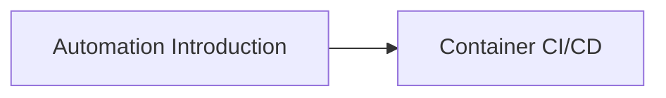

# Automation & CI/CD

Welcome to the Automation & CI/CD section! This section covers continuous integration, continuous delivery, and infrastructure automation essential for modern DevOps workflows.

## Learning Objectives

By completing this section, you will:

- Design and implement CI/CD pipelines
- Automate container build and deployment workflows
- Understand infrastructure as code principles
- Master version control and branching strategies
- Implement automated testing and quality gates

## Section Contents

### [Automation Introduction](introduction.md)

Learn CI/CD fundamentals, pipeline design, and automation best practices.

### [Container CI/CD](container-cicd.md)

Understand container-specific CI/CD patterns, registry management, and deployment strategies.

## Prerequisites

- Completed Containers & Orchestration section
- Understanding of version control (Git)
- Basic scripting knowledge
- Familiarity with container technologies

## Learning Path

## Why This Matters

Automation and CI/CD are crucial for DevOps because:

- **Speed**: Faster delivery of features and bug fixes
- **Quality**: Automated testing and quality assurance
- **Reliability**: Consistent and repeatable deployments
- **Collaboration**: Better developer and operations collaboration
- **Risk Reduction**: Smaller, more frequent, less risky deployments

You are now prepared to establish observability and reliability foundations.
