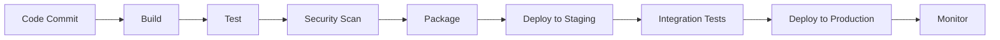

# CI/CD & Automation

Continuous Integration and Continuous Deployment (CI/CD) are fundamental practices in modern DevOps, enabling teams to deliver software faster and more reliably.

## CI/CD Concepts

Understanding CI/CD principles is essential before choosing tools and implementing pipelines.

### Core CI/CD Concepts

- **[CI/CD concepts | GitLab](https://docs.gitlab.com/ee/ci/introduction/)**
  
  Comprehensive introduction to CI/CD concepts, benefits, and best practices.

- **[What is CI/CD? | Red Hat](https://www.redhat.com/en/topics/devops/what-is-ci-cd)**
  
  Clear explanation of continuous integration, delivery, and deployment differences.

### CI/CD Pipeline Stages



#### Pipeline Components

| Stage | Purpose | Tools/Actions |
|-------|---------|---------------|
| **Source** | Code repository trigger | Git webhooks, scheduled builds |
| **Build** | Compile and package | Maven, npm, Docker build |
| **Test** | Automated testing | Unit tests, integration tests |
| **Security** | Vulnerability scanning | SAST, DAST, dependency scanning |
| **Deploy** | Environment deployment | Kubernetes, AWS ECS, VM deployment |
| **Monitor** | Post-deployment monitoring | Metrics, logs, alerts |

## Popular CI/CD Tools

Choosing the right CI/CD tool depends on your technology stack, team size, and infrastructure.

### Tool Comparison

- **[Top CI/CD Tools You Should Learn in 2023 | Turing](https://www.turing.com/kb/top-cicd-tools-you-should-learn-in-2022)**
  
  Comprehensive comparison of popular CI/CD platforms and their features.

#### Tool Categories

| Category | Tools | Best For |
|----------|-------|----------|
| **Cloud-Native** | GitHub Actions, GitLab CI | Teams using Git platforms |
| **Self-Hosted** | Jenkins, TeamCity | Organizations with compliance needs |
| **Container-First** | Tekton, Drone | Kubernetes-native environments |
| **Enterprise** | Azure DevOps, AWS CodePipeline | Large organizations with cloud focus |

## Infrastructure as Code (IaC)

IaC enables managing infrastructure through code, providing consistency, version control, and automation.

### IaC Fundamentals

- **[What Is Infrastructure as Code? | Stackify](https://stackify.com/what-is-infrastructure-as-code-how-it-works-best-practices-tutorials/)**
  
  Comprehensive guide covering IaC concepts, benefits, and implementation strategies.

- **[What is Infrastructure as Code with Terraform? | HashiCorp](https://developer.hashicorp.com/terraform/tutorials/aws-get-started/infrastructure-as-code)**
  
  Practical introduction to IaC using Terraform with AWS examples.

- **[What is Infrastructure as Code (IaC)? | Red Hat](https://www.redhat.com/en/topics/automation/what-is-infrastructure-as-code-iac)**
  
  Enterprise perspective on IaC adoption and benefits.

### IaC Tools Comparison

| Tool | Language | Cloud Support | Use Case |
|------|----------|---------------|----------|
| **Terraform** | HCL | Multi-cloud | Universal infrastructure provisioning |
| **CloudFormation** | JSON/YAML | AWS only | AWS-native deployments |
| **Pulumi** | Multiple languages | Multi-cloud | Developer-friendly IaC |
| **ARM Templates** | JSON | Azure only | Azure-specific infrastructure |
| **CDK** | Multiple languages | Multi-cloud | Programmatic infrastructure |

#### Terraform Example

```hcl
# Configure AWS provider
provider "aws" {
  region = "us-west-2"
}

# Create VPC
resource "aws_vpc" "main" {
  cidr_block           = "10.0.0.0/16"
  enable_dns_hostnames = true
  enable_dns_support   = true

  tags = {
    Name        = "main-vpc"
    Environment = "production"
  }
}

# Create subnet
resource "aws_subnet" "public" {
  vpc_id                  = aws_vpc.main.id
  cidr_block              = "10.0.1.0/24"
  availability_zone       = "us-west-2a"
  map_public_ip_on_launch = true

  tags = {
    Name = "public-subnet"
    Type = "public"
  }
}

# Create security group
resource "aws_security_group" "web" {
  name_prefix = "web-sg"
  vpc_id      = aws_vpc.main.id

  ingress {
    from_port   = 80
    to_port     = 80
    protocol    = "tcp"
    cidr_blocks = ["0.0.0.0/0"]
  }

  ingress {
    from_port   = 443
    to_port     = 443
    protocol    = "tcp"
    cidr_blocks = ["0.0.0.0/0"]
  }

  egress {
    from_port   = 0
    to_port     = 0
    protocol    = "-1"
    cidr_blocks = ["0.0.0.0/0"]
  }
}
```

## Configuration Management

Configuration management ensures consistent system configuration across environments.

### Configuration Management Overview

- **[Top 5 Configuration Management Tools | Opensource.com](https://opensource.com/article/18/12/configuration-management-tools)**
  
  Comparison of popular configuration management tools and their capabilities.

- **[Configuration Management: Definition and Benefits | Atlassian](https://www.atlassian.com/microservices/microservices-architecture/configuration-management)**
  
  Explanation of configuration management in microservices architecture.

### Configuration Management Tools

| Tool | Approach | Language | Best For |
|------|----------|----------|----------|
| **Ansible** | Agentless, Push | YAML | Simple automation, cloud provisioning |
| **Puppet** | Agent-based, Pull | DSL | Enterprise environments, compliance |
| **Chef** | Agent-based, Pull | Ruby DSL | Complex configurations, large scale |
| **SaltStack** | Agent/Agentless | YAML/Python | High-speed execution, event-driven |

#### Ansible Playbook Example

```yaml
---
- name: Configure web server
  hosts: webservers
  become: yes
  
  vars:
    nginx_port: 80
    app_user: webapp
    
  tasks:
    - name: Install Nginx
      package:
        name: nginx
        state: present
        
    - name: Create application user
      user:
        name: "{{ app_user }}"
        system: yes
        shell: /bin/false
        
    - name: Copy Nginx configuration
      template:
        src: nginx.conf.j2
        dest: /etc/nginx/nginx.conf
        backup: yes
      notify: restart nginx
      
    - name: Start and enable Nginx
      systemd:
        name: nginx
        state: started
        enabled: yes
        
  handlers:
    - name: restart nginx
      systemd:
        name: nginx
        state: restarted
```

## CI/CD Pipeline Examples

### GitHub Actions Workflow

```yaml
name: CI/CD Pipeline

on:
  push:
    branches: [ main, develop ]
  pull_request:
    branches: [ main ]

jobs:
  test:
    runs-on: ubuntu-latest
    
    steps:
    - uses: actions/checkout@v3
    
    - name: Set up Node.js
      uses: actions/setup-node@v3
      with:
        node-version: '18'
        cache: 'npm'
    
    - name: Install dependencies
      run: npm ci
      
    - name: Run tests
      run: npm test
      
    - name: Run security audit
      run: npm audit
      
  build:
    needs: test
    runs-on: ubuntu-latest
    
    steps:
    - uses: actions/checkout@v3
    
    - name: Build Docker image
      run: |
        docker build -t myapp:${{ github.sha }} .
        docker tag myapp:${{ github.sha }} myapp:latest
        
    - name: Push to registry
      run: |
        echo ${{ secrets.DOCKER_PASSWORD }} | docker login -u ${{ secrets.DOCKER_USERNAME }} --password-stdin
        docker push myapp:${{ github.sha }}
        docker push myapp:latest
        
  deploy:
    needs: build
    runs-on: ubuntu-latest
    if: github.ref == 'refs/heads/main'
    
    steps:
    - name: Deploy to production
      run: |
        # kubectl apply -f k8s/
        # Or use Terraform, Ansible, etc.
        echo "Deploying to production..."
```

### GitLab CI Example

```yaml
stages:
  - build
  - test
  - security
  - deploy

variables:
  DOCKER_REGISTRY: registry.gitlab.com
  IMAGE_NAME: $DOCKER_REGISTRY/$CI_PROJECT_PATH

build:
  stage: build
  script:
    - docker build -t $IMAGE_NAME:$CI_COMMIT_SHA .
    - docker push $IMAGE_NAME:$CI_COMMIT_SHA
  only:
    - main
    - develop

test:
  stage: test
  script:
    - npm install
    - npm run test:coverage
  coverage: '/Lines\s*:\s*(\d+\.\d+)%/'
  artifacts:
    reports:
      coverage_report:
        coverage_format: cobertura
        path: coverage/cobertura-coverage.xml

security_scan:
  stage: security
  script:
    - docker run --rm -v $(pwd):/app securecodewarrior/docker-security-scanner /app
  allow_failure: true

deploy_staging:
  stage: deploy
  script:
    - kubectl config use-context staging
    - kubectl set image deployment/app container=$IMAGE_NAME:$CI_COMMIT_SHA
  environment:
    name: staging
    url: https://staging.example.com
  only:
    - develop

deploy_production:
  stage: deploy
  script:
    - kubectl config use-context production
    - kubectl set image deployment/app container=$IMAGE_NAME:$CI_COMMIT_SHA
  environment:
    name: production
    url: https://example.com
  when: manual
  only:
    - main
```

## Best Practices

### CI/CD Best Practices

!!! tip "Implementation Guidelines"
    - **Keep pipelines fast**: Parallel execution, efficient caching
    - **Fail fast**: Run quick tests first
    - **Immutable artifacts**: Build once, deploy everywhere
    - **Environment parity**: Keep environments consistent
    - **Security integration**: Shift security left in the pipeline
    - **Monitoring**: Track pipeline metrics and success rates

### Infrastructure as Code Best Practices

!!! warning "IaC Guidelines"
    - **Version control**: Store all infrastructure code in Git
    - **Modularization**: Create reusable modules/components
    - **State management**: Use remote state with locking
    - **Documentation**: Comment code and maintain README files
    - **Testing**: Validate infrastructure code before deployment
    - **Secrets management**: Never store secrets in code

## Next Steps

After mastering automation fundamentals, explore:

- [Continuous Monitoring](../monitoring/introduction.md)
- Deployment Environments management
- Advanced Container Orchestration

!!! success "DevOps Integration"
    Automation is the cornerstone of DevOps culture, enabling faster delivery, consistent deployments, and reliable infrastructure management. Master these concepts to build robust, scalable systems.