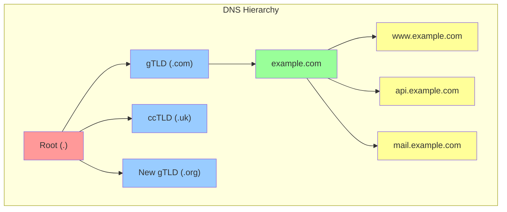
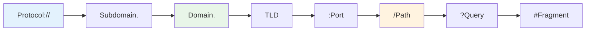
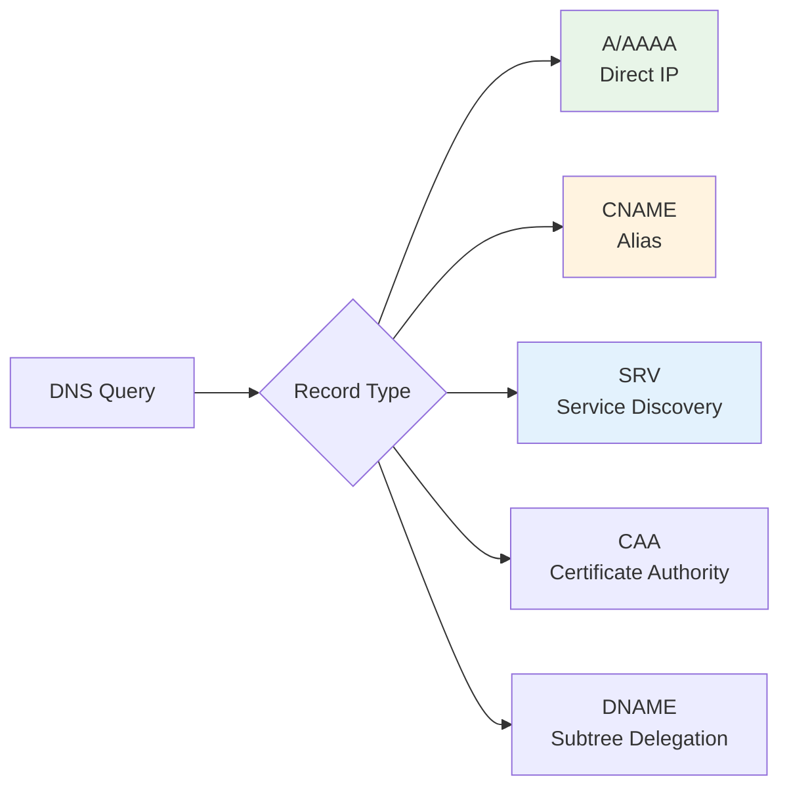

# Domain Names & DNS

Domain names and DNS management are fundamental to web infrastructure. Understanding these concepts is essential for DevOps engineers managing web applications, implementing service discovery, and ensuring reliable connectivity across distributed systems.

!!! info "Learning Objectives"
    After completing this section, you'll be able to:
    
    - Understand DNS resolution process and hierarchy
    - Configure and manage DNS records for production systems
    - Implement DNS-based load balancing and failover
    - Troubleshoot DNS issues in production environments
    - Secure DNS infrastructure against common attacks
    - Automate DNS management using Infrastructure as Code

## How DNS Works

DNS (Domain Name System) is often called the "phonebook of the internet." It translates human-readable domain names into IP addresses that computers use to communicate.

### DNS Resolution Process

  ```mermaid
sequenceDiagram
    participant U as Browser
    participant R as DNS Resolver
    participant Root as Root DNS
    participant TLD as TLD Server
    participant Auth as Auth Server
    participant Web as Web Server

    U->>+R: Query: example.com
    R->>+Root: Query .com servers
    Root-->>-R: TLD server list
    R->>+TLD: Query example.com
    TLD-->>-R: Auth nameservers
    R->>+Auth: Query IP
    Auth-->>-R: IP: 192.0.2.1
    R-->>-U: Return IP
    U->>+Web: HTTP Request
    Web-->>-U: Response
```

### DNS Hierarchy



## Domain Name Structure

### Anatomy of a Domain Name


    https://blog.api.example.com:443/articles/dns-guide?page=2#section1
    │      │    │   │       │   │   │                    │      │
    │      │    │   │       │   │   │                    │      └─ Fragment
    │      │    │   │       │   │   │                    └─ Query Parameters
    │      │    │   │       │   │   └─ Path
    │      │    │   │       │   └─ Port
    │      │    │   │       └─ Second Level Domain
    │      │    │   └─ Top Level Domain
    │      │    └─ Third Level Domain (Subdomain)
    │      └─ Fourth Level Domain (Subdomain)
    └─ Protocol/Scheme


#### **Domain Components**

**Fully Qualified Domain Name (FQDN):** `blog.api.example.com.`

- **Root Domain (.)**: Implicit in most contexts
- **Top Level Domain (TLD)**: `.com`, `.org`, `.net`, `.io`
- **Second Level Domain**: `example` (your brand/organization)
- **Subdomains**: `api`, `blog`, `www`, `mail`

### URL Structure and Components

#### **URL Components Explained**

    https://api.staging.example.com:8443/v1/users?limit=10&page=2#results

- **Protocol**: `https://` - How to access the resource
- **Subdomain**: `api.staging` - Service and environment identifiers  
- **Domain**: `example.com` - Your registered domain
- **Port**: `:8443` - Specific service port (optional)
- **Path**: `/v1/users` - Resource location
- **Query**: `?limit=10&page=2` - Parameters
- **Fragment**: `#results` - Page section

## Name Servers and DNS Records

### Name Server Types
 ```mermaid
    flowchart TB
        subgraph "DNS Infrastructure"
            A[Root Nameservers<br/>13 globally distributed]
            B[TLD Nameservers<br/>.com, .org, .net, etc.]
            C[Authoritative Nameservers<br/>Your domain's DNS]
            D[Recursive Resolvers<br/>ISP, Google, Cloudflare]
        end
        
        E[User Query] --> D
        D --> A
        D --> B  
        D --> C
        C --> D
        D --> E
        
        style A fill:#ff9999
        style B fill:#99ccff
        style C fill:#99ff99
        style D fill:#ffff99
 ```
#### **Authoritative Name Servers**

- **Primary (Master)**: Contains the original zone file
- **Secondary (Slave)**: Copies data from primary server
- **Purpose**: Provide definitive answers for your domain


#### **Recursive Resolvers**

- **Function**: Query other servers on behalf of clients
- **Caching**: Store responses to improve performance
- **Examples**: 8.8.8.8 (Google), 1.1.1.1 (Cloudflare)


### DNS Record Types

#### **Core Record Types**

| Record | Purpose | Example | TTL Considerations |
|--------|---------|---------|-------------------|
| **A** | IPv4 address mapping | `example.com → 192.0.2.1` | 300-3600s for dynamic IPs |
| **AAAA** | IPv6 address mapping | `example.com → 2001:db8::1` | Similar to A records |
| **CNAME** | Canonical name alias | `www → example.com` | Match target's TTL |
| **MX** | Mail exchange servers | `10 mail.example.com` | 3600s+ for stability |
| **TXT** | Text information | `"v=spf1 include:_spf.google.com ~all"` | Varies by purpose |
| **NS** | Name server delegation | `ns1.cloudflare.com` | 86400s+ for stability |
| **PTR** | Reverse DNS lookup | `192.0.2.1 → example.com` | Match forward record |
| **SRV** | Service location | `_http._tcp 10 5 80 web.example.com` | Service-dependent |

#### **Advanced Record Types**



#### **Modern DNS Records**


### CAA (Certification Authority Authorization)

    example.com. CAA 0 issue "letsencrypt.org"
    example.com. CAA 0 issuewild ";"
    example.com. CAA 0 iodef "mailto:security@example.com"


### DNAME (Delegation Name)

    old-brand.com. DNAME new-brand.com.

### ALIAS/ANAME (Apex Domain CDN)

    example.com. ALIAS load-balancer-123456.us-west-2.elb.amazonaws.com.


## DNS Configuration Patterns for DevOps

### Environment-Based Subdomains

 ```mermaid
    flowchart TB
        subgraph "Production Environment"
            A[app.example.com]
            B[api.example.com] 
            C[cdn.example.com]
        end
        
        subgraph "Staging Environment"  
            D[app.staging.example.com]
            E[api.staging.example.com]
            F[cdn.staging.example.com]
        end
        
        subgraph "Development Environment"
            G[app.dev.example.com]
            H[api.dev.example.com]
            I[cdn.dev.example.com]
        end
        
        style A fill:#e8f5e8
        style D fill:#fff3e0  
        style G fill:#e3f2fd
 ```
 
### Load Balancing Strategies

#### **DNS Round Robin**

    api.example.com. 300 IN A 192.0.2.10
    api.example.com. 300 IN A 192.0.2.11  
    api.example.com. 300 IN A 192.0.2.12


#### **Geographic DNS Routing**

    # North America
    api-na.example.com. 300 IN A 192.0.2.10
    # Europe  
    api-eu.example.com. 300 IN A 198.51.100.10
    # Asia-Pacific
    api-ap.example.com. 300 IN A 203.0.113.10

    # Global alias with geographic routing
    api.example.com. 300 IN CNAME api-na.example.com.


#### **Health Check Integration**

    # Healthcheck-based DNS updates
    #!/bin/bash
    if curl -f http://192.0.2.10/health; then
        # Server healthy, ensure DNS record exists
        aws route53 change-resource-record-sets --hosted-zone-id Z123 \
          --change-batch '{"Changes": [{"Action": "UPSERT", "ResourceRecordSet": {...}}]}'
    else
        # Server unhealthy, remove from DNS
        aws route53 change-resource-record-sets --hosted-zone-id Z123 \
          --change-batch '{"Changes": [{"Action": "DELETE", "ResourceRecordSet": {...}}]}'
    fi


### Service Discovery Patterns

#### **SRV Records for Microservices**

    _http._tcp.auth-service.example.com. 300 IN SRV 10 5 8080 auth-1.example.com.
    _http._tcp.auth-service.example.com. 300 IN SRV 10 5 8080 auth-2.example.com.
    _grpc._tcp.user-service.example.com. 300 IN SRV 10 5 9090 user-1.example.com.


#### **Consul DNS Integration**
    user-service.service.consul. 300 IN A 10.0.1.100
    user-service.service.consul. 300 IN A 10.0.1.101

#### **Kubernetes DNS**
    # Service DNS pattern
    <service-name>.<namespace>.svc.cluster.local
    
    # Example
    api-service.production.svc.cluster.local

## DNS Troubleshooting and Monitoring

### Essential DNS Tools

#### **Command Line Tools**

    # dig - Most comprehensive DNS lookup tool
    dig example.com                    # Basic A record lookup
    dig @8.8.8.8 example.com          # Query specific DNS server  
    dig example.com MX                 # Query specific record type
    dig +trace example.com             # Trace DNS resolution path
    dig +short example.com             # Short output format
    
    # nslookup - Interactive DNS tool
    nslookup example.com
    nslookup
    > set type=MX
    > example.com
    > exit
    
    # host - Simple DNS lookup
    host example.com                   # Basic lookup
    host -t MX example.com            # Specific record type
    host -a example.com               # All records
    
    # systemd-resolve (modern Linux)
    systemd-resolve example.com       # Query system resolver
    systemd-resolve --status          # Show resolver configuration

#### **Advanced DNS Debugging**

    # Check DNS propagation globally
    dig +short @1.1.1.1 example.com      # Cloudflare DNS
    dig +short @8.8.8.8 example.com      # Google DNS  
    dig +short @208.67.222.222 example.com # OpenDNS
    
    # Reverse DNS lookup
    dig -x 192.0.2.1
    
    # Check DNSSEC validation
    dig +dnssec example.com
    
    # Monitor DNS response times
    dig +stats example.com
    
    # Bulk DNS testing
    for server in 1.1.1.1 8.8.8.8 208.67.222.222; do
        echo "Testing $server:"
        dig +short @$server example.com
    done

### DNS Performance Monitoring

 ```mermaid
    flowchart TB
        A[DNS Query] --> B{Response Time}
        B -->|< 50ms| C[Excellent]
        B -->|50-100ms| D[Good]
        B -->|100-200ms| E[Acceptable]
        B -->|> 200ms| F[Poor - Investigate]
        
        F --> G[Check TTL Values]
        F --> H[Verify DNS Servers]
        F --> I[Analyze Network Path]
        
        style C fill:#e8f5e8
        style D fill:#fff3e0
        style E fill:#ffeb3b
        style F fill:#ffcdd2
 ```
 
#### **Monitoring Scripts**

    #!/bin/bash
    # DNS monitoring script
    DOMAIN="example.com"
    DNS_SERVERS=("1.1.1.1" "8.8.8.8" "208.67.222.222")
    THRESHOLD=100  # milliseconds
    
    for server in "${DNS_SERVERS[@]}"; do
        response_time=$(dig +stats @$server $DOMAIN | grep "Query time:" | awk '{print $4}')
        
        if [ "$response_time" -gt "$THRESHOLD" ]; then
            echo "ALERT: DNS server $server slow response: ${response_time}ms"
            # Send alert (email, Slack, PagerDuty, etc.)
        fi
    done

### Common DNS Issues and Solutions

| Problem | Symptoms | Diagnosis | Solution |
|---------|----------|-----------|----------|
| **DNS Propagation Delay** | Inconsistent responses globally | `dig +trace`, online checkers | Wait or reduce TTL |
| **Cached Stale Records** | Old IP returned after change | Check TTL, flush local cache | `systemctl flush-dns` |
| **Name Server Issues** | NXDOMAIN errors | Verify NS records | Update name server configuration |
| **Load Balancer Health** | Some servers unreachable | Test individual IPs | Update DNS records, fix health checks |
| **DNSSEC Validation Errors** | Resolution failures | `dig +dnssec` | Fix DNSSEC configuration |

## DNS Security Considerations

!!! warning "Security Best Practices"
    - **DNSSEC**: Implement DNS Security Extensions
    - **DNS over HTTPS (DoH)**: Encrypt DNS queries
    - **Regular Monitoring**: Watch for unauthorized changes
    - **Access Control**: Restrict DNS management permissions

### Common DNS Attacks

- **DNS Spoofing**: Redirecting traffic to malicious servers
- **DNS Cache Poisoning**: Corrupting DNS resolver caches  
- **DNS Amplification**: DDoS attacks using DNS responses
- **Domain Hijacking**: Unauthorized domain control

## DNS Monitoring & Troubleshooting

### Essential Tools

- **dig**: Command-line DNS lookup utility
- **nslookup**: Interactive DNS troubleshooting
- **host**: Simple DNS lookup tool
- **Online DNS Checkers**: Global propagation verification

### Common Issues

| Issue | Symptoms | Troubleshooting Steps |
|-------|----------|---------------------|
| DNS Resolution Failure | Site unreachable | Check A/AAAA records, verify name servers |
| Slow Resolution | Page load delays | Check TTL values, DNS server performance |
| Intermittent Issues | Sporadic failures | Test multiple DNS servers, check propagation |
| Email Delivery Problems | Mail bounces | Verify MX records, SPF, DKIM configuration |

## Infrastructure as Code for DNS

### Terraform Example


    resource "cloudflare_record" "api" {
      zone_id = var.cloudflare_zone_id
      name    = "api"
      value   = "192.168.1.10"
      type    = "A"
      ttl     = 300
    }
    
    resource "cloudflare_record" "www" {
      zone_id = var.cloudflare_zone_id
      name    = "www"
      value   = "example.com"
      type    = "CNAME"
      ttl     = 1
    }

## Learning Resources

### **Interactive Learning**


- **[DNS Learning Game](https://messwithdns.net/)** - Interactive DNS experiments and learning


- **[How DNS Works - Comic](https://howdns.works/)** - Visual explanation of DNS concepts

### **Technical Documentation**  

- **[What Is A Name Server? | Forbes Advisor](https://www.forbes.com/advisor/business/software/what-is-a-name-server/)** - Comprehensive name server explanation
- **[What is a Domain Name? | MDN Web Docs](https://developer.mozilla.org/en-US/docs/Learn/Common_questions/What_is_a_domain_name)** - Domain structure and management
- **[What is a URL? | MDN Web Docs](https://developer.mozilla.org/en-US/docs/Learn/Common_questions/What_is_a_URL)** - Complete URL breakdown

### **DNS Security Resources**

- **[DNSSEC Guide | Cloudflare](https://www.cloudflare.com/dns/dnssec/)** - DNS security implementation
- **[DNS Security Best Practices | NIST](https://csrc.nist.gov/publications/detail/sp/800-81/2/final)** - Official security guidelines

### **Monitoring and Tools**

- **[DNS Checker](https://dnschecker.org/)** - Global DNS propagation checking
- **[MXToolbox](https://mxtoolbox.com/)** - Comprehensive DNS and email testing
- **[WhatsMyDNS](https://www.whatsmydns.net/)** - DNS propagation checker

### **Infrastructure as Code**

- **[Terraform DNS Providers](https://registry.terraform.io/browse/providers?category=dns)** - DNS automation with Terraform
- **[External DNS for Kubernetes](https://github.com/kubernetes-sigs/external-dns)** - Kubernetes DNS automation

## Career Impact

DNS expertise is valuable for:

### **Site Reliability Engineering**

- Implement DNS-based service discovery
- Design fault-tolerant DNS architectures  
- Monitor and troubleshoot DNS performance issues

### **DevOps Engineering**

- Automate DNS management in CI/CD pipelines
- Implement blue-green deployments using DNS
- Configure load balancing and traffic routing

### **Cloud Architecture**

- Design multi-region DNS strategies
- Implement DNS-based disaster recovery
- Optimize global content delivery

### **Security Engineering**

- Implement DNSSEC and DNS filtering
- Monitor for DNS-based attacks
- Design secure DNS infrastructures

## Next Steps

With domain and DNS knowledge, you're ready to:

- [Internet Protocols](protocols.md) - Deep dive into HTTP, TCP/IP, and networking
- [SSL Certificates](ssl.md) - Implement secure connections for your domains
- [Web Development](web-development.md) - Apply DNS concepts in application development
- [Linux Server Management](../linux/introduction.md) - Configure DNS on production servers

!!! tip "Practical Exercise"
    **Try This**: Register a domain name, set up DNS records for different environments (dev, staging, prod), implement a simple health check system that updates DNS records based on server availability.

!!! tip "DevOps Integration"
    DNS management is crucial for blue-green deployments, service discovery, and infrastructure automation. Consider using infrastructure as code tools for DNS configuration.

## References and Further Reading

### **Primary Sources**

1. **[RFC 1034 - Domain Names Concepts](https://tools.ietf.org/html/rfc1034)** - Original DNS specification
2. **[RFC 1035 - Domain Names Implementation](https://tools.ietf.org/html/rfc1035)** - DNS implementation details  
3. **[Internet Corporation for Assigned Names and Numbers (ICANN)](https://www.icann.org/)** - Domain name governance

### **Security Standards**

1. **[RFC 4033 - DNSSEC Introduction](https://tools.ietf.org/html/rfc4033)** - DNS security extensions
2. **[DNS over HTTPS (DoH) - RFC 8484](https://tools.ietf.org/html/rfc8484)** - Encrypted DNS queries
3. **[DNS Security Extensions (DNSSEC) Deployment Guide](https://www.nist.gov/publications/secure-domain-name-system-dns-deployment-guide)** - NIST implementation guide

### **Modern DNS Technologies**

1. **[Cloudflare DNS Documentation](https://developers.cloudflare.com/dns/)** - Modern DNS service features
2. **[AWS Route 53 Best Practices](https://docs.aws.amazon.com/Route53/latest/DeveloperGuide/best-practices-dns.html)** - Cloud DNS management
3. **[Google Cloud DNS Documentation](https://cloud.google.com/dns/docs)** - Enterprise DNS solutions
