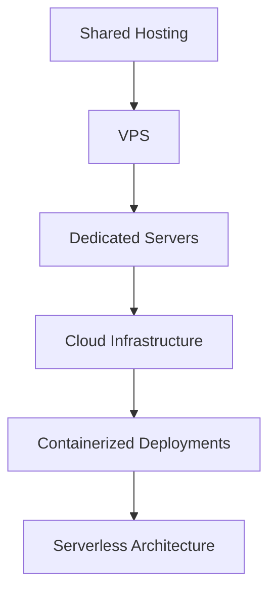

# Hosting Solutions

Understanding different hosting options is crucial for making informed infrastructure decisions in DevOps.

## Shared Web Hosting

Shared hosting is often the starting point for many web projects. Understanding its limitations helps you know when to scale up.

### What is Shared Hosting?

- **[What Is Shared Hosting? | ThemeIsle](https://themeisle.com/blog/what-is-shared-hosting/)**
  
  Comprehensive beginner's guide explaining shared hosting concepts, pros, and cons.

### WordPress on Shared Hosting

WordPress is one of the most common applications deployed on shared hosting.

- **[How to Install WordPress | Namecheap](https://www.namecheap.com/wordpress/how-to-install-wordpress/)**
  
  Step-by-step guide for WordPress installation and configuration.

### Shared Hosting vs VPS

Understanding the differences helps you make informed hosting decisions.

- **[VPS vs Cloud Hosting | ScalaHosting](https://www.scalahosting.com/blog/what-is-the-difference-between-vps-and-cloud-hosting/)**
  
  Detailed comparison of hosting types and their use cases.

## Free Hosting Options

Perfect for learning and experimentation before investing in paid solutions.

### Free Hosting Providers

- **[000webhost - Free cPanel Hosting](https://www.000webhost.com/free-cpanel-hosting)**
  
  Free hosting with cPanel support for testing and learning.

- **[AeonFree Hosting](https://aeonfree.com/)**
  
  Another free hosting option with good feature set for beginners.

### Free Domain Names

- **[Freenom - Free Domain Names](https://www.freenom.com/en/index.html?lang=en)**
  
  Get free domain names for testing and development projects.

## Hosting Evolution Path

!!! tip "Learning Path"
    Start with shared hosting to understand the basics, then progress to VPS and eventually to cloud infrastructure as your skills grow.

## Next Steps

After understanding hosting fundamentals:

- [Internet Protocols](protocols.md) - Learn how data travels between servers
- [SSL Certificates](ssl.md) - Secure your hosted applications
- [Domain Names & DNS](domains-dns.md) - Understand domain management

!!! info "DevOps Relevance"
    Hosting knowledge is essential for infrastructure planning, capacity management, and understanding application deployment requirements.