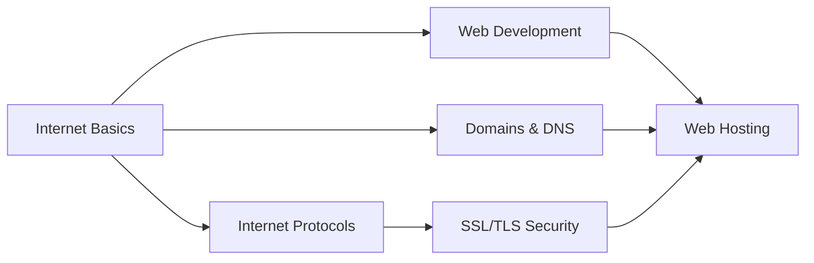

# DevOps Fundamentals

Welcome to the DevOps Fundamentals section! This section covers the essential concepts and technologies that form the foundation of modern DevOps practices.

## Learning Objectives

By completing this section, you will:

- Understand how the internet and web technologies work
- Learn web development fundamentals and their connection to DevOps
- Master domain names, DNS, and networking concepts
- Understand internet protocols and their role in DevOps
- Learn SSL/TLS security and encryption
- Explore web hosting options and infrastructure

## Section Contents

### [Internet Basics](internet-basics.md)
Learn how the internet works, including networking fundamentals, IP addresses, and routing.

### [Web Development Fundamentals](web-development.md)
Understand web development concepts, version control, and the software development lifecycle.

### [Domains & DNS](domains-dns.md)
Master domain name systems, DNS resolution, and domain management.

### [Internet Protocols](protocols.md)
Deep dive into HTTP/HTTPS, TCP/UDP, SSH, and other essential protocols.

### [SSL/TLS Security](ssl.md)
Learn about encryption, certificates, and securing web communications.

### [Web Hosting](hosting.md)
Explore hosting options, server management, and hosting infrastructure.

## Prerequisites

- Basic computer literacy
- Curiosity about how web technologies work
- No prior programming experience required

## Learning Path

## Why This Matters

Understanding these fundamentals is crucial for DevOps because:

- **Infrastructure Management**: You'll work with servers, domains, and networking
- **Application Deployment**: You'll deploy web applications and services
- **Security**: You'll implement SSL certificates and secure communications
- **Troubleshooting**: You'll debug network and connectivity issues
- **Automation**: You'll automate deployment and infrastructure tasks

Let's start building your DevOps foundation.
