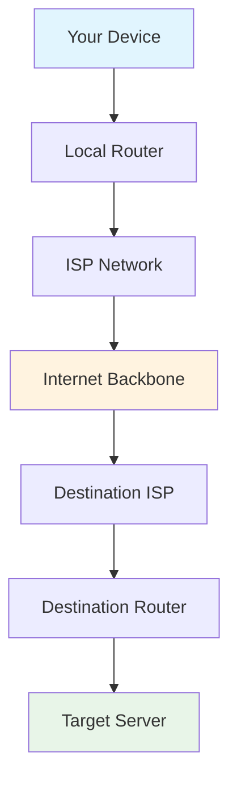
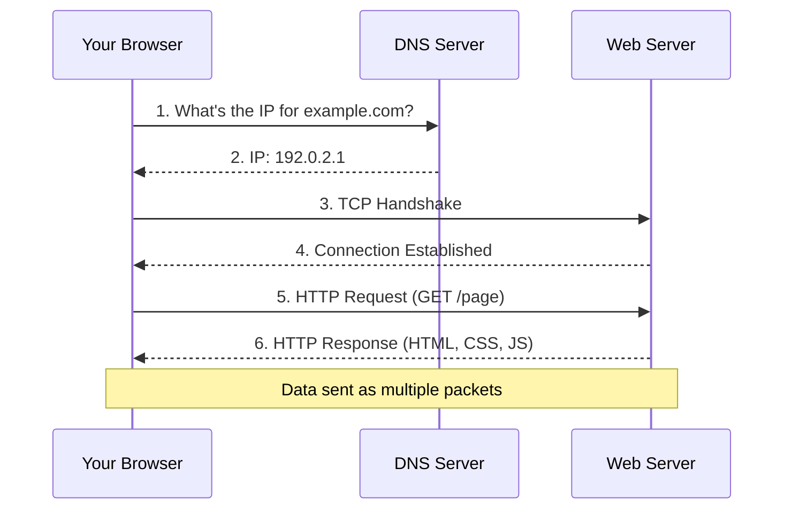
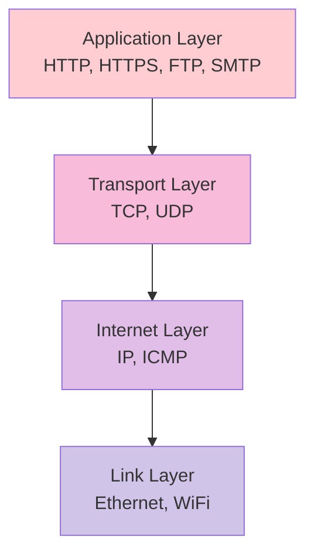
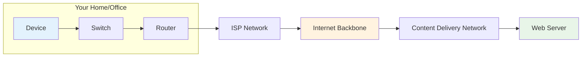

# Internet Basics

Understanding how the internet works is fundamental to DevOps engineering. This section covers the core concepts you need to know to build, deploy, and troubleshoot modern applications and infrastructure.

## How Does the Internet Work?

The internet is a global network of interconnected computers that communicate using standardized protocols. Understanding its architecture helps you troubleshoot issues, design better systems, and make informed decisions about performance, security, and scalability.

!!! info "Learning Objectives"
    After completing this section, you'll be able to:
    
    - Define what 'Internet' means and how computer networks function
    - Understand packet switching and networking protocols
    - Identify key networking hardware components
    - Explain how data travels from your device to servers worldwide
    - Troubleshoot basic network connectivity issues

## What is the Internet?

The Internet is essentially a **network of networks** - a vast, sprawling collection of interconnected computer networks that can communicate with each other. Think of it like a social network, but instead of people, it's computers sharing information globally.

### Core Concepts

#### 1. Distributed Network Architecture



The Internet has no central control point - it's **distributed** by design. This means:

- **Resilience**: If one path fails, data can take alternative routes
- **Scalability**: New networks can join without disrupting existing ones
- **Decentralization**: No single entity controls the entire Internet

#### 2. How Data Travels: Packets and Protocols

When you request a webpage or send an email, your data doesn't travel as one large chunk. Instead, it's broken into small pieces called **packets**.



##### Packet Structure

Each packet contains:
- **Header**: Destination address, source address, packet number
- **Payload**: The actual data being transmitted
- **Checksum**: Error detection mechanism

##### Why Packets?

- **Efficiency**: Multiple users can share the same network infrastructure
- **Reliability**: Lost packets can be retransmitted without resending everything
- **Flexibility**: Packets can take different routes to reach their destination

## Key Internet Protocols

Protocols are standardized rules that allow different devices and software to communicate effectively.

### Essential Protocol Stack



#### 1. **HTTP/HTTPS** (Application Layer)
- **Purpose**: Web communication protocol
- **HTTP**: Plain text communication
- **HTTPS**: Encrypted HTTP using TLS/SSL
- **DevOps Relevance**: Web applications, APIs, microservices communication

#### 2. **TCP** (Transport Layer)
- **Purpose**: Reliable, ordered data delivery
- **Features**: Error checking, flow control, congestion control
- **Use Cases**: Web browsing, file transfers, database connections

#### 3. **UDP** (Transport Layer)
- **Purpose**: Fast, lightweight data delivery
- **Trade-off**: Speed over reliability
- **Use Cases**: Video streaming, online gaming, DNS queries

#### 4. **IP** (Internet Layer)
- **Purpose**: Addressing and routing packets
- **IPv4**: 32-bit addresses (e.g., 192.168.1.1)
- **IPv6**: 128-bit addresses (future-proofing)

## Physical Infrastructure

### Network Hardware Components



#### **Routers**
- **Function**: Forward packets between different networks
- **Analogy**: Traffic cops directing vehicles to correct destinations
- **DevOps Context**: Network segmentation, load balancing

#### **Switches**
- **Function**: Connect devices within the same network
- **Method**: Packet switching to correct devices
- **DevOps Context**: Data center networking, VLAN management

#### **Servers**
- **Function**: Store and serve content, applications, databases
- **Types**: Web servers, application servers, database servers
- **DevOps Context**: The infrastructure you'll be managing and deploying to

### Global Infrastructure

- **Fiber Optic Cables**: Backbone of internet connectivity
- **Data Centers**: House servers and networking equipment
- **Content Delivery Networks (CDNs)**: Distribute content globally for faster access
- **Internet Exchange Points (IXPs)**: Where different networks interconnect

## Real-World Example: Loading a Website

Let's trace what happens when you visit a website:

### Step-by-Step Process

1. **DNS Query**: Browser asks "What's the IP address for example.com?"
2. **TCP Handshake**: Browser establishes connection with server
3. **TLS Handshake**: Secure encryption is set up (for HTTPS)
4. **HTTP Request**: Browser requests the webpage
5. **HTTP Response**: Server sends HTML, CSS, JavaScript as packets
6. **Rendering**: Browser assembles packets and displays the page

### Timing Breakdown
- DNS Query: ~20-100ms
- TCP Handshake: ~20-200ms
- TLS Handshake: ~100-500ms
- HTTP Request/Response: ~50-500ms

**Total**: Often under 1 second for a simple page!

## DevOps Relevance

Understanding internet fundamentals helps you:

### **Troubleshooting**
- Diagnose network connectivity issues
- Analyze performance bottlenecks
- Debug API communication problems

### **System Design**
- Choose appropriate protocols for different use cases
- Design resilient, distributed systems
- Optimize for network performance

### **Security**
- Understand attack vectors (DDoS, man-in-the-middle)
- Implement proper encryption and authentication
- Design secure network architectures

### **Monitoring**
- Set up network monitoring and alerting
- Analyze traffic patterns and performance metrics
- Capacity planning for network resources

## Learning Resources

### **Interactive Tutorials**
- **[How the Internet Works - Khan Academy](https://www.khanacademy.org/computing/code-org/computers-and-the-internet)**
  - Interactive lessons with visualizations
  - Perfect for beginners

- **[Internet 101 - Code.org](https://code.org/curriculum/course2/1/Teacher)**
  - Video series explaining internet concepts
  - Visual and engaging format

### **Technical Deep Dives**
- **[How does the Internet work? | Cloudflare](https://www.cloudflare.com/en-gb/learning/network-layer/how-does-the-internet-work/)**
  - Comprehensive technical guide
  - Covers packets, protocols, and infrastructure

- **[Computer Networks: A Top Down Approach](https://gaia.cs.umass.edu/kurose_ross/index.html)**
  - University-level textbook with online resources
  - Deep technical understanding

- **[High Performance Browser Networking](https://hpbn.co/)**
  - Free online book by Ilya Grigorik
  - Focus on web performance and networking

### **Hands-On Practice**
- **[Wireshark Network Analysis](https://www.wireshark.org/docs/wsug_html/)**
  - Learn to capture and analyze network traffic
  - Essential DevOps troubleshooting skill

- **[Packet Tracer (Cisco)](https://www.netacad.com/courses/packet-tracer)**
  - Network simulation tool
  - Practice building and configuring networks

### **Video Resources**
- **[Networking Fundamentals - NetworkChuck](https://www.youtube.com/watch?v=qiQR5rTSshw)**
  - Engaging video series on networking basics
  - Perfect for visual learners

- **[The Internet: How Search Works - Code.org](https://www.youtube.com/watch?v=LVV_93mBfSU)**
  - Short, clear explanation of internet basics

### **Command Line Tools**
Essential networking commands for DevOps:

```bash
# Test connectivity
ping google.com

# Trace route to destination
traceroute google.com

# DNS lookup
nslookup example.com
dig example.com

# Network configuration
ifconfig  # Linux/Mac
ipconfig  # Windows

# Network connections
netstat -an
ss -tuln  # Modern Linux alternative
```

## Advanced Topics to Explore Next

Once comfortable with basics, explore:

- **Network Security**: Firewalls, VPNs, DDoS protection
- **Load Balancing**: Distributing traffic across multiple servers
- **Content Delivery Networks**: Global content distribution
- **Software Defined Networking**: Programmable network infrastructure
- **Container Networking**: Docker and Kubernetes networking models

## Career Impact

Understanding internet fundamentals positions you for roles in:

- **Site Reliability Engineering**: Managing large-scale web services
- **Network Engineering**: Designing and maintaining network infrastructure  
- **Cloud Engineering**: Working with cloud networking services
- **Security Engineering**: Protecting network infrastructure and applications
- **DevOps Engineering**: Building and maintaining CI/CD pipelines that rely on network services

## Next Steps

Once you understand internet basics, proceed to learn about:

- [Web Development Fundamentals](web-development.md)
- [Internet Protocols](protocols.md)  
- [Domain Names & DNS](domains-dns.md)

!!! tip "Learning Tip"
    Take time to understand these fundamentals - they form the foundation for everything else in DevOps! Practice with the command-line tools and try setting up a simple network lab using VirtualBox or VMware.

!!! example "Practical Exercise"
    **Try This**: Use `traceroute` to trace the path from your computer to a popular website like Google.com. Notice how many hops (routers) your data passes through and research the organizations that own those network segments.

## References and Further Reading

### Primary Sources
1. **[Cloudflare Learning Center - How does the Internet work?](https://www.cloudflare.com/en-gb/learning/network-layer/how-does-the-internet-work/)** - Comprehensive technical guide with excellent diagrams
2. **[Mozilla Developer Network - How the Web Works](https://developer.mozilla.org/en-US/docs/Learn/Getting_started_with_the_web/How_the_Web_works)** - Developer-focused explanation
3. **[Internet Society - Internet Technologies](https://www.internetsociety.org/internet/how-it-works/)** - Authoritative source from the organization that manages internet standards

### Academic Resources  
4. **[RFC 791 - Internet Protocol](https://tools.ietf.org/html/rfc791)** - Official IP specification
5. **[RFC 793 - Transmission Control Protocol](https://tools.ietf.org/html/rfc793)** - Official TCP specification
6. **[Computer Networks and the Internet - UMass](https://gaia.cs.umass.edu/kurose_ross/index.html)** - University textbook resources

### Interactive Learning
7. **[Submarine Cable Map](https://www.submarinecablemap.com/)** - Visualize global internet infrastructure
8. **[Internet Traffic Report](http://www.internettrafficreport.com/)** - Real-time internet performance monitoring
9. **[BGP Looking Glass](http://www.bgp4.as/looking-glasses)** - See how internet routing works in real-time
