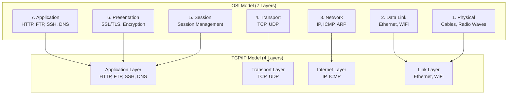
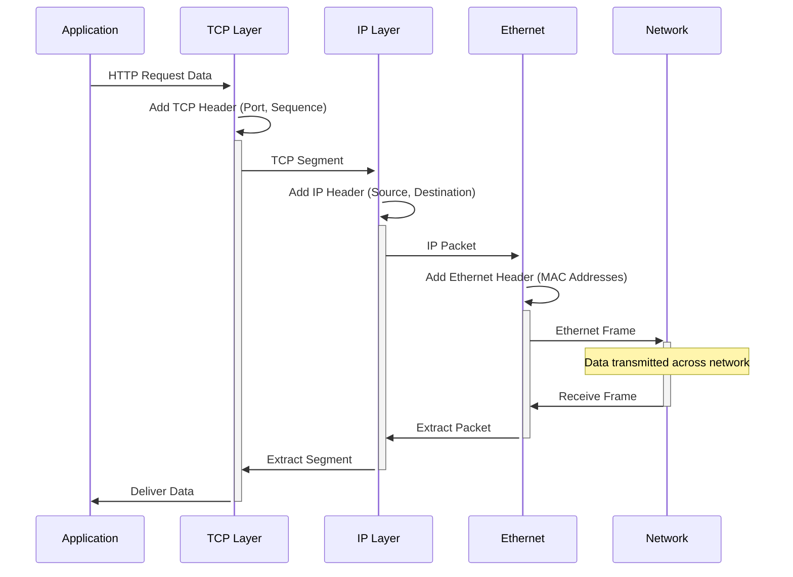
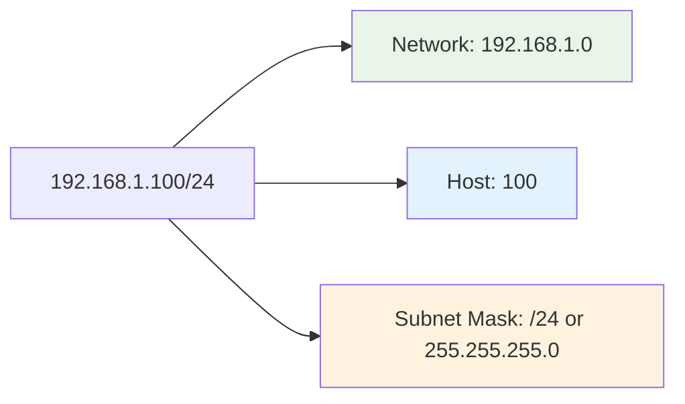
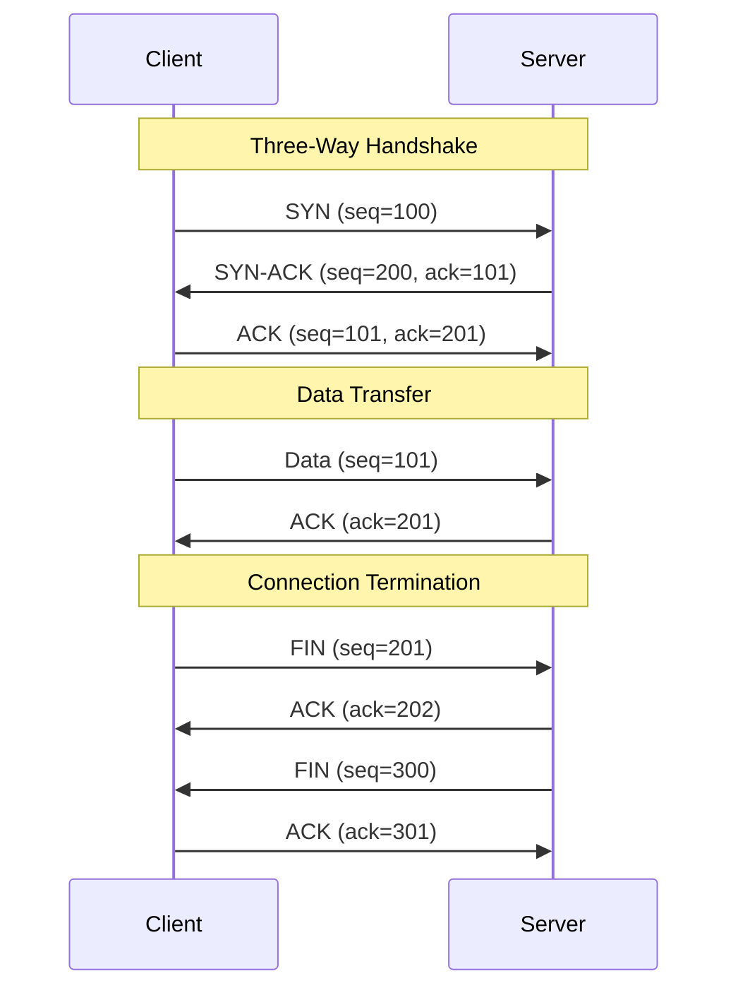
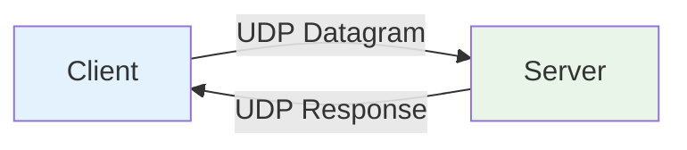
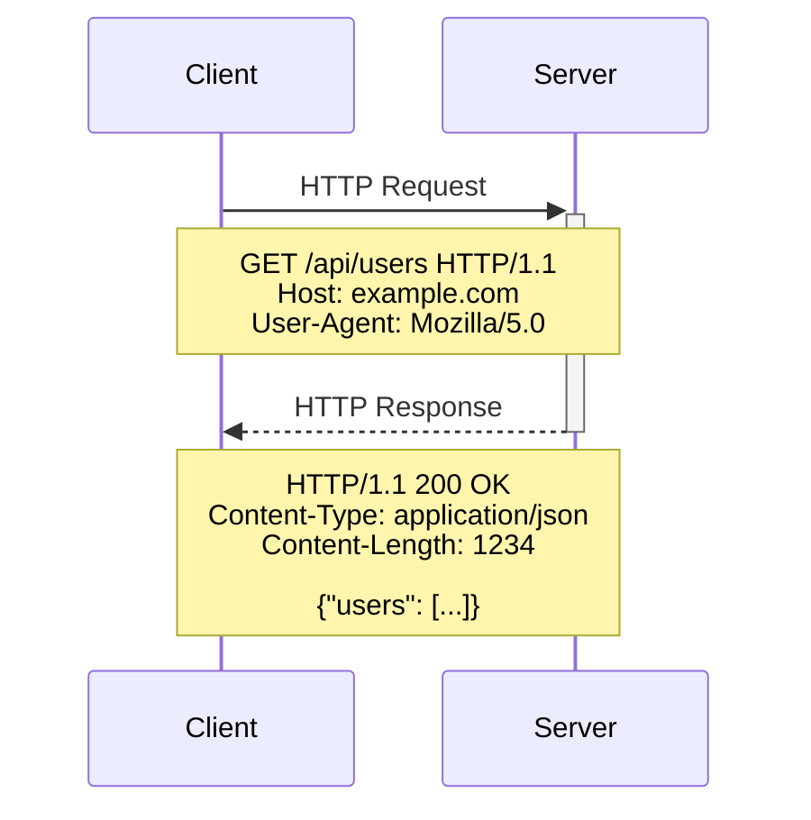
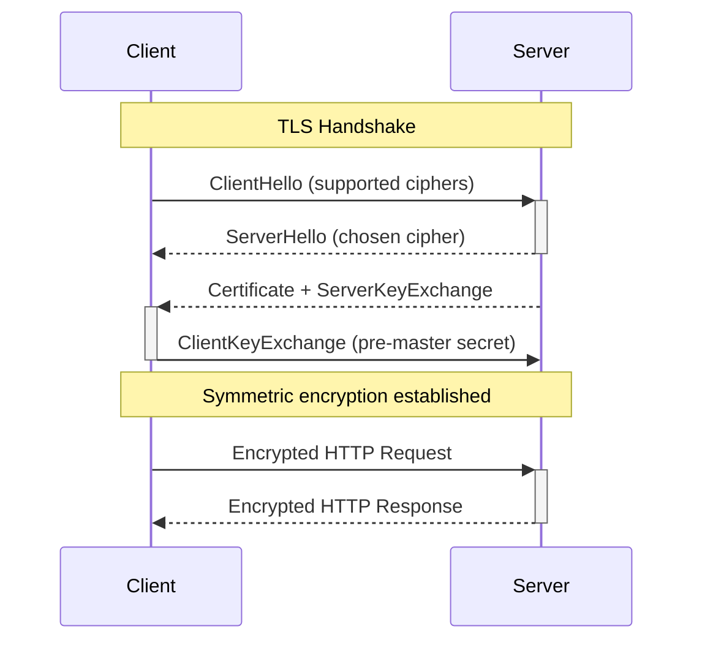
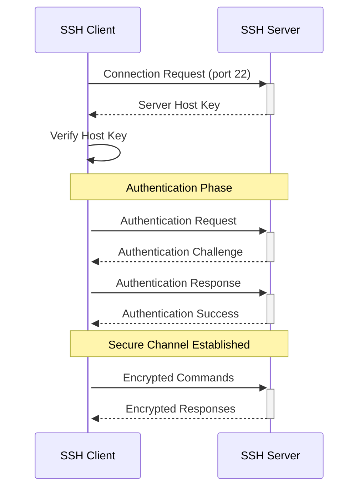

# Internet Protocols

Understanding network protocols is essential for DevOps engineers to troubleshoot connectivity issues, design secure systems, and build reliable infrastructure. This knowledge forms the backbone of modern application deployment and management.

!!! info "Learning Objectives"
    After completing this section, you'll be able to:
    
    - Understand the OSI model and TCP/IP protocol stack
    - Configure and troubleshoot HTTP/HTTPS communications
    - Implement secure protocols (SSH, SFTP, TLS/SSL)
    - Diagnose network connectivity issues
    - Design secure, efficient network architectures
    - Apply protocol knowledge to DevOps automation

## Protocol Stack Overview

### OSI Model vs TCP/IP Model

### Protocol Communication Flow

## IP Addressing and Subnetting

### IPv4 Addressing

#### **Address Classes**

| Class | Range | Default Subnet | Private Ranges | Use Case |
|-------|--------|----------------|----------------|----------|
| **A** | 1.0.0.0 - 126.0.0.0 | /8 | 10.0.0.0/8 | Large networks |
| **B** | 128.0.0.0 - 191.255.0.0 | /16 | 172.16.0.0/12 | Medium networks |
| **C** | 192.0.0.0 - 223.255.255.0 | /24 | 192.168.0.0/16 | Small networks |

#### **Special IP Addresses**

    # View certificate information
    openssl x509 -text -noout -in certificate.crt
    
    # Generate CSR
    openssl req -new -key private.key -out server.csr
    
    # Generate self-signed certificate
    openssl req -x509 -nodes -days 365 -newkey rsa:2048 \
        -keyout private.key -out certificate.crt

### IPv6 Addressing

    2001:0db8:85a3:0000:0000:8a2e:0370:7334
    │    │    │    │    │    │    │    │
    │    │    │    └────┴────┴────┴────┴── Interface ID (64 bits)
    └────┴────┴────┴────────────────────── Network Prefix (64 bits)

#### **IPv6 Address Types**

- **Global Unicast**: 2000::/3 (Internet routable)
- **Link-Local**: fe80::/10 (Local network only)  
- **Unique Local**: fc00::/7 (Private networks)
- **Multicast**: ff00::/8 (One-to-many communication)

### Subnetting Examples

    # Network: 192.168.1.0/24 (256 addresses)
    # Subnet into 4 smaller networks (62 hosts each)

    Subnet 1: 192.168.1.0/26   (192.168.1.1   - 192.168.1.62)
    Subnet 2: 192.168.1.64/26  (192.168.1.65  - 192.168.1.126)  
    Subnet 3: 192.168.1.128/26 (192.168.1.129 - 192.168.1.190)
    Subnet 4: 192.168.1.192/26 (192.168.1.193 - 192.168.1.254)

    # DevOps network segmentation example
    DMZ Subnet:    10.0.1.0/24   # Web servers, load balancers
    App Subnet:    10.0.2.0/24   # Application servers  
    DB Subnet:     10.0.3.0/24   # Database servers
    Mgmt Subnet:   10.0.10.0/24  # Management, monitoring

## Transport Layer Protocols

### TCP (Transmission Control Protocol)

#### **TCP Characteristics**

- **Reliable**: Guaranteed delivery with error checking
- **Connection-oriented**: Establishes session before data transfer
- **Flow Control**: Manages data transmission rate
- **Congestion Control**: Adapts to network conditions

#### **TCP Headers and Flags**

     0                   1                   2                   3
     0 1 2 3 4 5 6 7 8 9 0 1 2 3 4 5 6 7 8 9 0 1 2 3 4 5 6 7 8 9 0 1
    +-+-+-+-+-+-+-+-+-+-+-+-+-+-+-+-+-+-+-+-+-+-+-+-+-+-+-+-+-+-+-+-+
    |          Source Port          |       Destination Port        |
    +-+-+-+-+-+-+-+-+-+-+-+-+-+-+-+-+-+-+-+-+-+-+-+-+-+-+-+-+-+-+-+-+
    |                        Sequence Number                        |
    +-+-+-+-+-+-+-+-+-+-+-+-+-+-+-+-+-+-+-+-+-+-+-+-+-+-+-+-+-+-+-+-+
    |                    Acknowledgment Number                      |
    +-+-+-+-+-+-+-+-+-+-+-+-+-+-+-+-+-+-+-+-+-+-+-+-+-+-+-+-+-+-+-+-+
    | Flags |           Window Size           |        Checksum     |
    +-+-+-+-+-+-+-+-+-+-+-+-+-+-+-+-+-+-+-+-+-+-+-+-+-+-+-+-+-+-+-+-+

**TCP Flags:**

- **SYN**: Synchronize (establish connection)
- **ACK**: Acknowledgment
- **FIN**: Finish (close connection)  
- **RST**: Reset (abort connection)
- **PSH**: Push (immediate delivery)
- **URG**: Urgent

### UDP (User Datagram Protocol)

#### **UDP Characteristics**

- **Connectionless**: No session establishment
- **Fast**: Lower overhead than TCP
- **Unreliable**: No guaranteed delivery
- **Stateless**: Each packet independent

#### **UDP Use Cases**

- **DNS Queries**: Quick lookups (53/udp)
- **Video Streaming**: Real-time data where speed > reliability  
- **Online Gaming**: Low-latency communication
- **SNMP Monitoring**: Network management (161/udp)
- **DHCP**: IP address assignment (67/68 udp)

## DNS (Domain Name System)

DNS translates human-readable domain names into IP addresses that computers can understand.

### Understanding DNS

- **[What is DNS? How DNS works | Cloudflare](https://www.cloudflare.com/en-gb/learning/dns/what-is-dns/)**
  
  Detailed explanation of DNS functionality and its importance in web infrastructure.

## FTP Protocols

### FTP & SFTP

File transfer protocols are essential for deploying applications and managing server files.

- **[What Is File Transfer Protocol (FTP) | Investopedia](https://www.investopedia.com/terms/f/ftp-file-transfer-protocol.asp)**
  
  Basic introduction to FTP and its business applications.

- **[FTP vs SFTP: What's the Difference? | Kinsta](https://kinsta.com/knowledgebase/ftp-vs-sftp/)**
  
  Security comparison and best practices for file transfers.

## HTTP & HTTPS

HTTP and HTTPS are the foundation of web communication, essential for DevOps engineers managing web applications and APIs.

### HTTP Protocol Deep Dive

#### **HTTP Methods and Use Cases**

| Method | Purpose | Idempotent | Safe | DevOps Usage |
|---------|---------|------------|------|--------------|
| **GET** | Retrieve data | ✓ | ✓ | Health checks, monitoring |
| **POST** | Create resources | ✗ | ✗ | Deployments, webhook triggers |
| **PUT** | Update/replace | ✓ | ✗ | Configuration updates |
| **PATCH** | Partial update | ✗ | ✗ | Feature flags, gradual rollouts |
| **DELETE** | Remove resources | ✓ | ✗ | Cleanup, resource deallocation |
| **HEAD** | Headers only | ✓ | ✓ | Connectivity tests |
| **OPTIONS** | Available methods | ✓ | ✓ | CORS preflight requests |

#### **HTTP Status Codes**

    # 1xx Informational
    100 Continue          # Request can proceed
    101 Switching Protocols # Protocol upgrade (WebSocket)

    # 2xx Success  
    200 OK               # Request successful
    201 Created          # Resource created successfully
    202 Accepted         # Request accepted for processing
    204 No Content       # Success, but no response body

    # 3xx Redirection
    301 Moved Permanently # Resource permanently relocated
    302 Found            # Temporary redirect
    304 Not Modified     # Resource unchanged (caching)

    # 4xx Client Errors
    400 Bad Request      # Invalid request syntax
    401 Unauthorized     # Authentication required
    403 Forbidden        # Access denied
    404 Not Found        # Resource doesn't exist
    429 Too Many Requests # Rate limiting

    # 5xx Server Errors  
    500 Internal Server Error  # Generic server error
    502 Bad Gateway           # Upstream server error
    503 Service Unavailable   # Server temporarily unavailable
    504 Gateway Timeout       # Upstream server timeout

#### **HTTP Headers for DevOps**

    # Security Headers
    Strict-Transport-Security: max-age=31536000; includeSubDomains
    Content-Security-Policy: default-src 'self'
    X-Frame-Options: DENY
    X-Content-Type-Options: nosniff

    # Performance Headers  
    Cache-Control: public, max-age=3600
    ETag: "33a64df551425fcc55e4d42a148795d9f25f89d4"
    Expires: Wed, 21 Oct 2024 07:28:00 GMT

    # Load Balancing Headers
    X-Forwarded-For: 203.0.113.195, 70.41.3.18, 150.172.238.178
    X-Real-IP: 203.0.113.195
    X-Forwarded-Proto: https

    # Monitoring Headers
    X-Request-ID: 550e8400-e29b-41d4-a716-446655440000
    X-Response-Time: 123ms

### HTTPS and TLS/SSL

#### **TLS/SSL Certificate Types**

| Certificate Type | Validation Level | Use Case | DevOps Considerations |
|------------------|------------------|----------|---------------------|
| **Domain Validated (DV)** | Basic domain control | Development, testing | Automated with Let's Encrypt |
| **Organization Validated (OV)** | Company verification | Production websites | Manual validation process |
| **Extended Validation (EV)** | Strict verification | E-commerce, banking | Complex validation, expensive |
| **Wildcard** | Covers subdomains | Multi-subdomain apps | *.example.com pattern |
| **Multi-Domain (SAN)** | Multiple domains | Microservices, APIs | Single cert for multiple services |

#### **SSL/TLS Configuration Best Practices**

    # Nginx SSL configuration
    server {
        listen 443 ssl http2;
        server_name example.com;
        
        # Certificate files
        ssl_certificate /path/to/certificate.crt;
        ssl_certificate_key /path/to/private.key;
        
        # Security settings
        ssl_protocols TLSv1.2 TLSv1.3;
        ssl_ciphers ECDHE-RSA-AES256-GCM-SHA512:DHE-RSA-AES256-GCM-SHA512;
        ssl_prefer_server_ciphers off;
        
        # Security headers
        add_header Strict-Transport-Security "max-age=63072000" always;
        add_header X-Frame-Options DENY;
        add_header X-Content-Type-Options nosniff;
    }

## SSH (Secure Shell)

SSH is the backbone of secure remote administration and automation in DevOps environments.

### SSH Connection Process

### SSH Authentication Methods

#### **Public Key Authentication**
    # Generate SSH key pair
    ssh-keygen -t ed25519 -C "devops@example.com"
    ssh-keygen -t rsa -b 4096 -C "devops@example.com"  # Legacy systems

    # Copy public key to server
    ssh-copy-id user@server.example.com

    # Manual installation
    cat ~/.ssh/id_ed25519.pub >> ~/.ssh/authorized_keys
    chmod 600 ~/.ssh/authorized_keys

#### **SSH Configuration**
    # Client configuration (~/.ssh/config)
    Host production-server
        HostName prod.example.com
        User deploy
        IdentityFile ~/.ssh/production_key
        Port 2222
        
    Host *.example.com
        User admin
        IdentityFile ~/.ssh/company_key
        ProxyJump bastion.example.com

#### **SSH Security Hardening**
    # Server configuration (/etc/ssh/sshd_config)
    # Disable password authentication
    PasswordAuthentication no
    PubkeyAuthentication yes

    # Disable root login
    PermitRootLogin no

    # Change default port
    Port 2222

    # Limit users
    AllowUsers deploy admin

    # Disable X11 forwarding  
    X11Forwarding no

    # Set idle timeout
    ClientAliveInterval 300
    ClientAliveCountMax 2

### SSH for DevOps Automation

#### **SSH Tunneling**
    # Local port forwarding (access remote service locally)
    ssh -L 8080:localhost:80 user@server.com

    # Remote port forwarding (expose local service remotely)  
    ssh -R 9000:localhost:3000 user@server.com

    # Dynamic port forwarding (SOCKS proxy)
    ssh -D 1080 user@server.com

    # SSH tunnel for database access
    ssh -L 5432:db-server:5432 bastion.example.com

#### **SSH with CI/CD**
        # GitHub Actions example
        - name: Deploy to server
            uses: appleboy/ssh-action@v0.1.5
            with:
                host: ${{ secrets.HOST }}
                username: ${{ secrets.USERNAME }}
                key: ${{ secrets.SSH_KEY }}
                script: |
                    cd /var/www/app
                    git pull origin main
                    docker-compose up -d --build

## File Transfer Protocols

### SFTP vs SCP vs rsync

| Protocol | Speed | Features | Use Case |
|----------|-------|----------|----------|
| **SFTP** | Medium | Interactive, resume support | File management, interactive transfers |
| **SCP** | Fast | Simple, lightweight | Quick file copies, scripting |
| **rsync** | Variable | Incremental sync, compression | Backups, large directory sync |

#### **Practical Examples**

    # SFTP - Interactive file transfer
    sftp user@server.com
    sftp> put local-file.txt remote-file.txt
    sftp> get remote-file.txt local-file.txt
    sftp> ls -la
    sftp> exit

    # SCP - Simple file copy
    scp file.txt user@server.com:/path/to/destination/
    scp -r directory/ user@server.com:/path/to/destination/

    # rsync - Synchronization  
    rsync -avz --delete source/ user@server.com:/destination/
    rsync -avz --progress large-file.zip user@server.com:/backup/

### FTP Security Considerations

    # Secure alternatives to FTP
    FTPS (FTP over SSL/TLS)     # Encrypted FTP
    SFTP (SSH File Transfer)    # SSH-based transfer  
    WebDAV over HTTPS          # HTTP-based file access
    API-based transfers        # REST APIs for file management

    # Never use in production:
    FTP (unencrypted)          # Credentials sent in plain text
    Telnet                     # Unencrypted remote access

## Common Protocols and Ports

### Well-Known Ports

| Port | Protocol | Service | DevOps Usage |
|------|----------|---------|-------------|
| **22** | SSH | Secure shell access | Server management, automation |
| **53** | DNS | Domain resolution | Service discovery, load balancing |
| **80** | HTTP | Web traffic | Application access, health checks |
| **443** | HTTPS | Secure web traffic | Production web services |
| **25** | SMTP | Email sending | Notifications, alerts |
| **993** | IMAPS | Secure email access | Email monitoring |
| **3306** | MySQL | Database access | Application databases |
| **5432** | PostgreSQL | Database access | Application databases |
| **6379** | Redis | Cache access | Session storage, caching |
| **8080** | HTTP Alt | Alternative web | Development servers, proxies |

### DevOps-Specific Ports

| Port | Service | Purpose |
|------|---------|---------|
| **2375/2376** | Docker API | Container management |
| **6443** | Kubernetes API | Cluster management |
| **8080** | Jenkins | CI/CD management |
| **9090** | Prometheus | Metrics collection |
| **3000** | Grafana | Monitoring dashboards |
| **9200** | Elasticsearch | Log aggregation |
| **5601** | Kibana | Log visualization |

## Protocol Troubleshooting

### Network Diagnostic Commands

    # Test connectivity and protocols
    ping google.com                    # Basic connectivity (ICMP)
    telnet google.com 80               # Test TCP port connectivity
    nc -zv google.com 80               # Port scanning with netcat
    nmap -sT -p 80,443 google.com      # Port scanning with nmap
    
    # HTTP/HTTPS testing
    curl -I https://example.com         # Headers only
    curl -v https://example.com         # Verbose output
    curl -k https://example.com         # Ignore SSL errors
    curl --connect-timeout 10 https://example.com
    
    # SSL/TLS testing
    openssl s_client -connect example.com:443 -servername example.com
    openssl s_client -connect example.com:443 -verify_return_error
    
    # DNS testing
    nslookup example.com               # Basic DNS lookup
    dig @8.8.8.8 example.com          # Test specific DNS server
    host -t MX example.com             # Specific record type

### Common Protocol Issues and Solutions

| Issue | Symptoms | Diagnosis | Resolution |
|-------|----------|-----------|------------|
| **SSL Certificate Errors** | Browser warnings, curl failures | `openssl s_client`, certificate expiry | Renew certificate, fix chain |
| **Connection Timeouts** | Slow responses, timeouts | `telnet`, `nc`, firewall logs | Check firewalls, routing |  
| **SSH Key Authentication Failure** | Permission denied | `ssh -v`, key permissions | Fix key permissions (600), authorized_keys |
| **HTTP 502/503 Errors** | Gateway/service errors | Backend health, logs | Check upstream services, load balancer config |
| **DNS Resolution Issues** | Name resolution failures | `dig +trace`, DNS server logs | Update DNS records, check propagation |

### Protocol Monitoring

#### **Health Check Examples**

    #!/bin/bash
    # Protocol health monitoring script

    # HTTP health check
    http_check() {
        local url=$1
        local expected_code=${2:-200}
        
        response=$(curl -s -o /dev/null -w "%{http_code}" "$url")
        if [ "$response" -eq "$expected_code" ]; then
            echo "✓ HTTP $url: $response"
            return 0
        else
            echo "✗ HTTP $url: $response (expected $expected_code)"
            return 1
        fi
    }

    # SSH connectivity check
    ssh_check() {
        local host=$1
        local port=${2:-22}
        
        if nc -z "$host" "$port" 2>/dev/null; then
            echo "✓ SSH $host:$port: reachable"
            return 0
        else
            echo "✗ SSH $host:$port: unreachable"
            return 1
        fi
    }

    # SSL certificate expiry check
    ssl_expiry_check() {
        local host=$1
        local port=${2:-443}
        
        expiry=$(echo | openssl s_client -servername "$host" -connect "$host:$port" 2>/dev/null | \
                 openssl x509 -noout -enddate | cut -d= -f2)
        
        expiry_epoch=$(date -d "$expiry" +%s)
        current_epoch=$(date +%s)
        days_left=$(( (expiry_epoch - current_epoch) / 86400 ))
        
        if [ "$days_left" -gt 30 ]; then
            echo "✓ SSL $host: expires in $days_left days"
            return 0
        else
            echo "⚠ SSL $host: expires in $days_left days"
            return 1
        fi
    }

    # Run checks
    http_check "https://example.com/health"
    ssh_check "server.example.com"
    ssl_expiry_check "example.com"

## Security Best Practices

### Protocol Security Checklist

#### **Transport Security**

- ✅ Use TLS 1.2 or higher for all encrypted communications
- ✅ Disable weak cipher suites and protocols (SSLv3, TLS 1.0, TLS 1.1)
- ✅ Implement HTTP Strict Transport Security (HSTS)
- ✅ Use certificate pinning for critical applications
- ✅ Regular SSL/TLS certificate rotation

#### **Authentication Security**

- ✅ Disable password authentication for SSH (use keys only)
- ✅ Implement multi-factor authentication where possible
- ✅ Use service accounts with minimal privileges
- ✅ Regular key rotation and access reviews
- ✅ Monitor authentication logs and failed attempts

#### **Network Security**

- ✅ Change default ports for critical services
- ✅ Implement network segmentation and firewalls
- ✅ Use VPN or bastion hosts for remote access
- ✅ Monitor network traffic for anomalies
- ✅ Regular security scans and vulnerability assessments

### Protocol Security Configuration

    # Secure SSH configuration checklist
    sed -i 's/^#Port 22/Port 2222/' /etc/ssh/sshd_config
    sed -i 's/^#PasswordAuthentication yes/PasswordAuthentication no/' /etc/ssh/sshd_config
    sed -i 's/^#PermitRootLogin yes/PermitRootLogin no/' /etc/ssh/sshd_config
    sed -i 's/^#Protocol 2/Protocol 2/' /etc/ssh/sshd_config
    
    # Restart SSH service
    systemctl restart sshd
    
    # Firewall configuration (ufw example)
    ufw allow 2222/tcp comment 'SSH'
    ufw allow 80/tcp comment 'HTTP'
    ufw allow 443/tcp comment 'HTTPS'
    ufw enable

## Learning Resources

### **Protocol Fundamentals**

- **[HTTP Documentation | MDN](https://developer.mozilla.org/en-US/docs/Web/HTTP)** - Comprehensive HTTP protocol reference
- **[The HTTPS Protocol Explained | Medium](https://anushadasari.medium.com/the-https-protocol-explained-under-the-hood-c7bd9f9aaa7b)** - HTTPS security deep dive
- **[SSH Command in Linux with Examples | GeeksforGeeks](https://www.geeksforgeeks.org/ssh-command-in-linux-with-examples/)** - Practical SSH usage guide

### **IP Networking**

- **[Dedicated IP vs Shared IP Address | Kinsta](https://kinsta.com/blog/dedicated-ip-address/)** - IP addressing concepts
- **[Subnetting Tutorial | Cisco](https://www.cisco.com/c/en/us/support/docs/ip/routing-information-protocol-rip/13788-3.html)** - Network subnetting guide

### **Security Resources**

- **[OWASP Transport Layer Protection](https://owasp.org/www-project-cheat-sheets/cheatsheets/Transport_Layer_Protection_Cheat_Sheet.html)** - Security best practices
- **[Mozilla SSL Configuration Generator](https://ssl-config.mozilla.org/)** - Secure SSL/TLS configurations

### **File Transfer Protocols**

- **[FTP vs SFTP: What's the Difference? | Kinsta](https://kinsta.com/knowledgebase/ftp-vs-sftp/)** - Secure file transfer comparison
- **[rsync Tutorial](https://www.digitalocean.com/community/tutorials/how-to-use-rsync-to-sync-local-and-remote-directories)** - Efficient file synchronization

### **Troubleshooting Tools**

- **[Wireshark Network Analysis](https://www.wireshark.org/docs/)** - Packet capture and analysis
- **[nmap Network Discovery](https://nmap.org/book/man.html)** - Network scanning and reconnaissance
- **[curl User Manual](https://curl.se/docs/manual.html)** - HTTP client troubleshooting

## Career Impact

Protocol expertise is essential for:

### **Network Engineering**

- Design and implement secure network architectures
- Troubleshoot complex connectivity issues  
- Optimize network performance and reliability

### **Security Engineering**

- Implement defense-in-depth strategies
- Conduct security assessments and penetration testing
- Design secure communication protocols

### **DevOps Engineering**

- Automate secure deployment pipelines
- Implement monitoring and alerting systems
- Design fault-tolerant distributed systems

### **Cloud Architecture**

- Design multi-region, multi-cloud architectures
- Implement service mesh and API gateway patterns
- Optimize for performance, security, and cost

## Next Steps

Understanding protocols enables you to:

- [Configure SSL Certificates](ssl.md) - Implement secure HTTPS communications
- [Manage Domain Names & DNS](domains-dns.md) - Configure reliable name resolution
- [Web Development Fundamentals](web-development.md) - Apply protocol knowledge in applications
- [Linux Server Management](../linux/introduction.md) - Configure and secure production servers

!!! tip "Practical Exercise"
    **Try This**: Set up a simple web server with HTTPS, configure SSH key authentication, implement health checks using different protocols, and monitor the entire stack for security and performance.

!!! tip "DevOps Integration"
    Protocol knowledge is essential for network troubleshooting, security implementation, infrastructure automation, and designing resilient distributed systems.

## References and Further Reading

### **Protocol Specifications**

1. **[RFC 7231 - HTTP/1.1 Semantics](https://tools.ietf.org/html/rfc7231)** - HTTP protocol specification
2. **[RFC 8446 - TLS 1.3](https://tools.ietf.org/html/rfc8446)** - Latest TLS specification
3. **[RFC 4253 - SSH Transport Layer](https://tools.ietf.org/html/rfc4253)** - SSH protocol specification

### **Security Standards**

1. **[NIST Cybersecurity Framework](https://www.nist.gov/cyberframework)** - Security best practices
2. **[OWASP Application Security](https://owasp.org/)** - Web application security guidance
3. **[CIS Controls](https://www.cisecurity.org/controls/)** - Cybersecurity implementation guidelines

### **Networking Resources**

1. **[TCP/IP Illustrated Series](https://www.informit.com/series/series_detail.aspx?ser=4068590)** - Comprehensive networking reference
2. **[High Performance Browser Networking](https://hpbn.co/)** - Web performance optimization
3. **[Computer Networks: A Systems Approach](https://book.systemsapproach.org/)** - Modern networking concepts
