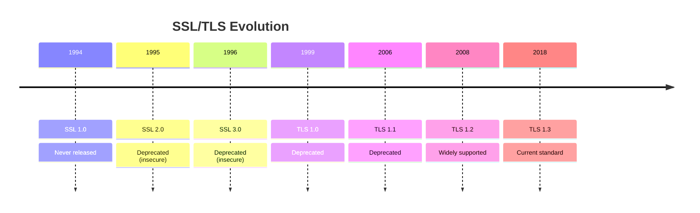

# SSL Certificates

SSL certificates are essential for securing web communications and building trust with users. Understanding SSL is crucial for DevOps security practices.

## What are SSL Certificates?

SSL (Secure Sockets Layer) certificates encrypt data transmitted between web browsers and servers, ensuring secure communication.

### Key Resources

- **[What is an SSL Certificate | Kaspersky](https://www.kaspersky.com/resource-center/definitions/what-is-a-ssl-certificate)**
  
  Comprehensive definition and explanation of SSL certificates and their importance.

- **[SSL Certificates Explained For Beginners | Steve's Internet Guide](http://www.steves-internet-guide.com/ssl-certificates-explained/)**
  
  Beginner-friendly guide covering SSL basics, types, and implementation.

## SSL Certificate Types

### Domain Validation (DV)
- Basic encryption
- Quick issuance
- Suitable for blogs and basic websites

### Organization Validation (OV)  
- Verified organization identity
- Higher trust level
- Recommended for business websites

### Extended Validation (EV)
- Highest trust level
- Extensive verification process
- Shows organization name in browser
- Ideal for e-commerce and financial sites

## SSL Implementation Best Practices

!!! tip "Security Best Practices"
    - Use strong encryption algorithms (TLS 1.2 or higher)
    - Implement HTTP Strict Transport Security (HSTS)
    - Regular certificate renewal and monitoring
    - Proper certificate chain configuration

## Certificate Management in DevOps

### Automation Considerations
- **Certificate Renewal**: Automate with tools like Let's Encrypt and Certbot
- **Monitoring**: Set up alerts for certificate expiration
- **Deployment**: Integrate certificate updates into CI/CD pipelines
- **Load Balancers**: Centralized SSL termination strategies

### Common Tools
- **Let's Encrypt**: Free, automated certificate authority
- **Certbot**: ACME client for Let's Encrypt certificates  
- **AWS Certificate Manager**: Managed SSL certificates for AWS services
- **Cloudflare**: SSL/TLS encryption and management

## Troubleshooting SSL Issues

| Issue | Symptoms | Common Causes | Solutions |
|-------|----------|---------------|-----------|
| Certificate Expired | Browser warnings | Forgotten renewal | Renew certificate, update automation |
| Mixed Content | Partial encryption | HTTP resources on HTTPS pages | Update all resources to HTTPS |
| Chain Issues | Untrusted certificate | Incomplete certificate chain | Install intermediate certificates |
| Name Mismatch | Certificate errors | Wrong domain in certificate | Issue certificate for correct domain |

## SSL/TLS Versions

!!! warning "Security Notice"
    Only use TLS 1.2 or TLS 1.3 in production environments. Older versions have known security vulnerabilities.

## Performance Considerations

### SSL/TLS Optimization
- **Session Resumption**: Reduce handshake overhead
- **OCSP Stapling**: Improve certificate validation performance
- **HTTP/2**: Leverage multiplexing with TLS
- **Cipher Suite Selection**: Balance security and performance

## Next Steps

With SSL knowledge, you're ready to:

- [Explore Domain Management](domains-dns.md)
- [Set up Linux Servers](../linux/introduction.md) with proper SSL configuration
- [Implement Container Security](../containers/security.md)

!!! info "DevOps Integration"
    SSL certificate management is a critical component of infrastructure automation, security compliance, and application deployment pipelines.