# Web Development Fundamentals

Understanding web development concepts is crucial for DevOps engineers who need to deploy, manage, and troubleshoot web applications. This knowledge forms the foundation for effective application lifecycle management, automation, and infrastructure design.

!!! info "Learning Objectives"
    After completing this section, you'll be able to:
    
    - Understand the Software Development Life Cycle (SDLC) and its phases
    - Explain how web applications work from frontend to backend
    - Use version control systems effectively for collaboration
    - Apply agile methodologies in DevOps contexts
    - Troubleshoot web applications using developer tools
    - Design deployment strategies for different application types

## Software Development Life Cycle (SDLC)

The SDLC provides a structured approach to developing software applications from conception to deployment and maintenance. Understanding these phases helps DevOps engineers design appropriate CI/CD pipelines and deployment strategies.

### SDLC Phases Overview

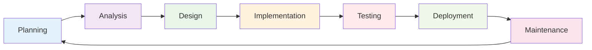

#### **1. Planning Phase**
- **Purpose**: Define project scope, requirements, and timeline
- **DevOps Impact**: Infrastructure requirements, deployment strategy planning
- **Key Activities**: Resource allocation, technology stack selection, architecture decisions

#### **2. Analysis Phase**
- **Purpose**: Detailed requirement gathering and feasibility analysis
- **DevOps Impact**: Performance requirements, scalability planning, security considerations
- **Key Activities**: Technical specifications, dependency analysis, risk assessment

#### **3. Design Phase**
- **Purpose**: System architecture and user interface design
- **DevOps Impact**: Deployment architecture, monitoring strategy, backup plans
- **Key Activities**: Database design, API specifications, infrastructure design

#### **4. Implementation Phase**
- **Purpose**: Actual code development and integration
- **DevOps Impact**: CI/CD pipeline setup, automated testing, code quality gates
- **Key Activities**: Coding, code reviews, continuous integration

#### **5. Testing Phase**
- **Purpose**: Quality assurance and bug identification
- **DevOps Impact**: Automated testing pipelines, performance testing, security testing
- **Key Activities**: Unit testing, integration testing, user acceptance testing

#### **6. Deployment Phase**
- **Purpose**: Release application to production environment
- **DevOps Impact**: Deployment automation, rollback strategies, monitoring setup
- **Key Activities**: Production deployment, configuration management, go-live support

#### **7. Maintenance Phase**
- **Purpose**: Ongoing support, updates, and improvements
- **DevOps Impact**: Monitoring, alerting, patch management, capacity planning
- **Key Activities**: Bug fixes, feature updates, performance optimization

### DevOps Integration in SDLC

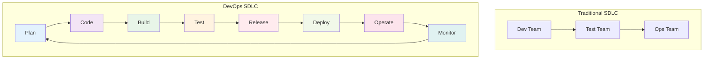

## Web Application Architecture

Understanding how web applications work is essential for deploying and managing them effectively.

### Three-Tier Architecture

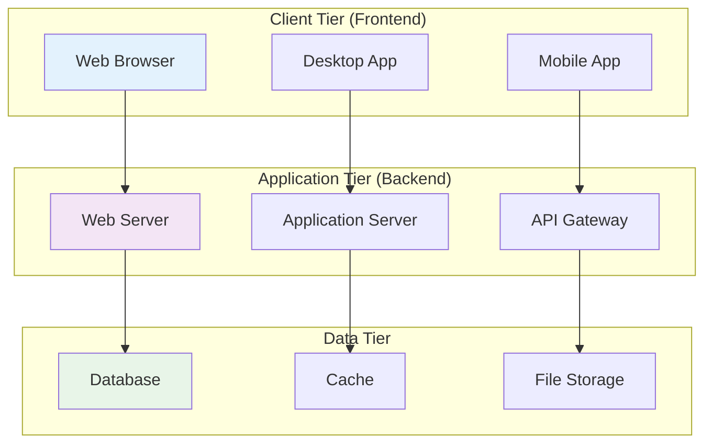

### Frontend Technologies

#### **HTML (Structure)**
- **Purpose**: Defines the structure and content of web pages
- **DevOps Relevance**: Static asset optimization, CDN configuration
- **Key Concepts**: Semantic markup, accessibility, SEO optimization

#### **CSS (Styling)**
- **Purpose**: Controls the presentation and layout of web pages
- **DevOps Relevance**: Asset bundling, minification, performance optimization
- **Key Concepts**: Responsive design, CSS frameworks, preprocessors

#### **JavaScript (Behavior)**
- **Purpose**: Adds interactivity and dynamic functionality
- **DevOps Relevance**: Bundle optimization, dependency management, security
- **Key Concepts**: ES6+, frameworks (React, Vue, Angular), build tools

### Backend Technologies

#### **Server-Side Languages**
- **Node.js**: JavaScript runtime for server-side development
- **Python**: Django, Flask frameworks for web development
- **Java**: Spring Boot for enterprise applications
- **PHP**: Laravel, Symfony for rapid development
- **C#**: .NET Core for Microsoft ecosystem

#### **Databases**
- **Relational**: PostgreSQL, MySQL, SQL Server
- **NoSQL**: MongoDB, Cassandra, Redis
- **NewSQL**: CockroachDB, TiDB

### API Design and Integration

#### RESTful APIs

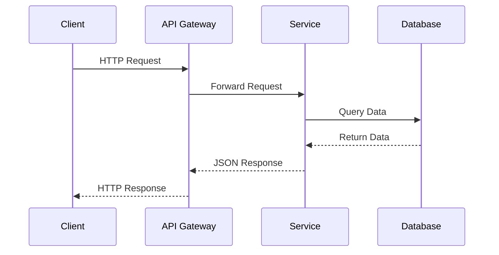

**REST Principles:**
- **Stateless**: Each request contains all necessary information
- **Cacheable**: Responses can be cached for performance
- **Uniform Interface**: Consistent URL patterns and HTTP methods
- **Layered System**: Intermediary layers for scalability and security

#### GraphQL APIs
- **Purpose**: Query language and runtime for APIs
- **Benefits**: Flexible data fetching, type safety, introspection
- **DevOps Considerations**: Caching strategies, query complexity analysis

## Version Control with Git

Version control is fundamental to modern software development and DevOps practices. Git enables collaboration, tracks changes, and supports branching strategies essential for CI/CD.

### Git Workflow

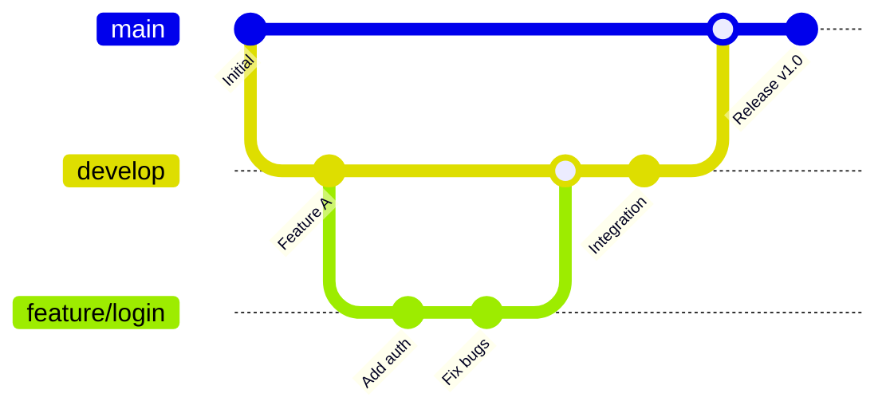

### Essential Git Commands for DevOps

```bash
# Repository Management
git init                    # Initialize repository
git clone <url>            # Clone remote repository
git remote add origin <url> # Add remote repository

# Daily Workflow
git status                 # Check working directory status
git add .                  # Stage changes
git commit -m "message"    # Commit changes
git push origin main       # Push to remote
git pull origin main       # Pull from remote

# Branching and Merging
git branch feature/new     # Create branch
git checkout feature/new   # Switch to branch
git checkout -b feature/new # Create and switch
git merge feature/new      # Merge branch
git branch -d feature/new  # Delete branch

# DevOps Specific Commands
git tag v1.0.0            # Create version tag
git log --oneline         # View commit history
git diff HEAD~1           # Compare with previous commit
git reset --hard HEAD~1   # Rollback (dangerous!)
```

### Git Branching Strategies

#### **GitFlow**
- **Main Branches**: `main` (production), `develop` (integration)
- **Supporting Branches**: `feature/*`, `release/*`, `hotfix/*`
- **Use Case**: Traditional release cycles, complex projects

#### **GitHub Flow**
- **Main Branch**: `main` (production-ready)
- **Feature Branches**: Short-lived, merged via pull requests
- **Use Case**: Continuous deployment, simple workflows

#### **GitLab Flow**
- **Environment Branches**: `main`, `staging`, `production`
- **Feature Branches**: Merged through environments
- **Use Case**: Multiple deployment environments

### Git Hooks for DevOps

```bash
# Pre-commit hook (runs before commit)
#!/bin/sh
# .git/hooks/pre-commit
npm run lint
npm run test

# Pre-push hook (runs before push)
#!/bin/sh
# .git/hooks/pre-push
npm run build
docker build -t app:latest .
```

## Development Tools and Debugging

### Browser Developer Tools

Essential for troubleshooting web applications in production and development.

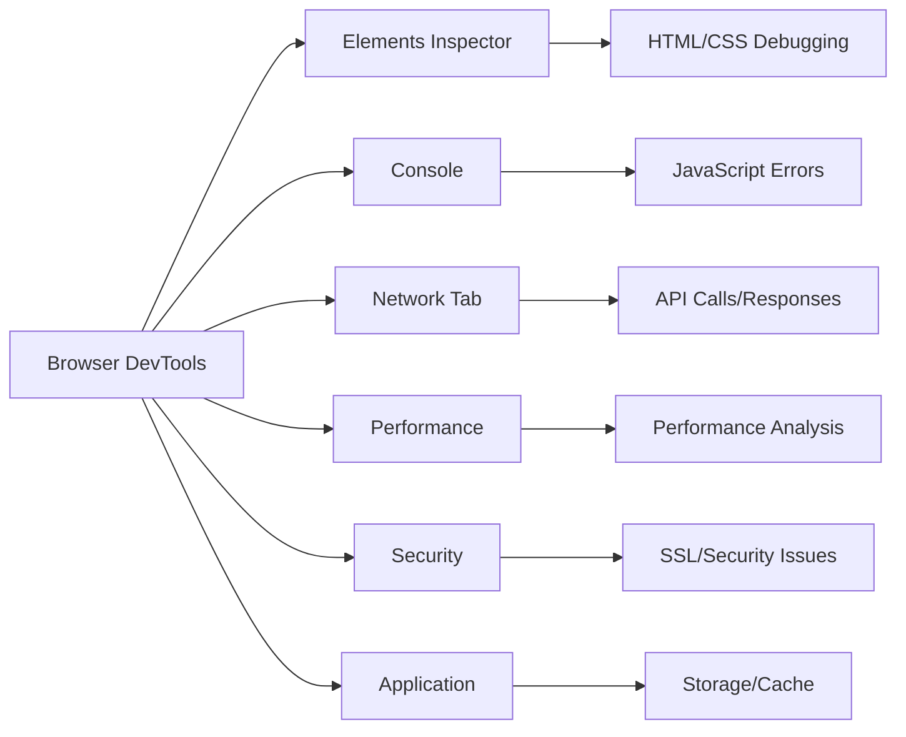

#### **Network Tab Analysis**
- **Request/Response Headers**: Debug API communication
- **Response Times**: Identify performance bottlenecks
- **Status Codes**: Troubleshoot HTTP errors
- **Payload Inspection**: Verify data transmission

#### **Console Debugging**
```javascript
// JavaScript debugging techniques
console.log('Debug info:', data);
console.error('Error occurred:', error);
console.table(arrayData);
console.time('operation');
// ... code to measure
console.timeEnd('operation');

// Performance monitoring
console.profile('Performance Analysis');
// ... code to profile
console.profileEnd();
```

### API Testing Tools

#### **Postman**
- **Purpose**: API development and testing
- **Features**: Collections, environments, automated testing
- **DevOps Integration**: CI/CD pipeline integration, monitoring

#### **curl Commands**
```bash
# GET request
curl -X GET https://api.example.com/users

# POST request with JSON
curl -X POST https://api.example.com/users \
  -H "Content-Type: application/json" \
  -d '{"name": "John", "email": "john@example.com"}'

# Authentication
curl -X GET https://api.example.com/protected \
  -H "Authorization: Bearer <token>"

# Save response to file
curl -X GET https://api.example.com/data -o response.json

# Include headers in output
curl -i https://api.example.com/health
```

## Agile and DevOps Integration

### Agile Methodologies

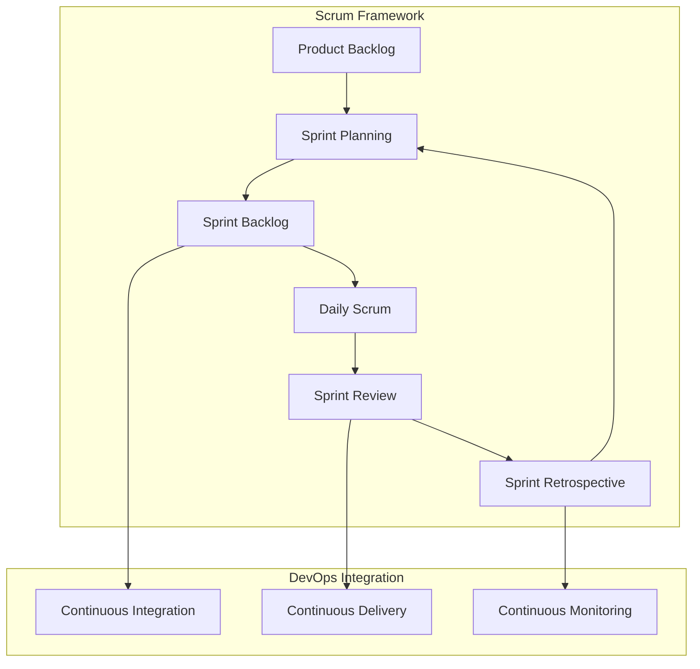

#### **Scrum Events and DevOps**
- **Sprint Planning**: Infrastructure and deployment planning
- **Daily Scrum**: Deployment status, pipeline issues
- **Sprint Review**: Demo in production-like environment
- **Sprint Retrospective**: Improve deployment processes

#### **DevOps Practices in Agile**
- **Definition of Done**: Includes deployment and monitoring
- **User Stories**: Include deployment and operational requirements
- **Acceptance Criteria**: Performance, security, and reliability requirements

### Kanban for DevOps

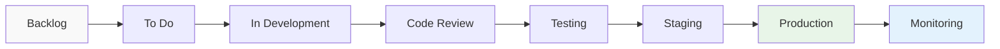

**Work-in-Progress (WIP) Limits:**
- Prevent bottlenecks in deployment pipeline
- Ensure smooth flow from development to production
- Identify constraints in the delivery process

## Static vs Dynamic Applications

### Static Sites

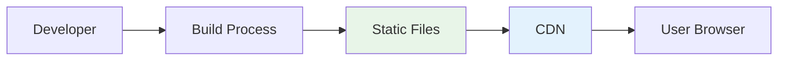

**Characteristics:**
- **Pre-built**: HTML, CSS, JS files generated at build time
- **Fast**: Served directly from CDN or web server
- **Scalable**: Easy to cache and distribute globally
- **Secure**: Reduced attack surface, no server-side vulnerabilities

**DevOps Advantages:**
- Simple deployment process
- Easy scaling and caching
- Reduced infrastructure requirements
- Version control friendly

**Popular Tools:**
- **Jekyll**: Ruby-based static site generator
- **Hugo**: Go-based, extremely fast builds
- **Gatsby**: React-based with GraphQL
- **Next.js**: React with static generation capabilities

### Dynamic Applications

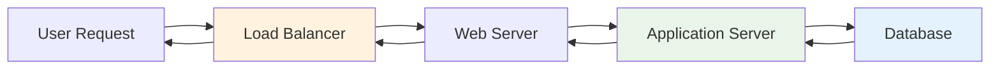

**Characteristics:**
- **Runtime Processing**: Content generated per request
- **Interactive**: User-specific content and functionality
- **Complex**: Multiple tiers and dependencies
- **Stateful**: Session management and data persistence

**DevOps Challenges:**
- Complex deployment pipelines
- Database migrations and state management
- Session handling and sticky sessions
- Scaling strategies (horizontal vs vertical)

## Performance Optimization

### Frontend Performance

#### **Critical Rendering Path**
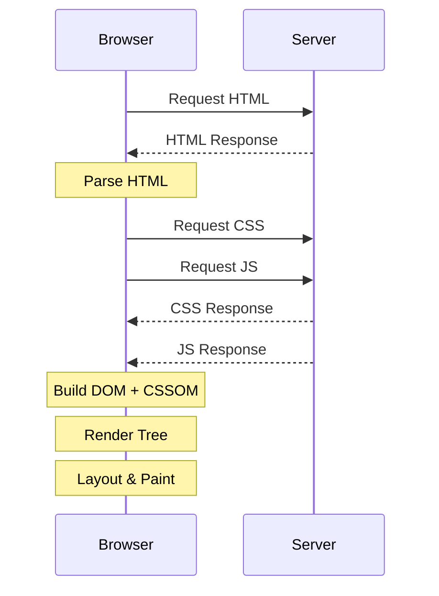

#### **Optimization Techniques**
- **Minification**: Remove whitespace and comments
- **Bundling**: Combine multiple files
- **Compression**: Gzip/Brotli compression
- **Caching**: Browser and CDN caching
- **Lazy Loading**: Load resources on demand

### Backend Performance

#### **Database Optimization**
```sql
-- Index optimization
CREATE INDEX idx_user_email ON users(email);

-- Query optimization
EXPLAIN ANALYZE SELECT * FROM users WHERE email = 'user@example.com';

-- Connection pooling configuration
max_connections = 100
shared_buffers = 256MB
```

#### **Application-Level Optimization**
- **Connection Pooling**: Reuse database connections
- **Caching**: Redis/Memcached for frequently accessed data
- **Async Processing**: Background jobs for heavy operations
- **Resource Optimization**: Memory and CPU usage monitoring

## Learning Resources

### **Interactive Tutorials**
- **[freeCodeCamp Web Development](https://www.freecodecamp.org/learn/responsive-web-design/)**
  - Hands-on coding challenges and projects
  - Certificate programs for different skill levels

- **[MDN Web Docs](https://developer.mozilla.org/en-US/docs/Learn)**
  - Comprehensive web development curriculum
  - Best practices and standards

### **Version Control**
- **[Git Tutorial | W3Schools](https://www.w3schools.com/git/default.asp?remote=gitlab)**
  - Comprehensive tutorial covering Git basics and advanced features
  - Interactive examples and exercises

- **[Atlassian Git Tutorials](https://www.atlassian.com/git/tutorials)**
  - In-depth Git concepts and workflows
  - Visual guides and best practices

### **Project Management**
- **[The Ultimate Introduction to Agile Project Management | Toptal](https://www.toptal.com/project-managers/agile/ultimate-introduction-to-agile-project-management)**
  - Comprehensive guide to agile methodologies and practices

- **[Get started with agile project management | Atlassian](https://www.atlassian.com/agile/project-management)**
  - Practical guide to implementing agile practices

### **Static Site Generators**
- **[How To Make a Static Website | W3Schools](https://www.w3schools.com/howto/howto_website_static.asp)**
  - Step-by-step tutorial for creating static websites

- **[Jamstack.org](https://jamstack.org/)**
  - Modern web development architecture
  - Best practices and case studies

### **Development Tools**
- **[Chrome DevTools Documentation](https://developer.chrome.com/docs/devtools/)**
  - Official documentation for browser debugging tools

- **[Postman Learning Center](https://learning.postman.com/)**
  - API development and testing tutorials

### **Performance Optimization**
- **[Web.dev Performance](https://web.dev/performance/)**
  - Google's performance optimization guides
  - Tools and metrics for measuring performance

- **[High Performance Browser Networking](https://hpbn.co/)**
  - Deep dive into web performance optimization

## DevOps Career Impact

Understanding web development fundamentals positions you for:

### **Full-Stack DevOps Engineer**
- Bridge development and operations teams
- Design end-to-end deployment pipelines
- Optimize application performance and reliability

### **Platform Engineer**
- Build developer productivity platforms
- Create self-service deployment tools
- Design scalable infrastructure abstractions

### **Site Reliability Engineer**
- Monitor and optimize application performance
- Design fault-tolerant systems
- Implement chaos engineering practices

### **Cloud Application Architect**
- Design cloud-native applications
- Implement microservices architectures
- Optimize for cost and performance

## Advanced Topics to Explore

Once comfortable with basics, explore:

- **Microservices Architecture**: Distributed systems design
- **API Gateway Patterns**: Traffic routing and management
- **Progressive Web Apps**: Modern web application features
- **WebAssembly**: High-performance web applications
- **Server-Side Rendering**: SEO and performance optimization
- **GraphQL Federation**: Distributed API architectures

## Next Steps

After mastering web development fundamentals, proceed to:

- [Hosting Solutions](hosting.md) - Learn about different hosting options and deployment strategies
- [Internet Protocols](protocols.md) - Deep dive into HTTP, TCP/IP, and other essential protocols
- [SSL Certificates](ssl.md) - Understand security and encryption for web applications
- [Domain Names & DNS](domains-dns.md) - Learn how domain resolution works

!!! tip "Practical Exercise"
    **Try This**: Create a simple web application using your preferred technology stack, set up a Git repository, implement a basic CI/CD pipeline using GitHub Actions, and deploy it to a cloud platform like Netlify or Vercel.

!!! warning "Important"
    These fundamentals directly impact how you'll architect and deploy applications in production environments. Understanding the development lifecycle helps you design better deployment strategies and troubleshoot issues more effectively.

## References and Further Reading

### **Primary Sources**
1. **[The Web Development Life Cycle | Better Programming](https://betterprogramming.pub/the-web-development-life-cycle-e7e2fd80fc55)** - Comprehensive guide explaining SDLC stages
2. **[Web Development Life Cycle - CS117](http://cs.tsu.edu/ghemri/CS117/ClassNotes/Web%20Development%20Life%20Cycle_small.htm)** - Academic overview of development processes
3. **[MDN Web Docs - Web Development Guide](https://developer.mozilla.org/en-US/docs/Web/Guide)** - Authoritative web development documentation

### **Version Control Resources**
4. **[Pro Git Book](https://git-scm.com/book/en/v2)** - Comprehensive Git documentation and tutorials
5. **[Atlassian Git Tutorials](https://www.atlassian.com/git/tutorials)** - Visual Git learning resources
6. **[GitHub Flow Guide](https://guides.github.com/introduction/flow/)** - Simple branching strategy for continuous deployment

### **Development Tools**
7. **[Chrome DevTools Protocol](https://chromedevtools.github.io/devtools-protocol/)** - Advanced debugging and automation
8. **[Postman API Network](https://www.postman.com/api-network/)** - API testing and documentation examples
9. **[Web Performance Working Group](https://www.w3.org/webperf/)** - Web performance standards and metrics

### **Agile and Project Management**
10. **[Scrum Guide](https://scrumguides.org/)** - Official Scrum framework documentation  
11. **[Kanban Guide for Scrum Teams](https://www.scrum.org/resources/kanban-guide-scrum-teams)** - Integrating Kanban with Scrum practices
12. **[State of DevOps Report](https://cloud.google.com/devops/state-of-devops)** - Annual research on DevOps practices and performance
