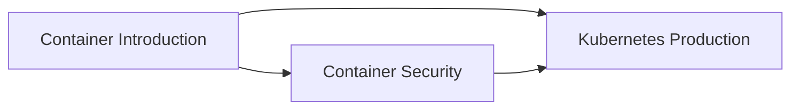

# Containers & Orchestration

Welcome to the Containers & Orchestration section! This section covers containerization technologies, security, and Kubernetes orchestration for modern DevOps practices.

## 🎯 Learning Objectives

By completing this section, you will:

- ✅ Master Docker containerization and container management
- ✅ Understand container security best practices
- ✅ Learn Kubernetes orchestration and production deployment
- ✅ Implement container networking and storage
- ✅ Design scalable container architectures

## 📚 Section Contents

### [Container Introduction](introduction.md)

Learn Docker fundamentals, container concepts, and containerization strategies.

### [Container Security](security.md)

Understand container security threats, vulnerability management, and security best practices.

### [Kubernetes Production](kubernetes-production.md)

Master Kubernetes deployment, management, and production-ready configurations.

## 🏁 Prerequisites

- Completed Linux & Systems section
- Basic understanding of networking concepts
- Familiarity with command line tools
- Understanding of web applications and services

## 📈 Learning Path

## 💡 Why This Matters

Containers are essential for modern DevOps because:

- **Portability**: Applications run consistently across environments
- **Scalability**: Easy horizontal scaling and resource optimization
- **Microservices**: Enable microservice architectures and service mesh
- **CI/CD**: Streamlined build, test, and deployment pipelines
- **Resource Efficiency**: Better resource utilization than traditional VMs

Let's containerize your DevOps skills! 🐳