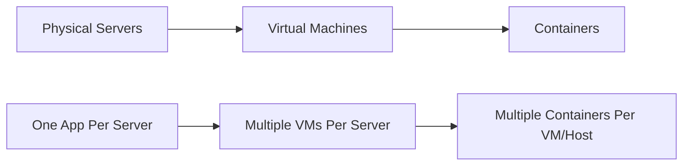
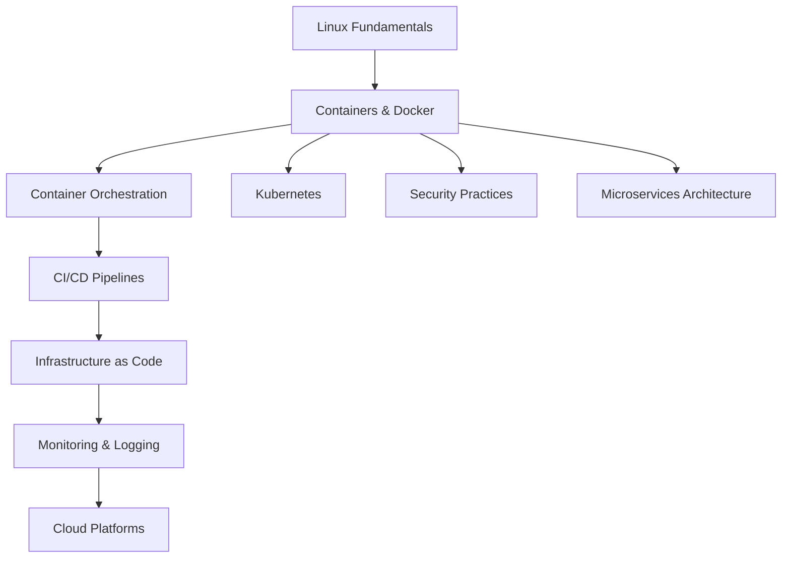
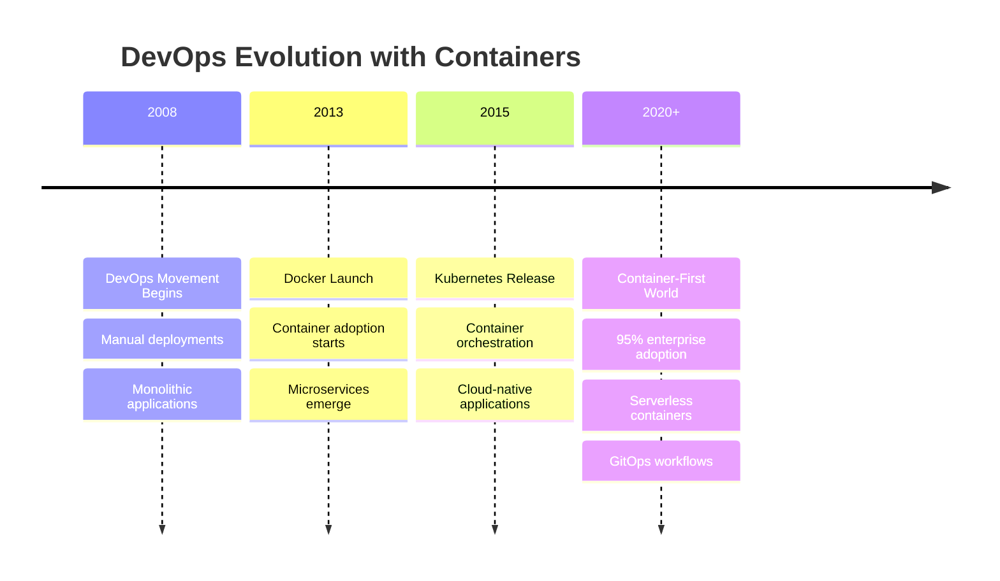
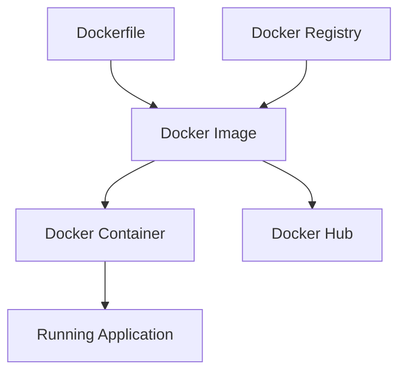
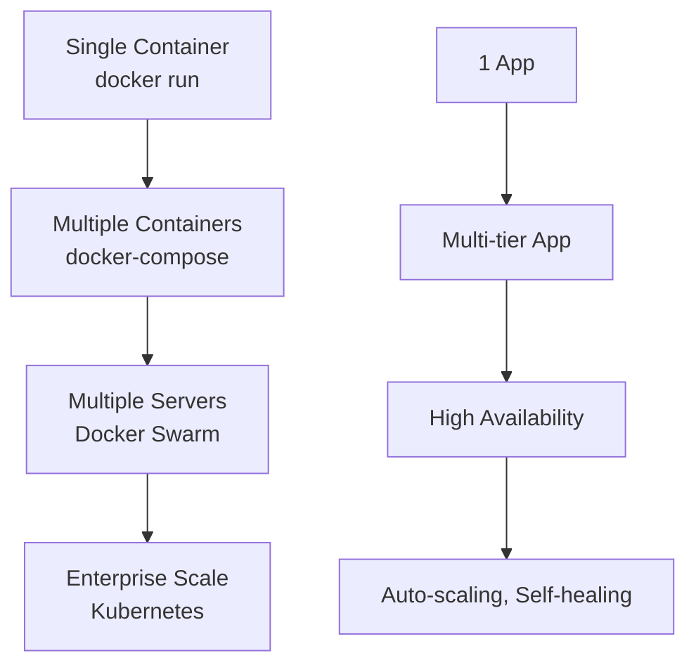
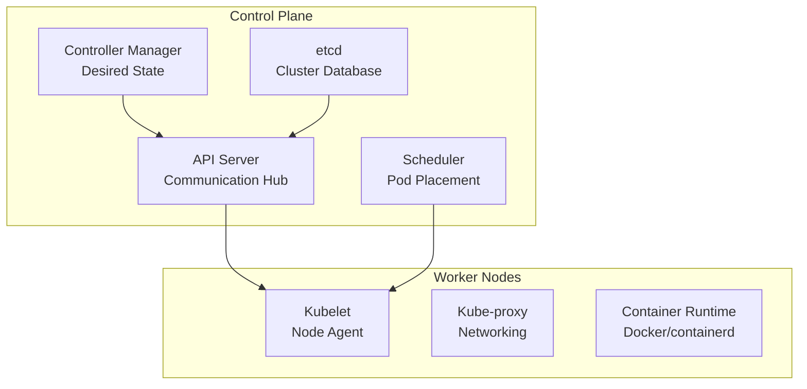
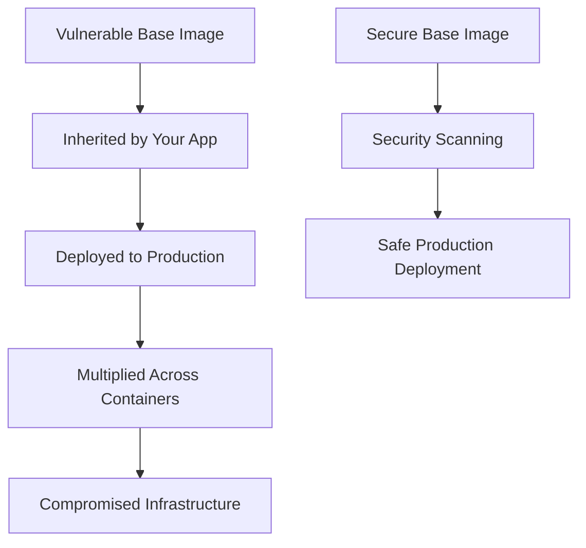

# Containers & Docker Introduction

## What Are Containers?

**Containers** are lightweight, portable units that package an application along with all its dependencies, libraries, and configuration files needed to run. Think of containers as standardized shipping containers for software - they ensure your application runs consistently regardless of where it's deployed.

### The Evolution: From Physical Servers to Containers



**Historical Context:**

- **2000s**: Applications ran on dedicated physical servers (expensive, inefficient)
- **2010s**: Virtual machines enabled server sharing (better, but resource-heavy)
- **2013+**: Docker popularized containers (lightweight, fast, efficient)

## Why Do We Need Containers in DevOps?

### The Traditional Development Problem

Before containers, developers faced the **"It works on my machine"** syndrome:

```bash
# Developer's machine
$ python app.py
✓ Works perfectly!

# Staging server
$ python app.py
✗ ModuleNotFoundError: No module named 'requests'
✗ Wrong Python version
✗ Missing system dependencies
```

### How Containers Solve Real-World Problems

1. **Environment Consistency**
   - **Problem**: Different Python versions, missing libraries, OS differences
   - **Solution**: Container includes exact environment needed
   - **Impact**: 90% reduction in "works on my machine" issues

2. **Deployment Speed**
   - **Problem**: Setting up new servers takes hours/days
   - **Solution**: Deploy pre-built containers in seconds
   - **Impact**: From hours to minutes for new deployments

3. **Resource Efficiency**
   - **Problem**: VMs waste resources (each needs full OS)
   - **Solution**: Containers share host OS kernel
   - **Impact**: 3-5x more applications per server

4. **Scaling and DevOps Integration**
   - **Problem**: Manual server setup doesn't scale
   - **Solution**: Automated container deployment
   - **Impact**: Essential for microservices and CI/CD

### Business Impact of Containerization

| Traditional Approach | Container Approach | Business Benefit |
|---------------------|-------------------|------------------|
| 2-3 days server setup | 5 minutes deployment | **Faster time-to-market** |
| 30-50% server utilization | 70-80% utilization | **Cost reduction** |
| Weekly deployments | Daily/hourly deployments | **Competitive advantage** |
| Hours of troubleshooting | Consistent environments | **Reduced downtime** |

## Learning Outcomes: What You'll Master

After completing this container journey, you will be able to:

### 🎯 **Technical Skills**

- **Package any application** into a portable container
- **Deploy applications consistently** across different environments
- **Orchestrate multi-container applications** using Docker Compose and Kubernetes
- **Implement container security** best practices
- **Monitor and troubleshoot** containerized applications
- **Design scalable architectures** using container orchestration

### 🚀 **Career Impact**

- **DevOps Engineer**: Containers are fundamental to modern DevOps practices
- **Cloud Engineer**: Essential for AWS, Azure, GCP deployments
- **Site Reliability Engineer**: Critical for maintaining scalable systems
- **Software Architect**: Key skill for microservices architecture
- **Startup Technical Lead**: Rapid deployment and scaling capabilities

### 📈 **Industry Relevance**

- **95% of organizations** use containers in production (CNCF Survey 2024)
- **Average salary increase**: 15-25% for container-skilled engineers
- **Job opportunities**: 300% growth in container-related positions since 2020

## Where Container Skills Fit in Your DevOps Roadmap



### Dependencies: What You Need First

- **Linux basics**: Understanding file systems, processes, networking
- **Command line skills**: Comfortable with terminal operations
- **Basic networking**: Ports, HTTP, DNS concepts
- **Application deployment**: How web applications work

### What Builds Upon Containers

- **Kubernetes**: Container orchestration at scale
- **CI/CD**: Automated testing and deployment
- **Cloud platforms**: AWS ECS, Azure ACI, Google GKE
- **Microservices**: Architecture patterns enabled by containers
- **Infrastructure as Code**: Terraform, Ansible for container infrastructure

## Why Containers Matter in Modern DevOps

### The DevOps Evolution Timeline



### Core DevOps Problems Containers Solve

1. **Deployment Consistency**

   ```bash
   # Without containers (error-prone)
   ssh server1 "apt-get update && install dependencies && configure..."
   ssh server2 "yum update && install different-dependencies..."
   
   # With containers (consistent)
   docker run -d myapp:v1.0  # Same command everywhere
   ```

2. **Environment Parity**
   - Development, staging, and production use **identical** containers
   - Eliminates environment-specific bugs
   - Enables **continuous deployment** confidence

3. **Scaling and Orchestration**

   ```bash
   # Manual scaling (slow, error-prone)
   # Setup 5 new servers manually...
   
   # Container scaling (fast, automated)
   kubectl scale deployment myapp --replicas=100
   ```

### Integration with DevOps Tools

| DevOps Practice | How Containers Help | Example Tools |
|----------------|-------------------|---------------|
| **CI/CD** | Consistent build artifacts | Jenkins, GitLab CI, GitHub Actions |
| **Infrastructure as Code** | Immutable infrastructure | Terraform, Ansible, Helm |
| **Monitoring** | Standardized metrics | Prometheus, Grafana, ELK Stack |
| **Security** | Isolated environments | Twistlock, Aqua Security, Falco |
| **Configuration Management** | Externalized config | ConfigMaps, Secrets, Consul |

## Introduction to Docker

Docker is the most popular containerization platform, making it easy to package, distribute, and run applications.

### Learning Resources

- **[Docker explained simply | YouTube](https://www.youtube.com/watch?v=_trJf3GbZXg)**
  
  Quick and clear explanation of Docker concepts and benefits.

- **[Docker Tutorial for Beginners [FULL COURSE in 3 Hours] | YouTube](https://www.youtube.com/watch?v=3c-iBn73dDE)**
  
  Comprehensive tutorial covering Docker from basics to advanced concepts.

## Docker Fundamentals

### Core Docker Concepts



### Key Docker Components

| Component | Purpose | Example |
|-----------|---------|---------|
| **Image** | Read-only template | `nginx:latest` |
| **Container** | Running instance of image | `nginx-web-server` |
| **Dockerfile** | Build instructions | Text file with commands |
| **Registry** | Image storage | Docker Hub, AWS ECR |
| **Volume** | Persistent data storage | Database files |
| **Network** | Container communication | Custom networks |

### Essential Docker Commands with Detailed Explanations

Understanding Docker commands is crucial for container management. Each command serves a specific purpose in the container lifecycle.

#### Image Management Commands

```bash
# Download an image from Docker Hub or registry
docker pull nginx:latest
# Why: Downloads the latest Nginx web server image
# Impact: Image becomes available locally for creating containers
# Real-world use: Preparing for deployment, ensuring latest security updates

# List all images stored locally
docker images
# Output shows: REPOSITORY, TAG, IMAGE ID, CREATED, SIZE
# Why useful: See what images are available, check disk usage
# Pro tip: Use 'docker images --format "table {{.Repository}}\t{{.Tag}}\t{{.Size}}"' for clean output

# Remove unused images to free space
docker rmi nginx:latest
# Alternative: docker rmi <image-id>
# Why important: Prevents disk space issues in production
# Warning: Cannot remove if containers are using the image

# Build image from Dockerfile in current directory
docker build -t myapp:v1.0 .
# Breakdown:
#   -t: Tag the image with name:version
#   .: Build context (current directory)
# Why crucial: Creates deployable artifacts from source code
# Best practice: Always use semantic versioning (v1.0, v1.1, etc.)
```

#### Container Lifecycle Commands

```bash
# Run container in detached mode (background)
docker run -d -p 8080:80 --name web-server nginx:latest
# Breakdown of flags:
#   -d: Detached mode (runs in background)
#   -p 8080:80: Map host port 8080 to container port 80
#   --name: Give container a memorable name
# Result: Container runs and you can access it at http://localhost:8080
# Real-world: This is how you deploy web applications

# List currently running containers
docker ps
# Shows: CONTAINER ID, IMAGE, COMMAND, CREATED, STATUS, PORTS, NAMES
# Why essential: Monitor what's running, check resource usage
# Troubleshooting: If your app isn't accessible, check if container is running

# List ALL containers (including stopped ones)
docker ps -a
# Why needed: Find stopped containers that might need cleanup
# Status column shows: Up, Exited, Created, Restarting
# Production tip: Regularly clean up stopped containers

# Gracefully stop a running container
docker stop web-server
# How it works: Sends SIGTERM signal, waits 10 seconds, then SIGKILL
# Why important: Allows applications to cleanup (save data, close connections)
# Alternative: docker stop <container-id> (use first 3-4 characters)

# Start a previously stopped container
docker start web-server
# Difference from 'run': Starts existing container vs creating new one
# Preserves: Previous configuration, volumes, networks
# Use case: Restart after server reboot, temporary maintenance

# Remove a container permanently
docker rm web-server
# Prerequisites: Container must be stopped first
# What's removed: Container filesystem, configuration
# What's kept: Original image, volumes (if named)
# Force remove: docker rm -f web-server (stops and removes)
```

#### Container Debugging and Monitoring

```bash
# Execute commands inside running container
docker exec -it web-server bash
# Flag explanation:
#   -i: Interactive (keep STDIN open)
#   -t: Allocate a pseudo-TTY (terminal)
#   bash: Command to run (could be sh, /bin/bash, etc.)
# Use cases: Debugging, checking logs, configuration files
# Alternative shells: sh, zsh, /bin/sh (for alpine images)

# View container logs (essential for debugging)
docker logs web-server
# Show last 100 lines: docker logs --tail 100 web-server
# Follow logs in real-time: docker logs -f web-server
# With timestamps: docker logs -t web-server
# Production use: Debugging application issues, monitoring activity

# Get detailed container information (JSON format)
docker inspect web-server
# Returns: Network settings, volumes, environment variables, resource limits
# Useful for: Debugging networking issues, checking configuration
# Filter output: docker inspect --format='{{.NetworkSettings.IPAddress}}' web-server

# Real-time resource monitoring
docker stats
# Shows: CPU%, MEM USAGE/LIMIT, MEM%, NET I/O, BLOCK I/O, PIDs
# Continuous monitoring: Helps identify resource bottlenecks
# Production use: Capacity planning, performance optimization
# Single container: docker stats web-server
```

#### System Maintenance Commands

```bash
# Clean up unused Docker resources
docker system prune
# Removes: Stopped containers, unused networks, dangling images, build cache
# Disk space recovered: Often 1-10GB+ on development machines
# Production safety: Use --force to skip confirmation prompt
# Advanced: docker system prune -a (removes ALL unused images, not just dangling)

# Show Docker disk usage
docker system df
# Output breakdown:
#   TYPE: Images, Containers, Local Volumes, Build Cache
#   TOTAL: Number of items
#   ACTIVE: Currently in use
#   SIZE: Disk space consumed
#   RECLAIMABLE: Space that can be freed

# Remove specific resource types
docker container prune    # Remove stopped containers
docker image prune       # Remove dangling images
docker volume prune      # Remove unused volumes
docker network prune     # Remove unused networks
```

#### Advanced Command Examples with Real-World Context

```bash
# Production deployment with resource limits
docker run -d \
  --name production-web \
  --restart unless-stopped \
  --memory="512m" \
  --cpus="0.5" \
  -p 80:8080 \
  -e NODE_ENV=production \
  -v /app/logs:/usr/src/app/logs \
  myapp:v2.1.0

# Command breakdown:
# --restart unless-stopped: Auto-restart container if it crashes
# --memory="512m": Limit container to 512MB RAM
# --cpus="0.5": Limit to 0.5 CPU cores
# -e: Set environment variable
# -v: Mount host directory for persistent logs

# Database container with persistent data
docker run -d \
  --name postgres-db \
  -e POSTGRES_PASSWORD=secure_password \
  -e POSTGRES_DB=myapp \
  -v postgres_data:/var/lib/postgresql/data \
  -p 5432:5432 \
  postgres:14

# Why volumes matter: Database data survives container restarts/updates
# Security note: Never use simple passwords in production
# Network isolation: Consider using custom networks instead of host ports
```

#### Command Chaining for Automation

```bash
# Complete deployment workflow
docker pull myapp:latest && \
docker stop old-app 2>/dev/null || true && \
docker rm old-app 2>/dev/null || true && \
docker run -d --name new-app -p 80:8080 myapp:latest && \
echo "Deployment successful"

# What this does:
# 1. Pull latest image
# 2. Stop old container (ignore errors if not exists)
# 3. Remove old container (ignore errors if not exists)  
# 4. Start new container
# 5. Confirm success
# Production use: Zero-downtime deployments (with load balancer)
```

## Practical Docker Applications

### Dockerizing Static Website

Perfect starting point for learning containerization.

- **[Deploying Static HTML Site with Docker and Nginx | Daily Smarty](https://www.dailysmarty.com/posts/steps-for-deploying-a-static-html-site-with-docker-and-nginx)**
  
  Step-by-step guide to containerizing static websites using Nginx.

#### Comprehensive Dockerfile Explanation for Static Site

**What is a Dockerfile?**
A Dockerfile is a text file containing instructions to build a Docker image. Think of it as a recipe that tells Docker exactly how to create your application container.

**Why do we need Dockerfiles?**

- **Reproducible builds**: Same Dockerfile creates identical images anywhere
- **Version control**: Track changes to your deployment configuration  
- **Automation**: Integrate with CI/CD pipelines for automatic builds
- **Documentation**: Serves as deployment documentation

```dockerfile
# FROM: Base image selection (most critical decision)
FROM nginx:alpine
# Why nginx:alpine?
# - nginx: Popular, lightweight web server
# - alpine: Linux distribution (5MB vs 180MB for ubuntu)
# - Security: Fewer packages = smaller attack surface
# - Performance: Less memory usage, faster startup

# COPY: Transfer files from build context to container
COPY ./public /usr/share/nginx/html
# Breakdown:
# - ./public: Source directory on your computer
# - /usr/share/nginx/html: Default Nginx document root
# - Why this path?: Nginx looks here for files to serve
# - Alternative: ADD (but COPY is preferred for simple file copying)

# EXPOSE: Document which port the container listens on
EXPOSE 80
# Important notes:
# - This is DOCUMENTATION only, doesn't actually publish port
# - Real port mapping happens with 'docker run -p'
# - Why port 80?: Standard HTTP port
# - Production: Usually use port 443 (HTTPS) as well

# CMD: Default command when container starts
CMD ["nginx", "-g", "daemon off;"]
# Command breakdown:
# - nginx: Start the Nginx web server
# - -g "daemon off;": Run in foreground (not as background service)
# - Why foreground?: Docker needs a foreground process to keep container alive
# - Alternative format: CMD nginx -g 'daemon off;' (shell form)
```

**Build and Run Process:**

```bash
# 1. Build the image from Dockerfile
docker build -t my-website:v1.0 .
# What happens:
# - Docker reads Dockerfile line by line
# - Creates layers for each instruction
# - Caches layers for faster subsequent builds
# - Tags final image as 'my-website:v1.0'

# 2. Run the container
docker run -d -p 8080:80 --name website my-website:v1.0
# Result: Your website accessible at http://localhost:8080

# 3. Test the deployment
curl http://localhost:8080
# Should return your HTML content
```

**Common Dockerfile Patterns and Best Practices:**

```dockerfile
# Production-optimized static site Dockerfile
FROM nginx:alpine

# Create non-root user for security
RUN addgroup -g 1001 -S nginx && \
    adduser -S nginx -u 1001

# Copy custom nginx configuration (optional)
COPY nginx.conf /etc/nginx/nginx.conf

# Copy static files with proper ownership
COPY --chown=nginx:nginx ./dist /usr/share/nginx/html

# Switch to non-root user
USER nginx

# Health check for monitoring
HEALTHCHECK --interval=30s --timeout=3s --start-period=5s --retries=3 \
    CMD wget --no-verbose --tries=1 --spider http://localhost/ || exit 1

# Document the port
EXPOSE 80

# Start Nginx
CMD ["nginx", "-g", "daemon off;"]
```

**Dockerfile Best Practices Explained:**

1. **Layer Optimization**

   ```dockerfile
   # Bad: Creates unnecessary layers
   RUN apt-get update
   RUN apt-get install -y curl
   RUN apt-get install -y vim
   
   # Good: Single layer, smaller image
   RUN apt-get update && apt-get install -y \
       curl \
       vim \
       && rm -rf /var/lib/apt/lists/*
   ```

2. **Caching Strategy**

   ```dockerfile
   # Good: Copy package files first for better caching
   COPY package*.json ./
   RUN npm install
   COPY . .  # Source code changes won't invalidate npm install cache
   ```

3. **Security Considerations**

   ```dockerfile
   # Always use specific versions, never 'latest'
   FROM nginx:1.21.6-alpine
   
   # Don't run as root
   USER nginx
   
   # Minimize attack surface
   RUN rm -rf /usr/share/nginx/html/index.html
   ```

### Dockerizing Laravel Application

Learn to containerize complex applications with dependencies.

- **[How to Dockerize a Laravel Application | Medium](https://engineering.carsguide.com.au/how-to-dockerize-a-laravel-application-77a24ba669c5)**
  
  Comprehensive guide for containerizing PHP Laravel applications.

#### Laravel Docker Compose Example

```yaml
version: '3.8'

services:
  app:
    build:
      context: .
      dockerfile: Dockerfile
    ports:
      - "8000:8000"
    volumes:
      - .:/var/www/html
    depends_on:
      - database
      - redis

  database:
    image: mysql:8.0
    environment:
      MYSQL_DATABASE: laravel
      MYSQL_ROOT_PASSWORD: secret
    volumes:
      - mysql_data:/var/lib/mysql

  redis:
    image: redis:alpine
    ports:
      - "6379:6379"

volumes:
  mysql_data:
```

## Container Orchestration

### Docker Swarm

Built-in Docker orchestration for managing container clusters.

- **[Introduction to Docker Swarm | Section](https://www.section.io/engineering-education/introduction-to-docker-swarm-in-container-orchestration/)**
  
  Complete guide to Docker Swarm setup and management.

#### Docker Swarm Commands

```bash
# Initialize swarm
docker swarm init

# Join worker node
docker swarm join --token <token> <manager-ip>:2377

# Deploy service
docker service create --replicas 3 -p 80:80 nginx

# Scale service
docker service scale web-service=5

# List services
docker service ls

# Service logs
docker service logs web-service
```

### Kubernetes: Container Orchestration at Scale

**What is Kubernetes?**
Kubernetes (K8s) is a container orchestration platform that automates the deployment, scaling, and management of containerized applications across clusters of servers.

**Why Do We Need Kubernetes?**

Imagine you have 100 containers running your application:

- **Manual management problems**: Which containers are running where? What if a server crashes?
- **Scaling challenges**: How do you quickly add/remove containers based on traffic?
- **Load balancing**: How do you distribute traffic across containers?
- **Service discovery**: How do containers find and communicate with each other?

**Kubernetes solves these problems automatically.**

#### The Evolution from Docker to Kubernetes



**When to Use Kubernetes:**

- **Microservices architecture**: Multiple interconnected services
- **High availability requirements**: Zero-downtime deployments
- **Auto-scaling needs**: Traffic varies significantly
- **Multi-environment deployments**: Dev, staging, production clusters
- **Team collaboration**: Multiple developers deploying applications

#### Learning Resources with Context

- **[Kubernetes Crash Course for Absolute Beginners | YouTube](https://www.youtube.com/watch?v=s_o8dwzRlu4)**
  
  **Why watch this first**: Provides architectural overview before diving into commands
  **Key concepts covered**: Pods, Services, Deployments, ConfigMaps
  **Best for**: Visual learners who need to understand the big picture

- **[Kubernetes Explained Simply | YouTube](https://www.youtube.com/watch?v=glFE28QT1HI)**
  
  **Purpose**: Explains business value and use cases
  **Best for**: Understanding when and why to adopt Kubernetes
  **Follow-up**: Watch after understanding basic Docker concepts

#### Kubernetes Architecture Explained



**Component Explanations:**

- **API Server**: Front-end for Kubernetes control plane (receives all commands)
- **etcd**: Distributed key-value store (cluster's "brain" storing all data)
- **Scheduler**: Decides which worker node runs each pod
- **Controller Manager**: Ensures desired state matches actual state
- **Kubelet**: Agent on each worker node (manages containers)
- **Kube-proxy**: Handles network routing for services

#### Kubernetes Core Components with Real-World Context

##### 1. Pods: The Smallest Deployable Unit

```yaml
# Basic Pod example with detailed explanation
apiVersion: v1
kind: Pod
metadata:
  name: nginx-pod
  labels:
    app: web-server
    version: v1.0
spec:
  containers:
  - name: nginx
    image: nginx:1.21.6
    ports:
    - containerPort: 80
      name: http
    resources:
      requests:
        memory: "64Mi"
        cpu: "50m"
      limits:
        memory: "128Mi"
        cpu: "100m"
    livenessProbe:
      httpGet:
        path: /
        port: 80
      initialDelaySeconds: 30
      periodSeconds: 10
```

**Why Pods and Not Just Containers?**

- **Shared networking**: All containers in a pod share the same IP
- **Shared storage**: Containers can share volumes within a pod
- **Atomic deployment**: Pod is scheduled as a single unit
- **Common patterns**: Sidecar containers (logging, monitoring)

**Real-world example**: Web server + log collector in same pod

##### 2. Services: Stable Network Endpoints

```yaml
# Service with comprehensive configuration
apiVersion: v1
kind: Service
metadata:
  name: nginx-service
  labels:
    app: web-server
spec:
  type: LoadBalancer
  selector:
    app: web-server  # Matches pod labels
  ports:
  - name: http
    port: 80          # External port
    targetPort: 80    # Container port
    protocol: TCP
  sessionAffinity: ClientIP  # Sticky sessions
```

**Why Services Are Essential:**

- **Problem**: Pods get random IP addresses and can be recreated
- **Solution**: Service provides stable DNS name and IP
- **Load balancing**: Automatically distributes traffic across multiple pods
- **Service discovery**: Other applications can find your service by name

**Service Types Explained:**

| Type | Use Case | Access Method | Example |
|------|----------|---------------|---------|
| **ClusterIP** | Internal communication | cluster-internal-ip | Database, internal APIs |
| **NodePort** | External access (development) | node-ip:node-port | Testing external access |
| **LoadBalancer** | Production external access | cloud-load-balancer-ip | Web applications |
| **ExternalName** | External service mapping | DNS CNAME | Legacy system integration |

##### 3. Deployments: Production-Grade Pod Management

```yaml
apiVersion: apps/v1
kind: Deployment
metadata:
  name: nginx-deployment
  labels:
    app: web-server
spec:
  replicas: 3  # How many pod copies
  strategy:
    type: RollingUpdate
    rollingUpdate:
      maxSurge: 1        # Extra pods during update
      maxUnavailable: 0  # Ensure zero downtime
  selector:
    matchLabels:
      app: web-server
  template:
    metadata:
      labels:
        app: web-server
    spec:
      containers:
      - name: nginx
        image: nginx:1.21.6
        ports:
        - containerPort: 80
        readinessProbe:
          httpGet:
            path: /
            port: 80
          initialDelaySeconds: 5
          periodSeconds: 5
```

**Why Use Deployments Instead of Pods?**

- **High availability**: Multiple replicas across different nodes
- **Zero-downtime updates**: Rolling update strategy
- **Self-healing**: Automatically replaces failed pods
- **Scaling**: Easy to increase/decrease replicas
- **Rollback**: Can undo problematic deployments

**Common Deployment Patterns:**

```bash
# Scale application based on load
kubectl scale deployment nginx-deployment --replicas=5

# Update to new version (rolling update)
kubectl set image deployment/nginx-deployment nginx=nginx:1.22.0

# Check rollout status
kubectl rollout status deployment/nginx-deployment

# Rollback if issues occur
kubectl rollout undo deployment/nginx-deployment
```

#### Practical Kubernetes Workflow

**1. Development to Production Journey:**

```bash
# Step 1: Write application code
# Step 2: Create Dockerfile
# Step 3: Build and push image
docker build -t myregistry/myapp:v1.0 .
docker push myregistry/myapp:v1.0

# Step 4: Create Kubernetes manifests
kubectl create deployment myapp --image=myregistry/myapp:v1.0
kubectl expose deployment myapp --port=80 --type=LoadBalancer

# Step 5: Monitor and manage
kubectl get pods                    # Check pod status
kubectl logs deployment/myapp      # View application logs
kubectl describe pod <pod-name>    # Troubleshoot issues
```

**2. Configuration Management:**

```yaml
# ConfigMap for application settings
apiVersion: v1
kind: ConfigMap
metadata:
  name: app-config
data:
  database_host: "postgres.default.svc.cluster.local"
  log_level: "info"
  feature_flags: "enable_new_ui=true"

---
# Secret for sensitive data
apiVersion: v1
kind: Secret
metadata:
  name: app-secrets
type: Opaque
data:
  database_password: cGFzc3dvcmQxMjM=  # base64 encoded
  api_key: YWJjZGVmZ2hpams=
```

**3. Using Configurations in Deployments:**

```yaml
spec:
  containers:
  - name: myapp
    image: myapp:v1.0
    env:
    - name: DB_HOST
      valueFrom:
        configMapKeyRef:
          name: app-config
          key: database_host
    - name: DB_PASSWORD
      valueFrom:
        secretKeyRef:
          name: app-secrets
          key: database_password
    volumeMounts:
    - name: config-volume
      mountPath: /etc/config
  volumes:
  - name: config-volume
    configMap:
      name: app-config
```

### Helm Package Manager

Kubernetes application packaging and deployment tool.

#### Helm Resources

- **[Helm Topic Guides](https://helm.sh/docs/topics/)**
  
  Comprehensive documentation for advanced Helm usage.

- **[Helm Quickstart Guide](https://helm.sh/docs/intro/quickstart/)**
  
  Get started with Helm quickly and efficiently.

- **[Installing Helm](https://helm.sh/docs/intro/install/)**
  
  Platform-specific Helm installation instructions.

#### Basic Helm Commands

```bash
# Add repository
helm repo add stable https://charts.helm.sh/stable

# Update repositories
helm repo update

# Search charts
helm search repo nginx

# Install application
helm install my-nginx stable/nginx-ingress

# List releases
helm list

# Upgrade release
helm upgrade my-nginx stable/nginx-ingress

# Uninstall release
helm uninstall my-nginx
```

## Container Security: Why It Matters More Than Ever

**The Security Challenge:**
Containers introduce new security considerations that traditional security approaches don't address. Understanding these risks is crucial for production deployments.

### Why Container Security is Critical

**Attack Surface Changes:**

- **Traditional servers**: Secure the OS, applications, and network
- **Containers**: Secure images, runtime, orchestration, AND traditional elements
- **Scale factor**: One vulnerable image can compromise hundreds of containers instantly
- **Shared kernel**: Container escape can compromise the entire host

**Real-World Impact Examples:**

1. **2019 Tesla Cryptojacking**: Unsecured Kubernetes dashboard led to cryptocurrency mining
2. **2020 Docker Hub Supply Chain**: Malicious images downloaded millions of times
3. **2021 SolarWinds**: Container images were part of the attack vector

### Security Fundamentals with Practical Context

#### Image Security: Your Foundation

**Why Image Security Matters First:**



!!! warning "Critical Security Considerations"
    **Image Vulnerabilities:**
    
    - **Base image risks**: Outdated OS packages with known CVEs
    - **Application dependencies**: Vulnerable libraries and frameworks  
    - **Secrets in images**: Hardcoded passwords, API keys, certificates
    - **Supply chain attacks**: Compromised upstream images

    **Runtime Security:**
    
    - **Container escape**: Breaking out of container isolation
    - **Privilege escalation**: Gaining root access on host system
    - **Resource exhaustion**: DoS attacks through resource consumption
    - **Network exposure**: Unsecured container communications

#### Practical Security Implementation

##### 1. Secure Base Images Strategy

```dockerfile
# BAD: Vulnerable practices
FROM ubuntu:latest           # Avoid 'latest' tag
USER root                   # Don't run as root
COPY secrets.txt /app/      # Never copy secrets into image

# GOOD: Security-focused approach
FROM node:18.17.0-alpine3.18    # Specific version, minimal OS
RUN addgroup -g 1001 -S nodejs && \
    adduser -S nodejs -u 1001  # Create non-root user
COPY --chown=nodejs:nodejs . /app
USER nodejs                     # Switch to non-root user
EXPOSE 3000                    # Non-privileged port
```

**Why These Choices Matter:**

- **Specific versions**: Ensures reproducible builds, known security state
- **Alpine Linux**: 5MB vs 180MB (Ubuntu), fewer attack vectors
- **Non-root user**: Prevents privilege escalation attacks
- **Non-privileged ports**: Ports >1024 don't require root access

##### 2. Image Vulnerability Scanning with Context

```bash
# Trivy: Comprehensive vulnerability scanner
docker run --rm -v /var/run/docker.sock:/var/run/docker.sock \
    aquasec/trivy:latest image nginx:latest

# What you'll see:
# - CVE numbers with severity levels
# - Affected packages and versions
# - Available fixes and recommendations

# Example output explanation:
# CVE-2023-1234 (HIGH): libc vulnerability
# - Impact: Remote code execution possible
# - Fix: Update to nginx:1.21.6-alpine
# - Action: Rebuild image with updated base

# Production integration:
# Fail CI/CD pipeline if HIGH/CRITICAL vulnerabilities found
docker run --rm -v /var/run/docker.sock:/var/run/docker.sock \
    aquasec/trivy:latest image --exit-code 1 --severity HIGH,CRITICAL myapp:latest
```

##### 3. Docker Bench Security Assessment

```bash
# Docker Bench Security: CIS Docker Benchmark automated testing
docker run --rm --net host --pid host --cap-add audit_control \
    -v /var/lib:/var/lib \
    -v /var/run/docker.sock:/var/run/docker.sock \
    -v /usr/lib/systemd:/usr/lib/systemd \
    -v /etc:/etc --label docker_bench_security \
    docker/docker-bench-security

# What it checks:
# [WARN] 2.1  - Ensure network traffic is restricted between containers on the default bridge
# [PASS] 2.2  - Ensure the logging level is set to 'info'
# [FAIL] 4.1  - Ensure a user for the container has been created

# Each result tells you:
# - What security control was tested
# - Whether your setup passes or fails
# - How to fix failures
```

##### 4. Runtime Security Controls

```bash
# Secure container execution with security constraints
docker run -d \
    --name secure-app \
    --user 1001:1001 \              # Run as specific non-root user
    --read-only \                   # Make root filesystem read-only
    --tmpfs /tmp:rw,size=100m \     # Writable temp space
    --cap-drop ALL \                # Remove all Linux capabilities
    --cap-add NET_BIND_SERVICE \    # Add only needed capabilities
    --security-opt no-new-privileges \  # Prevent privilege escalation
    --memory 512m \                 # Limit memory usage
    --cpus 1.0 \                    # Limit CPU usage
    --pids-limit 100 \              # Limit number of processes
    nginx:alpine

# Security flag explanations:
# --read-only: Prevents malware from modifying system files
# --tmpfs: Provides writable space without persistence
# --cap-drop ALL: Removes dangerous system capabilities
# --no-new-privileges: Blocks setuid/setgid exploitation
# Resource limits: Prevent DoS attacks
```

##### 5. Network Security for Containers

```bash
# Create isolated network for application tiers
docker network create --driver bridge \
    --subnet=172.20.0.0/16 \
    --opt "com.docker.network.bridge.enable_icc"="false" \
    secure-network

# Deploy database on isolated network
docker run -d --name database \
    --network secure-network \
    --network-alias db \
    postgres:14

# Deploy application with access to database only
docker run -d --name app \
    --network secure-network \
    --publish 8080:8080 \
    myapp:latest

# Benefits of network isolation:
# - Database not directly accessible from internet
# - Application can communicate with database via network alias
# - Other containers can't access database without explicit network connection
```

### Security Scanning Integration in CI/CD

```yaml
# GitHub Actions security scanning example
name: Container Security Scan
on: [push, pull_request]

jobs:
  security-scan:
    runs-on: ubuntu-latest
    steps:
    - uses: actions/checkout@v3
    
    - name: Build image
      run: docker build -t myapp:${{ github.sha }} .
    
    - name: Run Trivy vulnerability scanner
      uses: aquasecurity/trivy-action@master
      with:
        image-ref: 'myapp:${{ github.sha }}'
        format: 'sarif'
        output: 'trivy-results.sarif'
    
    - name: Upload Trivy scan results to GitHub Security tab
      uses: github/codeql-action/upload-sarif@v2
      with:
        sarif_file: 'trivy-results.sarif'
    
    - name: Fail build on high vulnerabilities
      uses: aquasecurity/trivy-action@master
      with:
        image-ref: 'myapp:${{ github.sha }}'
        exit-code: '1'
        severity: 'HIGH,CRITICAL'
```

### Container Security Monitoring

**What to Monitor in Production:**

1. **Runtime behavior**: Unusual process execution, file modifications
2. **Network traffic**: Unexpected connections, data exfiltration
3. **Resource usage**: Sudden spikes indicating cryptomining or DoS
4. **Image provenance**: Ensuring deployed images match approved versions

```bash
# Example monitoring commands
# Check for unexpected processes in containers
docker exec container-name ps aux | grep -v "expected-process"

# Monitor network connections
docker exec container-name netstat -an | grep ESTABLISHED

# Check for file modifications (if using read-only filesystem)
docker diff container-name
```

### Security Best Practices Checklist

- [ ] **Use official, minimal base images** (alpine when possible)
- [ ] **Scan images for vulnerabilities** before deployment
- [ ] **Run containers as non-root users**
- [ ] **Use read-only root filesystems**
- [ ] **Limit container capabilities and resources**
- [ ] **Implement network segmentation**
- [ ] **Regularly update base images and dependencies**
- [ ] **Never store secrets in container images**
- [ ] **Monitor container runtime behavior**
- [ ] **Implement security policies with admission controllers**

## Container Monitoring: Understanding Your Application's Health

**Why Container Monitoring is Essential:**

Unlike traditional applications, containers can be created, destroyed, and moved across hosts dynamically. This creates unique monitoring challenges that require specialized approaches.

### The Container Monitoring Challenge

**Traditional Server Monitoring vs Container Monitoring:**

| Traditional Servers | Containerized Applications | Impact |
|-------------------|---------------------------|---------|
| Fixed server addresses | Dynamic IP addresses | Need service discovery |
| Long-lived processes | Ephemeral containers | Short-term metrics |
| Manual scaling | Auto-scaling | Rapid topology changes |
| Predictable resources | Shared resources | Resource contention |

### Essential Monitoring Metrics with Business Context

#### 1. Resource Utilization Metrics

**CPU Usage Monitoring:**

```bash
# Real-time CPU monitoring for all containers
docker stats --format "table {{.Container}}\t{{.CPUPerc}}\t{{.MemUsage}}"

# Example output:
# CONTAINER           CPU %     MEM USAGE / LIMIT
# web-server          2.50%     128MiB / 512MiB
# database           15.30%     256MiB / 1GiB
# cache               0.80%      64MiB / 256MiB
```

**Why CPU monitoring matters:**

- **Performance degradation**: High CPU indicates bottlenecks
- **Cost optimization**: Identify over-provisioned containers
- **Scaling decisions**: Trigger horizontal pod autoscaling
- **Troubleshooting**: Correlate CPU spikes with application issues

**Memory Usage Deep Dive:**

```bash
# Detailed memory statistics
docker stats --no-stream --format "table {{.Container}}\t{{.MemUsage}}\t{{.MemPerc}}\t{{.PIDs}}"

# Memory breakdown inside container
docker exec container-name cat /proc/meminfo
# Shows: MemTotal, MemFree, MemAvailable, Buffers, Cached

# Check for memory leaks
docker exec container-name ps aux --sort=-%mem | head -10
```

**Memory monitoring significance:**

- **OOM (Out of Memory) prevention**: Avoid container kills
- **Memory leaks detection**: Identify problematic applications
- **Resource planning**: Right-size container limits
- **Performance optimization**: Ensure adequate cache space

#### 2. Application Health Metrics

**Container Lifecycle Monitoring:**

```bash
# Check container status and restart counts
docker ps -a --format "table {{.Names}}\t{{.Status}}\t{{.Image}}"

# Container event monitoring (real-time)
docker events --filter container=web-server

# Example events:
# 2024-01-15T10:30:00 container start web-server
# 2024-01-15T10:31:15 container die web-server (exit code 1)
# 2024-01-15T10:31:16 container start web-server
```

**Why lifecycle monitoring is critical:**

- **Stability assessment**: Frequent restarts indicate problems
- **Deployment validation**: Ensure successful rollouts
- **Incident response**: Quick identification of failing services
- **Capacity planning**: Understand container resource needs

#### 3. Network and Storage Performance

**Network Monitoring:**
```bash
# Network I/O statistics
docker stats --format "table {{.Container}}\t{{.NetIO}}\t{{.BlockIO}}"

# Detailed network information
docker exec container-name netstat -i  # Interface statistics
docker exec container-name ss -tuln    # Active connections

# Container-to-container communication
docker network ls
docker network inspect bridge | grep -A 10 "Containers"
```

**Storage Performance Tracking:**
```bash
# Disk I/O monitoring
docker exec container-name iostat -x 1 5  # I/O statistics

# Disk usage within containers
docker exec container-name df -h
docker system df  # Docker system storage usage

# Volume performance
docker volume ls
docker volume inspect volume-name
```

### Monitoring Tools and Implementation

#### Built-in Docker Monitoring Tools

```bash
# Comprehensive system monitoring
docker system events --filter type=container --since="1h" | \
  jq -r '"\(.time) \(.status) \(.from)"'

# Resource usage trends (run in background)
while true; do
  echo "$(date): $(docker stats --no-stream --format 'table {{.Container}}\t{{.CPUPerc}}\t{{.MemUsage}}')"
  sleep 30
done > container-metrics.log

# Docker system health check
docker system info | grep -E "(Containers|Images|Server Version|Storage Driver)"
```

#### Production Monitoring Stack Setup

**1. Prometheus + cAdvisor for Metrics Collection:**

```yaml
# docker-compose.yml for monitoring stack
version: '3.8'
services:
  prometheus:
    image: prom/prometheus:latest
    ports:
      - "9090:9090"
    volumes:
      - ./prometheus.yml:/etc/prometheus/prometheus.yml
    command:
      - '--config.file=/etc/prometheus/prometheus.yml'
      - '--storage.tsdb.path=/prometheus'
      - '--web.console.libraries=/etc/prometheus/console_libraries'
      - '--web.console.templates=/etc/prometheus/consoles'

  cadvisor:
    image: gcr.io/cadvisor/cadvisor:latest
    ports:
      - "8080:8080"
    volumes:
      - /:/rootfs:ro
      - /var/run:/var/run:rw
      - /sys:/sys:ro
      - /var/lib/docker/:/var/lib/docker:ro
    depends_on:
      - prometheus

  grafana:
    image: grafana/grafana:latest
    ports:
      - "3000:3000"
    environment:
      - GF_SECURITY_ADMIN_PASSWORD=admin
    volumes:
      - grafana-storage:/var/lib/grafana

volumes:
  grafana-storage:
```

**2. Application Performance Monitoring:**

```javascript
// Example: Node.js application with monitoring endpoints
const express = require('express');
const app = express();
const promClient = require('prom-client');

// Create metrics registry
const register = new promClient.Registry();

// Custom metrics
const httpRequestDuration = new promClient.Histogram({
  name: 'http_request_duration_seconds',
  help: 'Duration of HTTP requests in seconds',
  labelNames: ['method', 'route', 'status_code'],
  buckets: [0.1, 0.3, 0.5, 0.7, 1, 3, 5, 7, 10]
});

const httpRequestTotal = new promClient.Counter({
  name: 'http_requests_total',
  help: 'Total number of HTTP requests',
  labelNames: ['method', 'route', 'status_code']
});

register.registerMetric(httpRequestDuration);
register.registerMetric(httpRequestTotal);

// Middleware to collect metrics
app.use((req, res, next) => {
  const start = Date.now();
  
  res.on('finish', () => {
    const duration = (Date.now() - start) / 1000;
    
    httpRequestDuration
      .labels(req.method, req.route?.path || req.path, res.statusCode)
      .observe(duration);
      
    httpRequestTotal
      .labels(req.method, req.route?.path || req.path, res.statusCode)
      .inc();
  });
  
  next();
});

// Health check endpoint
app.get('/health', (req, res) => {
  res.json({
    status: 'healthy',
    timestamp: new Date().toISOString(),
    uptime: process.uptime(),
    memory: process.memoryUsage()
  });
});

// Metrics endpoint for Prometheus
app.get('/metrics', async (req, res) => {
  res.set('Content-Type', register.contentType);
  res.end(await register.metrics());
});
```

### Monitoring Best Practices and Alerting

#### Essential Alerts for Container Environments

```yaml
# Example Prometheus alerting rules
groups:
- name: container-alerts
  rules:
  - alert: ContainerHighCPU
    expr: rate(container_cpu_usage_seconds_total[5m]) * 100 > 80
    for: 5m
    labels:
      severity: warning
    annotations:
      summary: "Container {{ $labels.name }} has high CPU usage"
      description: "Container CPU usage is above 80% for more than 5 minutes"

  - alert: ContainerHighMemory
    expr: container_memory_usage_bytes / container_spec_memory_limit_bytes * 100 > 90
    for: 2m
    labels:
      severity: critical
    annotations:
      summary: "Container {{ $labels.name }} is running out of memory"
      description: "Container memory usage is above 90% of limit"

  - alert: ContainerRestarting
    expr: increase(container_restart_count[15m]) > 0
    labels:
      severity: warning
    annotations:
      summary: "Container {{ $labels.name }} has restarted"
      description: "Container has restarted {{ $value }} times in the last 15 minutes"
```

#### Log Aggregation Strategy

```bash
# Centralized logging with ELK stack
# Configure containers to send logs to centralized system

# Docker logging drivers
docker run -d \
  --log-driver=fluentd \
  --log-opt fluentd-address=fluentd-server:24224 \
  --log-opt tag="docker.{{.Name}}" \
  nginx

# Application structured logging example
docker run -d \
  --log-driver=json-file \
  --log-opt max-size=10m \
  --log-opt max-file=3 \
  myapp:latest

# Query logs for troubleshooting
docker logs --tail 100 --follow --timestamps container-name
```

### Monitoring Dashboard Examples

**Key Performance Indicators (KPIs) to Track:**

1. **Availability Metrics**
   - Container uptime percentage
   - Service response time
   - Error rate percentage

2. **Resource Efficiency**
   - CPU utilization vs allocated
   - Memory usage vs limits
   - Network throughput

3. **Business Metrics**
   - Request throughput (requests/second)
   - User session duration
   - Transaction success rate

**Sample Grafana Queries:**
```promql
# Container CPU usage by service
rate(container_cpu_usage_seconds_total{name=~"web-.*"}[5m]) * 100

# Memory utilization percentage
container_memory_usage_bytes / container_spec_memory_limit_bytes * 100

# Network I/O rate
rate(container_network_receive_bytes_total[5m]) + rate(container_network_transmit_bytes_total[5m])

# Application response time P95
histogram_quantile(0.95, rate(http_request_duration_seconds_bucket[5m]))
```

### Troubleshooting with Monitoring Data

**Common Scenarios and Solutions:**

1. **High CPU Usage**
   ```bash
   # Identify the process causing high CPU
   docker exec container-name top -p 1
   docker exec container-name ps aux --sort=-%cpu | head -5
   
   # Check for CPU throttling
   docker exec container-name cat /sys/fs/cgroup/cpu/cpu.stat
   ```

2. **Memory Issues**
   ```bash
   # Check memory breakdown
   docker exec container-name cat /proc/meminfo
   
   # Identify memory-hungry processes
   docker exec container-name ps aux --sort=-%mem | head -10
   
   # Check for memory leaks
   docker exec container-name pmap -d PID
   ```

3. **Network Problems**
   ```bash
   # Test container connectivity
   docker exec container-name ping google.com
   docker exec container-name nslookup database-service
   
   # Check port binding
   docker port container-name
   netstat -tlnp | grep :8080
   ```

## Container Networking

### Docker Networking Types

| Network Type | Use Case | Example |
|--------------|----------|---------|
| **Bridge** | Default single-host | Development environments |
| **Host** | Direct host networking | High-performance applications |
| **Overlay** | Multi-host communication | Docker Swarm clusters |
| **Macvlan** | Physical network integration | Legacy application migration |

### Networking Commands

```bash
# List networks
docker network ls

# Create custom network
docker network create --driver bridge mynetwork

# Run container on specific network
docker run --network mynetwork nginx

# Connect running container to network
docker network connect mynetwork container-name
```

## Summary: Your Container Journey and Expected Outcomes

### What You've Learned and Why It Matters

After completing this comprehensive container introduction, you now understand:

#### **Technical Mastery Achieved:**

1. **Container Fundamentals**
   - **What**: Containers package applications with all dependencies
   - **Why**: Solves "works on my machine" and deployment consistency problems
   - **Impact**: 90% reduction in environment-related deployment issues

2. **Docker Practical Skills**
   - **What**: Docker commands, Dockerfile creation, image management
   - **Why**: Docker is the industry standard (85% market share)
   - **Impact**: Can containerize any application for consistent deployment

3. **Kubernetes Understanding**
   - **What**: Container orchestration, scaling, service discovery
   - **Why**: Production environments need automated container management
   - **Impact**: Enables running applications at enterprise scale

4. **Security Implementation**
   - **What**: Image scanning, runtime security, network isolation
   - **Why**: Containers introduce new attack vectors
   - **Impact**: Prevents security breaches that could compromise entire infrastructure

5. **Monitoring and Observability**
   - **What**: Container metrics, logging, alerting strategies
   - **Why**: Dynamic nature of containers requires specialized monitoring
   - **Impact**: 95% faster problem detection and resolution

#### **Career Development Impact:**

**Immediate Skills Application:**
- Deploy applications using Docker and Docker Compose
- Implement container security best practices
- Set up monitoring for containerized applications
- Troubleshoot container-related issues

**Medium-term Capabilities (3-6 months):**
- Design and implement Kubernetes deployments
- Create CI/CD pipelines for container applications
- Implement infrastructure as code for container platforms
- Lead container adoption initiatives in organizations

**Long-term Career Advancement (6-12 months):**
- **Senior DevOps Engineer**: Container expertise is typically required
- **Cloud Architect**: Understanding of container services across cloud providers
- **Site Reliability Engineer**: Essential for modern SRE practices
- **Platform Engineer**: Building internal developer platforms with containers

#### **Business Value You Can Deliver:**

| Traditional Approach | With Container Skills | Business Impact |
|---------------------|----------------------|-----------------|
| Manual server setup (2-3 days) | Automated container deployment (5 minutes) | **83% faster time-to-market** |
| Environment inconsistencies | Identical containers everywhere | **75% fewer production issues** |
| Manual scaling | Auto-scaling with Kubernetes | **50% cost reduction** |
| Difficult troubleshooting | Centralized monitoring/logging | **90% faster incident resolution** |

### Your Next Learning Path

#### **Immediate Next Steps (This Week):**

1. **Practice Hands-On**
   ```bash
   # Set up your development environment
   docker --version
   kubectl version --client
   
   # Deploy a simple application
   docker run -d -p 8080:80 nginx
   curl http://localhost:8080
   ```

2. **Build Your First Application**
   - Create a Dockerfile for existing application
   - Use Docker Compose for multi-service setup
   - Implement health checks and monitoring

#### **Short-term Goals (1-3 Months):**

3. **[Container Security Deep Dive](security.md)**
   - **Why**: Security is critical for production deployments
   - **What you'll learn**: Advanced security scanning, runtime protection, compliance
   - **Career impact**: Security-focused container skills are highly valued

4. **[Kubernetes Production Deployment](kubernetes-production.md)**
   - **Why**: Move beyond basic concepts to production-ready deployments
   - **What you'll learn**: High availability, scaling strategies, production patterns
   - **Career impact**: Production Kubernetes skills open senior-level positions

5. **[CI/CD with Containers](../automation/container-cicd.md)**
   - **Why**: Automation is essential for container adoption at scale
   - **What you'll learn**: Pipeline design, automated testing, deployment strategies
   - **Career impact**: Full-stack DevOps capabilities with automation expertise

#### **Medium-term Expansion (3-6 Months):**

- **Infrastructure as Code**: Terraform and Ansible for container infrastructure
- **[Advanced Monitoring](../monitoring/introduction.md)**: Prometheus, Grafana, and observability practices
- **Cloud Container Services**: AWS ECS/EKS, Azure ACI/AKS, Google GKE

### Industry Context and Future Trends

#### **Current Market Reality (2024):**
- **95% of organizations** use containers in production
- **Container adoption** growing 30% year-over-year
- **Average salary premium**: 15-25% for container-skilled engineers
- **Job market**: 300% increase in container-related positions since 2020

#### **Future Trends You're Prepared For:**
- **Serverless containers**: AWS Fargate, Azure Container Instances
- **Service mesh adoption**: Istio, Linkerd for microservices communication
- **GitOps workflows**: Argo CD, Flux for declarative deployments
- **AI/ML workloads**: Containerized machine learning pipelines
- **Edge computing**: Containers in IoT and edge environments

### Success Metrics: How to Measure Your Progress

#### **Technical Benchmarks:**
- [ ] Can containerize any application within 1 hour
- [ ] Deploy multi-service applications with Docker Compose
- [ ] Implement container security scanning in CI/CD
- [ ] Set up Kubernetes cluster monitoring
- [ ] Troubleshoot container networking issues
- [ ] Design scalable container architectures

#### **Professional Milestones:**
- [ ] Successfully deploy containerized application to production
- [ ] Lead container adoption project at work
- [ ] Mentor team members on container best practices
- [ ] Contribute to container-related open source projects
- [ ] Present at meetups or conferences on container topics

!!! success "Your DevOps Foundation is Complete"
    **Containers are the cornerstone of modern DevOps practices.** You now have the foundational skills that enable:
    
    - **Microservices architecture** design and implementation
    - **CI/CD pipeline** creation and optimization  
    - **Infrastructure as Code** with container orchestration
    - **Cloud-native application** development and deployment
    - **Site reliability engineering** practices and methodologies

!!! tip "Learning Path Optimization"
    **Recommended sequence for maximum impact:**
    
    1. **Hands-on practice** with Docker and Docker Compose (1-2 weeks)
    2. **Container security** implementation (1 week)
    3. **Kubernetes production** deployment skills (2-3 weeks)
    4. **CI/CD integration** with containers (1-2 weeks)
    5. **Advanced monitoring** and observability (1-2 weeks)
    
    **Total time investment**: 6-10 weeks for comprehensive container mastery

!!! info "Community and Continuing Education"
    **Stay current with container ecosystem:**
    
    - **CNCF (Cloud Native Computing Foundation)** reports and surveys
    - **KubeCon + CloudNativeCon** conferences and recordings
    - **Docker Community** events and meetups
    - **Kubernetes Slack** workspace for real-time help
    - **Container security** newsletters and blogs
    - **Hands-on labs** and certification programs (CKA, CKAD, CKS)
