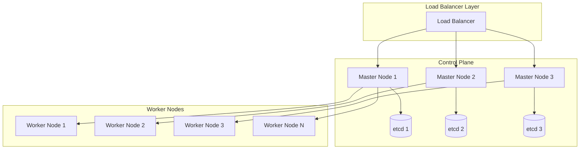

# Kubernetes Production Deployment

This guide covers advanced Kubernetes production deployment strategies, cluster management, and enterprise-grade configurations for running containers at scale.

## Production Cluster Architecture

### High Availability Cluster Setup



### Cluster Sizing and Capacity Planning

#### Control Plane Sizing

```bash
# Minimum production requirements
# Master nodes: 3 nodes for HA
# CPU: 4 cores per master
# RAM: 8GB per master
# Storage: 100GB SSD per master

# Example terraform configuration for AWS EKS
resource "aws_eks_cluster" "production" {
  name     = "production-cluster"
  role_arn = aws_iam_role.cluster.arn
  version  = "1.24"

  vpc_config {
    subnet_ids              = var.subnet_ids
    endpoint_private_access = true
    endpoint_public_access  = true
    public_access_cidrs    = ["0.0.0.0/0"]
  }

  enabled_cluster_log_types = [
    "api",
    "audit",
    "authenticator",
    "controllerManager",
    "scheduler"
  ]

  encryption_config {
    provider {
      key_arn = aws_kms_key.cluster.arn
    }
    resources = ["secrets"]
  }
}

# Node groups with different instance types
resource "aws_eks_node_group" "general" {
  cluster_name    = aws_eks_cluster.production.name
  node_group_name = "general"
  node_role_arn   = aws_iam_role.node.arn
  subnet_ids      = var.private_subnet_ids

  scaling_config {
    desired_size = 3
    max_size     = 10
    min_size     = 3
  }

  instance_types = ["t3.large"]
  capacity_type  = "ON_DEMAND"
  
  # Use latest EKS optimized AMI
  ami_type = "AL2_x86_64"
  
  update_config {
    max_unavailable = 1
  }

  launch_template {
    name    = aws_launch_template.node_group.name
    version = "$Latest"
  }
}
```

### Node Configuration and Management

#### Node Labeling and Taints

```bash
# Label nodes for specific workloads
kubectl label nodes worker-1 workload-type=compute-intensive
kubectl label nodes worker-2 workload-type=memory-intensive
kubectl label nodes worker-3 workload-type=general

# Add taints to dedicated nodes
kubectl taint nodes gpu-node-1 nvidia.com/gpu=true:NoSchedule
kubectl taint nodes database-node dedicated=database:NoSchedule

# Remove taints
kubectl taint nodes node-1 key1=value1:NoSchedule-

# Node selector example
apiVersion: apps/v1
kind: Deployment
metadata:
  name: compute-app
spec:
  replicas: 3
  selector:
    matchLabels:
      app: compute-app
  template:
    metadata:
      labels:
        app: compute-app
    spec:
      nodeSelector:
        workload-type: compute-intensive
      containers:
      - name: app
        image: compute-app:v1.0.0
```

#### Node Affinity and Anti-Affinity

```yaml
# Advanced node affinity
apiVersion: apps/v1
kind: Deployment
metadata:
  name: database
spec:
  replicas: 3
  selector:
    matchLabels:
      app: database
  template:
    metadata:
      labels:
        app: database
    spec:
      affinity:
        nodeAffinity:
          requiredDuringSchedulingIgnoredDuringExecution:
            nodeSelectorTerms:
            - matchExpressions:
              - key: node-type
                operator: In
                values:
                - database
          preferredDuringSchedulingIgnoredDuringExecution:
          - weight: 100
            preference:
              matchExpressions:
              - key: zone
                operator: In
                values:
                - us-west-2a
        podAntiAffinity:
          requiredDuringSchedulingIgnoredDuringExecution:
          - labelSelector:
              matchExpressions:
              - key: app
                operator: In
                values:
                - database
            topologyKey: kubernetes.io/hostname
      tolerations:
      - key: dedicated
        operator: Equal
        value: database
        effect: NoSchedule
      containers:
      - name: postgres
        image: postgres:14
        resources:
          requests:
            memory: "2Gi"
            cpu: "1000m"
          limits:
            memory: "4Gi"
            cpu: "2000m"
```

## Production Deployment Strategies

### Blue-Green Deployments

```yaml
# Blue deployment (current production)
apiVersion: apps/v1
kind: Deployment
metadata:
  name: app-blue
  labels:
    app: myapp
    version: blue
spec:
  replicas: 3
  selector:
    matchLabels:
      app: myapp
      version: blue
  template:
    metadata:
      labels:
        app: myapp
        version: blue
    spec:
      containers:
      - name: app
        image: myapp:v1.0.0
        ports:
        - containerPort: 8080

---
# Green deployment (new version)
apiVersion: apps/v1
kind: Deployment
metadata:
  name: app-green
  labels:
    app: myapp
    version: green
spec:
  replicas: 3
  selector:
    matchLabels:
      app: myapp
      version: green
  template:
    metadata:
      labels:
        app: myapp
        version: green
    spec:
      containers:
      - name: app
        image: myapp:v2.0.0
        ports:
        - containerPort: 8080

---
# Service that can switch between blue and green
apiVersion: v1
kind: Service
metadata:
  name: app-service
spec:
  selector:
    app: myapp
    version: blue  # Change to 'green' for cutover
  ports:
  - port: 80
    targetPort: 8080
    protocol: TCP
```

### Canary Deployments with Flagger

```yaml
# Flagger canary configuration
apiVersion: flagger.app/v1beta1
kind: Canary
metadata:
  name: app-canary
  namespace: production
spec:
  # deployment reference
  targetRef:
    apiVersion: apps/v1
    kind: Deployment
    name: app
  # the maximum time in seconds for the canary deployment
  progressDeadlineSeconds: 60
  # HPA reference (optional)
  autoscalerRef:
    apiVersion: autoscaling/v2beta2
    kind: HorizontalPodAutoscaler
    name: app
  service:
    # ClusterIP port number
    port: 80
    # container port number or name (optional)
    targetPort: 8080
    # Istio gateways (optional)
    gateways:
    - public-gateway.istio-system.svc.cluster.local
    # Istio virtual service host names (optional)
    hosts:
    - app.example.com
  analysis:
    # schedule interval (default 60s)
    interval: 1m
    # max number of failed metric checks before rollback
    threshold: 5
    # max traffic percentage routed to canary
    maxWeight: 50
    # canary increment step
    stepWeight: 10
    # Prometheus checks
    metrics:
    - name: request-success-rate
      # minimum req success rate (non 5xx responses)
      thresholdRange:
        min: 99
      interval: 1m
    - name: request-duration
      # maximum req duration P99
      thresholdRange:
        max: 500
      interval: 30s
    # testing (optional)
    webhooks:
      - name: acceptance-test
        type: pre-rollout
        url: http://flagger-loadtester.test/
        timeout: 30s
        metadata:
          type: bash
          cmd: "curl -sd 'test' http://app-canary.production/token | grep token"
      - name: load-test
        url: http://flagger-loadtester.test/
        timeout: 5s
        metadata:
          cmd: "hey -z 1m -q 10 -c 2 http://app-canary.production/"
```

### Rolling Updates with Readiness Probes

```yaml
apiVersion: apps/v1
kind: Deployment
metadata:
  name: rolling-update-app
spec:
  replicas: 10
  strategy:
    type: RollingUpdate
    rollingUpdate:
      maxUnavailable: 25%
      maxSurge: 25%
  selector:
    matchLabels:
      app: rolling-app
  template:
    metadata:
      labels:
        app: rolling-app
    spec:
      containers:
      - name: app
        image: myapp:v2.0.0
        ports:
        - containerPort: 8080
        readinessProbe:
          httpGet:
            path: /health/ready
            port: 8080
          initialDelaySeconds: 5
          periodSeconds: 5
          timeoutSeconds: 3
          successThreshold: 1
          failureThreshold: 3
        livenessProbe:
          httpGet:
            path: /health/live
            port: 8080
          initialDelaySeconds: 30
          periodSeconds: 10
          timeoutSeconds: 5
          failureThreshold: 3
        startupProbe:
          httpGet:
            path: /health/startup
            port: 8080
          initialDelaySeconds: 10
          periodSeconds: 5
          timeoutSeconds: 3
          failureThreshold: 30
        lifecycle:
          preStop:
            exec:
              command: ["/bin/sh", "-c", "sleep 15"]
        resources:
          requests:
            memory: "256Mi"
            cpu: "100m"
          limits:
            memory: "512Mi"
            cpu: "500m"
```

## Persistent Storage in Production

### StorageClass Configuration

```yaml
# AWS EBS StorageClass
apiVersion: storage.k8s.io/v1
kind: StorageClass
metadata:
  name: fast-ssd
provisioner: ebs.csi.aws.com
parameters:
  type: gp3
  iops: "3000"
  throughput: "125"
  encrypted: "true"
allowVolumeExpansion: true
volumeBindingMode: WaitForFirstConsumer
reclaimPolicy: Delete

---
# Azure Disk StorageClass
apiVersion: storage.k8s.io/v1
kind: StorageClass
metadata:
  name: managed-premium
provisioner: disk.csi.azure.com
parameters:
  storageaccounttype: Premium_LRS
  kind: Managed
  cachingmode: ReadOnly
allowVolumeExpansion: true
volumeBindingMode: WaitForFirstConsumer
reclaimPolicy: Delete

---
# Database with persistent storage
apiVersion: apps/v1
kind: StatefulSet
metadata:
  name: postgres-cluster
spec:
  serviceName: postgres-cluster
  replicas: 3
  selector:
    matchLabels:
      app: postgres
  template:
    metadata:
      labels:
        app: postgres
    spec:
      containers:
      - name: postgres
        image: postgres:14
        env:
        - name: POSTGRES_DB
          value: productiondb
        - name: POSTGRES_USER
          valueFrom:
            secretKeyRef:
              name: postgres-secret
              key: username
        - name: POSTGRES_PASSWORD
          valueFrom:
            secretKeyRef:
              name: postgres-secret
              key: password
        volumeMounts:
        - name: postgres-storage
          mountPath: /var/lib/postgresql/data
        resources:
          requests:
            memory: "2Gi"
            cpu: "1"
          limits:
            memory: "4Gi"
            cpu: "2"
  volumeClaimTemplates:
  - metadata:
      name: postgres-storage
    spec:
      accessModes: ["ReadWriteOnce"]
      storageClassName: fast-ssd
      resources:
        requests:
          storage: 100Gi
```

### Backup and Recovery

```yaml
# Velero backup configuration
apiVersion: v1
kind: ConfigMap
metadata:
  name: backup-config
  namespace: velero
data:
  backup-schedule.yaml: |
    apiVersion: velero.io/v1
    kind: Schedule
    metadata:
      name: daily-backup
      namespace: velero
    spec:
      schedule: "0 1 * * *"  # Daily at 1 AM
      template:
        includedNamespaces:
        - production
        - staging
        excludedResources:
        - events
        - events.events.k8s.io
        ttl: 720h0m0s  # 30 days
        storageLocation: default
        volumeSnapshotLocations:
        - default

---
# Database backup CronJob
apiVersion: batch/v1
kind: CronJob
metadata:
  name: postgres-backup
  namespace: production
spec:
  schedule: "0 2 * * *"  # Daily at 2 AM
  jobTemplate:
    spec:
      template:
        spec:
          containers:
          - name: postgres-backup
            image: postgres:14
            command:
            - /bin/bash
            - -c
            - |
              export PGPASSWORD=$POSTGRES_PASSWORD
              pg_dump -h postgres-cluster -U $POSTGRES_USER $POSTGRES_DB > /backup/backup-$(date +%Y%m%d-%H%M%S).sql
              find /backup -name "backup-*.sql" -mtime +7 -delete
            env:
            - name: POSTGRES_DB
              value: productiondb
            - name: POSTGRES_USER
              valueFrom:
                secretKeyRef:
                  name: postgres-secret
                  key: username
            - name: POSTGRES_PASSWORD
              valueFrom:
                secretKeyRef:
                  name: postgres-secret
                  key: password
            volumeMounts:
            - name: backup-storage
              mountPath: /backup
          volumes:
          - name: backup-storage
            persistentVolumeClaim:
              claimName: backup-pvc
          restartPolicy: OnFailure
```

## Service Mesh Implementation

### Istio Production Configuration

```yaml
# Istio installation configuration
apiVersion: install.istio.io/v1alpha1
kind: IstioOperator
metadata:
  name: control-plane
spec:
  values:
    global:
      meshID: mesh1
      multiCluster:
        clusterName: cluster1
      network: network1
    pilot:
      env:
        EXTERNAL_ISTIOD: false
  components:
    pilot:
      k8s:
        resources:
          requests:
            cpu: 500m
            memory: 2048Mi
          limits:
            cpu: 1000m
            memory: 4096Mi
    ingressGateways:
    - name: istio-ingressgateway
      enabled: true
      k8s:
        service:
          type: LoadBalancer
        resources:
          requests:
            cpu: 100m
            memory: 128Mi
          limits:
            cpu: 2000m
            memory: 1024Mi
    egressGateways:
    - name: istio-egressgateway
      enabled: true

---
# Gateway configuration
apiVersion: networking.istio.io/v1beta1
kind: Gateway
metadata:
  name: production-gateway
  namespace: istio-system
spec:
  selector:
    istio: ingressgateway
  servers:
  - port:
      number: 80
      name: http
      protocol: HTTP
    hosts:
    - "*.example.com"
    tls:
      httpsRedirect: true
  - port:
      number: 443
      name: https
      protocol: HTTPS
    tls:
      mode: SIMPLE
      credentialName: example-com-tls
    hosts:
    - "*.example.com"

---
# Virtual Service with traffic splitting
apiVersion: networking.istio.io/v1beta1
kind: VirtualService
metadata:
  name: app-virtualservice
  namespace: production
spec:
  hosts:
  - app.example.com
  gateways:
  - istio-system/production-gateway
  http:
  - match:
    - headers:
        canary:
          exact: "true"
    route:
    - destination:
        host: app-service
        subset: v2
  - route:
    - destination:
        host: app-service
        subset: v1
      weight: 90
    - destination:
        host: app-service
        subset: v2
      weight: 10

---
# Destination Rule
apiVersion: networking.istio.io/v1beta1
kind: DestinationRule
metadata:
  name: app-destination
  namespace: production
spec:
  host: app-service
  trafficPolicy:
    loadBalancer:
      simple: LEAST_CONN
    connectionPool:
      tcp:
        maxConnections: 100
      http:
        http1MaxPendingRequests: 10
        maxRequestsPerConnection: 2
    circuitBreaker:
      consecutiveErrors: 3
      interval: 30s
      baseEjectionTime: 30s
  subsets:
  - name: v1
    labels:
      version: v1
  - name: v2
    labels:
      version: v2
```

## Cluster Monitoring and Alerting

### Prometheus Operator Setup

```yaml
# Prometheus Operator configuration
apiVersion: monitoring.coreos.com/v1
kind: Prometheus
metadata:
  name: prometheus
  namespace: monitoring
spec:
  replicas: 2
  retention: 30d
  storage:
    volumeClaimTemplate:
      spec:
        storageClassName: fast-ssd
        resources:
          requests:
            storage: 50Gi
  resources:
    requests:
      memory: 2Gi
      cpu: 1000m
    limits:
      memory: 4Gi
      cpu: 2000m
  serviceAccountName: prometheus
  serviceMonitorSelector:
    matchLabels:
      team: devops
  ruleSelector:
    matchLabels:
      prometheus: kube-prometheus
  alerting:
    alertmanagers:
    - namespace: monitoring
      name: alertmanager-main
      port: web

---
# ServiceMonitor for application metrics
apiVersion: monitoring.coreos.com/v1
kind: ServiceMonitor
metadata:
  name: app-metrics
  namespace: monitoring
  labels:
    team: devops
spec:
  selector:
    matchLabels:
      app: myapp
  endpoints:
  - port: metrics
    interval: 30s
    path: /metrics

---
# PrometheusRule for alerting
apiVersion: monitoring.coreos.com/v1
kind: PrometheusRule
metadata:
  name: app-alerts
  namespace: monitoring
  labels:
    prometheus: kube-prometheus
spec:
  groups:
  - name: app.rules
    rules:
    - alert: HighErrorRate
      expr: |
        (
          rate(http_requests_total{code=~"5.."}[5m])
          /
          rate(http_requests_total[5m])
        ) > 0.1
      for: 5m
      labels:
        severity: critical
      annotations:
        summary: "High error rate detected"
        description: "Error rate is {{ $value | humanizePercentage }} for {{ $labels.instance }}"
    
    - alert: HighMemoryUsage
      expr: |
        (
          container_memory_working_set_bytes{pod=~"myapp-.*"}
          /
          container_spec_memory_limit_bytes{pod=~"myapp-.*"}
        ) > 0.8
      for: 5m
      labels:
        severity: warning
      annotations:
        summary: "High memory usage"
        description: "Memory usage is {{ $value | humanizePercentage }} for {{ $labels.pod }}"
```

### Grafana Dashboard Configuration

```yaml
# Grafana deployment with persistence
apiVersion: apps/v1
kind: Deployment
metadata:
  name: grafana
  namespace: monitoring
spec:
  replicas: 1
  selector:
    matchLabels:
      app: grafana
  template:
    metadata:
      labels:
        app: grafana
    spec:
      containers:
      - name: grafana
        image: grafana/grafana:9.3.0
        env:
        - name: GF_SECURITY_ADMIN_PASSWORD
          valueFrom:
            secretKeyRef:
              name: grafana-secret
              key: admin-password
        - name: GF_INSTALL_PLUGINS
          value: grafana-piechart-panel,grafana-worldmap-panel
        ports:
        - containerPort: 3000
        volumeMounts:
        - name: grafana-storage
          mountPath: /var/lib/grafana
        - name: grafana-config
          mountPath: /etc/grafana/provisioning
        resources:
          requests:
            memory: 256Mi
            cpu: 100m
          limits:
            memory: 512Mi
            cpu: 200m
      volumes:
      - name: grafana-storage
        persistentVolumeClaim:
          claimName: grafana-pvc
      - name: grafana-config
        configMap:
          name: grafana-config
```

## Disaster Recovery and Business Continuity

### Multi-Region Setup

```yaml
# External DNS for multi-region failover
apiVersion: apps/v1
kind: Deployment
metadata:
  name: external-dns
  namespace: kube-system
spec:
  strategy:
    type: Recreate
  selector:
    matchLabels:
      app: external-dns
  template:
    metadata:
      labels:
        app: external-dns
    spec:
      serviceAccountName: external-dns
      containers:
      - name: external-dns
        image: k8s.gcr.io/external-dns/external-dns:v0.13.1
        args:
        - --source=service
        - --source=ingress
        - --domain-filter=example.com
        - --provider=aws
        - --policy=sync
        - --aws-zone-type=public
        - --registry=txt
        - --txt-owner-id=k8s-cluster-1
        - --log-format=json

---
# Service with health check annotations
apiVersion: v1
kind: Service
metadata:
  name: app-service-primary
  annotations:
    external-dns.alpha.kubernetes.io/hostname: app.example.com
    external-dns.alpha.kubernetes.io/aws-health-check-id: "health-check-id"
    service.beta.kubernetes.io/aws-load-balancer-healthcheck-path: "/health"
spec:
  type: LoadBalancer
  selector:
    app: myapp
  ports:
  - port: 80
    targetPort: 8080
```

## Security and Compliance

### Pod Security Standards Implementation

```yaml
# Namespace with Pod Security Standards
apiVersion: v1
kind: Namespace
metadata:
  name: secure-production
  labels:
    pod-security.kubernetes.io/enforce: restricted
    pod-security.kubernetes.io/audit: restricted
    pod-security.kubernetes.io/warn: restricted

---
# Network Policy for zero-trust networking
apiVersion: networking.k8s.io/v1
kind: NetworkPolicy
metadata:
  name: default-deny-all
  namespace: secure-production
spec:
  podSelector: {}
  policyTypes:
  - Ingress
  - Egress

---
# Allow ingress from ingress controller
apiVersion: networking.k8s.io/v1
kind: NetworkPolicy
metadata:
  name: allow-ingress-controller
  namespace: secure-production
spec:
  podSelector:
    matchLabels:
      app: web-app
  policyTypes:
  - Ingress
  ingress:
  - from:
    - namespaceSelector:
        matchLabels:
          name: ingress-nginx
    ports:
    - protocol: TCP
      port: 8080

---
# OPA Gatekeeper constraint template
apiVersion: templates.gatekeeper.sh/v1beta1
kind: ConstraintTemplate
metadata:
  name: k8srequiredsecuritycontext
spec:
  crd:
    spec:
      names:
        kind: K8sRequiredSecurityContext
      validation:
        type: object
        properties:
          runAsNonRoot:
            type: boolean
  targets:
    - target: admission.k8s.gatekeeper.sh
      rego: |
        package k8srequiredsecuritycontext
        
        violation[{"msg": msg}] {
          container := input.review.object.spec.containers[_]
          not container.securityContext.runAsNonRoot
          msg := "Container must set runAsNonRoot to true"
        }
```

## Next Steps

After mastering production Kubernetes deployment:

- Service Mesh Deep Dive (Istio, Linkerd)
- Multi-Cloud Kubernetes deployment
- Kubernetes Cost Optimization strategies

!!! warning "Production Checklist"
    - [ ] High availability control plane
    - [ ] Node auto-scaling configured
    - [ ] Network policies implemented
    - [ ] RBAC properly configured
    - [ ] Monitoring and alerting active
    - [ ] Backup and disaster recovery tested
    - [ ] Security scanning integrated
    - [ ] Resource limits enforced

!!! tip "Performance Best Practices"
    - Use node affinity for workload placement
    - Configure resource requests and limits
    - Implement horizontal pod autoscaling
    - Use readiness and liveness probes
    - Monitor cluster resource utilization
    - Regularly update Kubernetes version