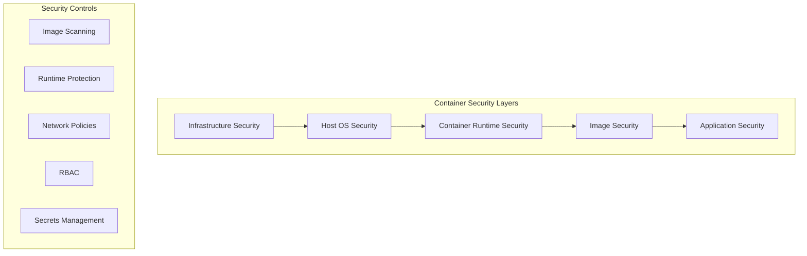

# Container Security & Advanced Topics

Container security is critical in production environments. This section covers security best practices, advanced networking, and enterprise-grade container management strategies.

## Container Security Fundamentals

Container security requires a multi-layered approach covering images, runtime, orchestration, and infrastructure security.

### Security Architecture Overview



### Image Security Best Practices

#### Secure Dockerfile Practices

```dockerfile
# Use official base images with specific versions
FROM node:18-alpine3.17

# Create non-root user
RUN addgroup -g 1001 -S nodejs && \
    adduser -S nextjs -u 1001

# Set working directory
WORKDIR /app

# Copy package files first (better layer caching)
COPY package*.json ./

# Install dependencies as root, then clean up
RUN npm ci --only=production && \
    npm cache clean --force && \
    rm -rf /tmp/* /var/cache/apk/*

# Copy application code
COPY --chown=nextjs:nodejs . .

# Switch to non-root user
USER nextjs

# Expose port (use non-privileged port)
EXPOSE 3000

# Use specific command (not shell form)
CMD ["npm", "start"]

# Health check
HEALTHCHECK --interval=30s --timeout=3s --start-period=5s --retries=3 \
    CMD curl -f http://localhost:3000/health || exit 1
```

#### Multi-Stage Build for Security

```dockerfile
# Build stage
FROM node:18-alpine AS builder
WORKDIR /app
COPY package*.json ./
RUN npm ci
COPY . .
RUN npm run build

# Production stage
FROM node:18-alpine AS production
RUN addgroup -g 1001 -S nodejs && \
    adduser -S nextjs -u 1001

WORKDIR /app

# Copy only necessary files from builder
COPY --from=builder --chown=nextjs:nodejs /app/dist ./dist
COPY --from=builder --chown=nextjs:nodejs /app/package*.json ./

# Install only production dependencies
RUN npm ci --only=production && npm cache clean --force

USER nextjs
EXPOSE 3000
CMD ["node", "dist/index.js"]
```

### Container Scanning and Vulnerability Management

#### Image Vulnerability Scanning with Trivy

```bash
# Install Trivy
curl -sfL https://raw.githubusercontent.com/aquasecurity/trivy/main/contrib/install.sh | sh -s -- -b /usr/local/bin

# Scan Docker image
trivy image nginx:latest

# Scan with specific severity levels
trivy image --severity HIGH,CRITICAL nginx:latest

# Generate JSON report
trivy image --format json --output report.json nginx:latest

# Scan local Dockerfile
trivy config Dockerfile

# Scan filesystem
trivy fs /path/to/project

# CI/CD Integration
docker run --rm -v /var/run/docker.sock:/var/run/docker.sock \
    -v $PWD:/tmp/trivy aquasec/trivy:latest image \
    --exit-code 1 --severity HIGH,CRITICAL myapp:latest
```

#### Docker Bench Security

```bash
# Run Docker Bench Security
docker run --rm --net host --pid host --userns host --cap-add audit_control \
    -e DOCKER_CONTENT_TRUST=$DOCKER_CONTENT_TRUST \
    -v /var/lib:/var/lib \
    -v /var/run/docker.sock:/var/run/docker.sock \
    -v /usr/lib/systemd:/usr/lib/systemd \
    -v /etc:/etc --label docker_bench_security \
    docker/docker-bench-security

# Generate JSON output
docker run --rm --net host --pid host --userns host --cap-add audit_control \
    -v /var/lib:/var/lib \
    -v /var/run/docker.sock:/var/run/docker.sock \
    -v /usr/lib/systemd:/usr/lib/systemd \
    -v /etc:/etc --label docker_bench_security \
    docker/docker-bench-security -f json > security_report.json
```

## Runtime Security

### Container Runtime Protection

#### AppArmor Profile Example

```bash
# /etc/apparmor.d/docker-nginx
#include <tunables/global>

profile docker-nginx flags=(attach_disconnected,mediate_deleted) {
  #include <abstractions/base>
  
  # Allow networking
  network inet tcp,
  network inet udp,
  
  # File system access
  /usr/sbin/nginx ix,
  /etc/nginx/ r,
  /etc/nginx/** r,
  /var/log/nginx/ w,
  /var/log/nginx/** w,
  /var/www/html/ r,
  /var/www/html/** r,
  
  # Deny dangerous capabilities
  deny capability sys_admin,
  deny capability sys_module,
  deny capability sys_rawio,
  
  # Allow necessary capabilities
  capability net_bind_service,
  capability setuid,
  capability setgid,
}
```

#### Seccomp Security Profile

```json
{
  "defaultAction": "SCMP_ACT_ERRNO",
  "architectures": [
    "SCMP_ARCH_X86_64",
    "SCMP_ARCH_X86",
    "SCMP_ARCH_X32"
  ],
  "syscalls": [
    {
      "names": [
        "accept",
        "accept4",
        "access",
        "brk",
        "close",
        "connect",
        "dup",
        "dup2",
        "execve",
        "exit",
        "exit_group",
        "fchmod",
        "fchown",
        "fcntl",
        "fork",
        "fstat",
        "getdents",
        "getpid",
        "getuid",
        "listen",
        "mkdir",
        "mmap",
        "open",
        "openat",
        "read",
        "readlink",
        "rt_sigaction",
        "rt_sigprocmask",
        "rt_sigreturn",
        "select",
        "socket",
        "stat",
        "write"
      ],
      "action": "SCMP_ACT_ALLOW"
    }
  ]
}
```

### Container Resource Limits and Security

#### Docker Security Configuration

```bash
# Run container with security constraints
docker run -d \
  --name secure-app \
  --user 1001:1001 \
  --read-only \
  --tmpfs /tmp \
  --tmpfs /var/cache \
  --cap-drop ALL \
  --cap-add NET_BIND_SERVICE \
  --security-opt no-new-privileges \
  --security-opt seccomp=seccomp-profile.json \
  --security-opt apparmor=docker-nginx \
  --memory 512m \
  --cpus 1.0 \
  --pids-limit 100 \
  --restart unless-stopped \
  nginx:alpine

# Docker Compose with security settings
version: '3.8'
services:
  web:
    image: nginx:alpine
    user: "1001:1001"
    read_only: true
    tmpfs:
      - /tmp
      - /var/cache/nginx
    cap_drop:
      - ALL
    cap_add:
      - NET_BIND_SERVICE
    security_opt:
      - no-new-privileges:true
      - seccomp:./seccomp-profile.json
    deploy:
      resources:
        limits:
          cpus: '1.0'
          memory: 512M
        reservations:
          cpus: '0.5'
          memory: 256M
```

## Advanced Container Networking

### Docker Networking Deep Dive

#### Custom Bridge Network Configuration

```bash
# Create custom network with specific subnet
docker network create \
  --driver bridge \
  --subnet=172.20.0.0/16 \
  --ip-range=172.20.240.0/20 \
  --gateway=172.20.0.1 \
  --opt "com.docker.network.bridge.name"="br-custom" \
  --opt "com.docker.network.driver.mtu"="1500" \
  custom-network

# Advanced network with multiple subnets
docker network create \
  --driver bridge \
  --subnet=172.21.0.0/24 \
  --subnet=172.22.0.0/24 \
  --gateway=172.21.0.1 \
  --aux-address="host1=172.21.0.5" \
  --aux-address="host2=172.21.0.6" \
  multi-subnet-network
```

#### Container Network Security

```bash
# Network isolation example
docker run -d --name database \
  --network isolated-db \
  --network-alias db \
  postgres:13

docker run -d --name backend \
  --network isolated-db \
  --network app-tier \
  --network-alias api \
  myapp:backend

docker run -d --name frontend \
  --network app-tier \
  --network public \
  -p 80:80 \
  myapp:frontend

# No direct access between frontend and database
```

### Kubernetes Advanced Networking

#### Network Policies for Micro-segmentation

```yaml
# Default deny all ingress traffic
apiVersion: networking.k8s.io/v1
kind: NetworkPolicy
metadata:
  name: default-deny-ingress
  namespace: production
spec:
  podSelector: {}
  policyTypes:
  - Ingress

---
# Allow specific traffic to web tier
apiVersion: networking.k8s.io/v1
kind: NetworkPolicy
metadata:
  name: web-tier-policy
  namespace: production
spec:
  podSelector:
    matchLabels:
      tier: web
  policyTypes:
  - Ingress
  - Egress
  ingress:
  - from:
    - namespaceSelector:
        matchLabels:
          name: ingress-nginx
    ports:
    - protocol: TCP
      port: 80
    - protocol: TCP
      port: 443
  egress:
  - to:
    - podSelector:
        matchLabels:
          tier: api
    ports:
    - protocol: TCP
      port: 8080

---
# Database tier - only allow from API
apiVersion: networking.k8s.io/v1
kind: NetworkPolicy
metadata:
  name: database-tier-policy
  namespace: production
spec:
  podSelector:
    matchLabels:
      tier: database
  policyTypes:
  - Ingress
  ingress:
  - from:
    - podSelector:
        matchLabels:
          tier: api
    ports:
    - protocol: TCP
      port: 5432
```

#### Ingress Controller with TLS

```yaml
apiVersion: networking.k8s.io/v1
kind: Ingress
metadata:
  name: secure-ingress
  namespace: production
  annotations:
    nginx.ingress.kubernetes.io/ssl-redirect: "true"
    nginx.ingress.kubernetes.io/force-ssl-redirect: "true"
    nginx.ingress.kubernetes.io/proxy-body-size: "32m"
    nginx.ingress.kubernetes.io/rate-limit: "100"
    nginx.ingress.kubernetes.io/rate-limit-window: "1m"
    cert-manager.io/cluster-issuer: "letsencrypt-prod"
spec:
  tls:
  - hosts:
    - api.example.com
    - www.example.com
    secretName: example-tls
  rules:
  - host: api.example.com
    http:
      paths:
      - path: /
        pathType: Prefix
        backend:
          service:
            name: api-service
            port:
              number: 80
  - host: www.example.com
    http:
      paths:
      - path: /
        pathType: Prefix
        backend:
          service:
            name: web-service
            port:
              number: 80
```

## Kubernetes Security Hardening

### Pod Security Standards

#### Pod Security Policy (Legacy)

```yaml
apiVersion: policy/v1beta1
kind: PodSecurityPolicy
metadata:
  name: restricted-psp
spec:
  privileged: false
  allowPrivilegeEscalation: false
  requiredDropCapabilities:
    - ALL
  volumes:
    - 'configMap'
    - 'emptyDir'
    - 'projected'
    - 'secret'
    - 'downwardAPI'
    - 'persistentVolumeClaim'
  runAsUser:
    rule: 'MustRunAsNonRoot'
  seLinux:
    rule: 'RunAsAny'
  fsGroup:
    rule: 'RunAsAny'
  readOnlyRootFilesystem: true
  seccompProfile:
    type: RuntimeDefault
```

#### Pod Security Standards (Current)

```yaml
apiVersion: v1
kind: Namespace
metadata:
  name: secure-namespace
  labels:
    pod-security.kubernetes.io/enforce: restricted
    pod-security.kubernetes.io/audit: restricted
    pod-security.kubernetes.io/warn: restricted

---
apiVersion: apps/v1
kind: Deployment
metadata:
  name: secure-app
  namespace: secure-namespace
spec:
  replicas: 3
  selector:
    matchLabels:
      app: secure-app
  template:
    metadata:
      labels:
        app: secure-app
    spec:
      securityContext:
        runAsNonRoot: true
        runAsUser: 1000
        runAsGroup: 1000
        fsGroup: 1000
        seccompProfile:
          type: RuntimeDefault
      containers:
      - name: app
        image: myapp:v1.0.0
        securityContext:
          allowPrivilegeEscalation: false
          capabilities:
            drop:
            - ALL
          readOnlyRootFilesystem: true
        resources:
          limits:
            cpu: 500m
            memory: 512Mi
          requests:
            cpu: 100m
            memory: 128Mi
        volumeMounts:
        - name: tmp
          mountPath: /tmp
        - name: cache
          mountPath: /app/cache
      volumes:
      - name: tmp
        emptyDir: {}
      - name: cache
        emptyDir: {}
```

### RBAC (Role-Based Access Control)

#### Service Account and RBAC Configuration

```yaml
# Service Account
apiVersion: v1
kind: ServiceAccount
metadata:
  name: app-service-account
  namespace: production

---
# Role for application-specific permissions
apiVersion: rbac.authorization.k8s.io/v1
kind: Role
metadata:
  namespace: production
  name: app-role
rules:
- apiGroups: [""]
  resources: ["configmaps", "secrets"]
  verbs: ["get", "list", "watch"]
- apiGroups: [""]
  resources: ["pods"]
  verbs: ["get", "list"]

---
# RoleBinding
apiVersion: rbac.authorization.k8s.io/v1
kind: RoleBinding
metadata:
  name: app-rolebinding
  namespace: production
subjects:
- kind: ServiceAccount
  name: app-service-account
  namespace: production
roleRef:
  kind: Role
  name: app-role
  apiGroup: rbac.authorization.k8s.io

---
# ClusterRole for cross-namespace access
apiVersion: rbac.authorization.k8s.io/v1
kind: ClusterRole
metadata:
  name: monitoring-clusterrole
rules:
- apiGroups: [""]
  resources: ["nodes", "pods", "services", "endpoints"]
  verbs: ["get", "list", "watch"]
- apiGroups: ["apps"]
  resources: ["deployments", "replicasets"]
  verbs: ["get", "list", "watch"]

---
# ClusterRoleBinding
apiVersion: rbac.authorization.k8s.io/v1
kind: ClusterRoleBinding
metadata:
  name: monitoring-clusterrolebinding
subjects:
- kind: ServiceAccount
  name: monitoring-service-account
  namespace: monitoring
roleRef:
  kind: ClusterRole
  name: monitoring-clusterrole
  apiGroup: rbac.authorization.k8s.io
```

### Secrets Management

#### External Secrets Operator

```yaml
# SecretStore configuration
apiVersion: external-secrets.io/v1beta1
kind: SecretStore
metadata:
  name: vault-secret-store
  namespace: production
spec:
  provider:
    vault:
      server: "https://vault.example.com"
      path: "secret"
      version: "v2"
      auth:
        kubernetes:
          mountPath: "kubernetes"
          role: "external-secrets"
          serviceAccountRef:
            name: external-secrets-sa

---
# ExternalSecret
apiVersion: external-secrets.io/v1beta1
kind: ExternalSecret
metadata:
  name: app-secrets
  namespace: production
spec:
  refreshInterval: 15s
  secretStoreRef:
    name: vault-secret-store
    kind: SecretStore
  target:
    name: app-secrets
    creationPolicy: Owner
  data:
  - secretKey: database-password
    remoteRef:
      key: database/config
      property: password
  - secretKey: api-key
    remoteRef:
      key: api/credentials
      property: key
```

#### Sealed Secrets

```bash
# Install Sealed Secrets controller
kubectl apply -f https://github.com/bitnami-labs/sealed-secrets/releases/download/v0.18.0/controller.yaml

# Install kubeseal client
wget https://github.com/bitnami-labs/sealed-secrets/releases/download/v0.18.0/kubeseal-0.18.0-linux-amd64.tar.gz
tar -xvzf kubeseal-0.18.0-linux-amd64.tar.gz
sudo install -m 755 kubeseal /usr/local/bin/kubeseal

# Create sealed secret
echo -n mypassword | kubectl create secret generic mysecret --dry-run=client --from-file=password=/dev/stdin -o yaml | kubeseal -o yaml > mysealedsecret.yaml

# Apply sealed secret
kubectl apply -f mysealedsecret.yaml
```

## Container Monitoring and Observability

### Prometheus Monitoring for Containers

#### Container Metrics Collection

```yaml
# Prometheus configuration for container monitoring
apiVersion: v1
kind: ConfigMap
metadata:
  name: prometheus-config
data:
  prometheus.yml: |
    global:
      scrape_interval: 15s
      evaluation_interval: 15s
    
    scrape_configs:
    # Kubernetes API server
    - job_name: 'kubernetes-apiservers'
      kubernetes_sd_configs:
      - role: endpoints
      scheme: https
      tls_config:
        ca_file: /var/run/secrets/kubernetes.io/serviceaccount/ca.crt
      bearer_token_file: /var/run/secrets/kubernetes.io/serviceaccount/token
      relabel_configs:
      - source_labels: [__meta_kubernetes_namespace, __meta_kubernetes_service_name, __meta_kubernetes_endpoint_port_name]
        action: keep
        regex: default;kubernetes;https
    
    # Node metrics
    - job_name: 'kubernetes-nodes'
      kubernetes_sd_configs:
      - role: node
      relabel_configs:
      - action: labelmap
        regex: __meta_kubernetes_node_label_(.+)
    
    # Kubelet metrics
    - job_name: 'kubernetes-kubelet'
      kubernetes_sd_configs:
      - role: node
      relabel_configs:
      - action: labelmap
        regex: __meta_kubernetes_node_label_(.+)
      - target_label: __address__
        replacement: kubernetes.default.svc:443
      - source_labels: [__meta_kubernetes_node_name]
        regex: (.+)
        target_label: __metrics_path__
        replacement: /api/v1/nodes/${1}/proxy/metrics
    
    # Pod metrics
    - job_name: 'kubernetes-pods'
      kubernetes_sd_configs:
      - role: pod
      relabel_configs:
      - source_labels: [__meta_kubernetes_pod_annotation_prometheus_io_scrape]
        action: keep
        regex: true
      - source_labels: [__meta_kubernetes_pod_annotation_prometheus_io_path]
        action: replace
        target_label: __metrics_path__
        regex: (.+)
```

#### cAdvisor for Container Metrics

```yaml
apiVersion: apps/v1
kind: DaemonSet
metadata:
  name: cadvisor
  namespace: monitoring
spec:
  selector:
    matchLabels:
      name: cadvisor
  template:
    metadata:
      labels:
        name: cadvisor
    spec:
      hostNetwork: true
      hostPID: true
      containers:
      - name: cadvisor
        image: gcr.io/cadvisor/cadvisor:v0.45.0
        resources:
          requests:
            memory: 200Mi
            cpu: 150m
          limits:
            memory: 2000Mi
            cpu: 300m
        volumeMounts:
        - name: rootfs
          mountPath: /rootfs
          readOnly: true
        - name: var-run
          mountPath: /var/run
          readOnly: true
        - name: sys
          mountPath: /sys
          readOnly: true
        - name: docker
          mountPath: /var/lib/docker
          readOnly: true
        - name: disk
          mountPath: /dev/disk
          readOnly: true
        ports:
        - name: http
          containerPort: 8080
          protocol: TCP
        args:
          - --housekeeping_interval=10s
          - --max_housekeeping_interval=15s
          - --event_storage_event_limit=default=0
          - --event_storage_age_limit=default=0
          - --disable_metrics=percpu,sched,tcp,udp,disk,diskIO,accelerator,hugetlb,referenced_memory,cpu_topology,resctrl
          - --docker_only
      automountServiceAccountToken: false
      volumes:
      - name: rootfs
        hostPath:
          path: /
      - name: var-run
        hostPath:
          path: /var/run
      - name: sys
        hostPath:
          path: /sys
      - name: docker
        hostPath:
          path: /var/lib/docker
      - name: disk
        hostPath:
          path: /dev/disk
```

## Container Runtime Alternatives

### containerd Configuration

```toml
# /etc/containerd/config.toml
version = 2

[plugins."io.containerd.grpc.v1.cri"]
  sandbox_image = "registry.k8s.io/pause:3.6"
  
  [plugins."io.containerd.grpc.v1.cri".containerd]
    [plugins."io.containerd.grpc.v1.cri".containerd.runtimes]
      [plugins."io.containerd.grpc.v1.cri".containerd.runtimes.runc]
        runtime_type = "io.containerd.runc.v2"
        [plugins."io.containerd.grpc.v1.cri".containerd.runtimes.runc.options]
          SystemdCgroup = true
      
      # gVisor runtime for enhanced security
      [plugins."io.containerd.grpc.v1.cri".containerd.runtimes.runsc]
        runtime_type = "io.containerd.runsc.v1"
      
      # Kata Containers for VM-level isolation
      [plugins."io.containerd.grpc.v1.cri".containerd.runtimes.kata]
        runtime_type = "io.containerd.kata.v2"

  [plugins."io.containerd.grpc.v1.cri".registry]
    [plugins."io.containerd.grpc.v1.cri".registry.mirrors]
      [plugins."io.containerd.grpc.v1.cri".registry.mirrors."docker.io"]
        endpoint = ["https://mirror.gcr.io", "https://registry-1.docker.io"]
```

### Podman Rootless Containers

```bash
# Install Podman
sudo apt update
sudo apt install -y podman

# Configure rootless mode
echo 'user.max_user_namespaces=28633' | sudo tee -a /etc/sysctl.conf
sudo sysctl -p

# Setup subuid and subgid
sudo usermod --add-subuids 10000-75535 $USER
sudo usermod --add-subgids 10000-75535 $USER

# Start user services
systemctl --user enable --now podman.socket

# Run rootless container
podman run -d --name web -p 8080:80 nginx:alpine

# Generate Kubernetes YAML
podman generate kube web > web-pod.yaml

# Podman compose (docker-compose compatible)
pip3 install podman-compose
podman-compose up -d
```

## Next Steps

After mastering container security and advanced topics:

- [Kubernetes Production Deployment](kubernetes-production.md)
- [Container CI/CD Pipelines](../automation/container-cicd.md)
- Service Mesh Implementation (Istio, Linkerd)

!!! warning "Security Reminders"
    - Never run containers as root in production
    - Regularly scan images for vulnerabilities
    - Implement network segmentation with policies
    - Use secrets management solutions
    - Monitor container runtime behavior
    - Keep orchestration platforms updated

!!! tip "Best Practices"
    - Use minimal base images (distroless, alpine)
    - Implement proper resource limits
    - Use health checks for reliability
    - Tag images with specific versions
    - Implement proper logging and monitoring
    - Use multi-stage builds to reduce attack surface