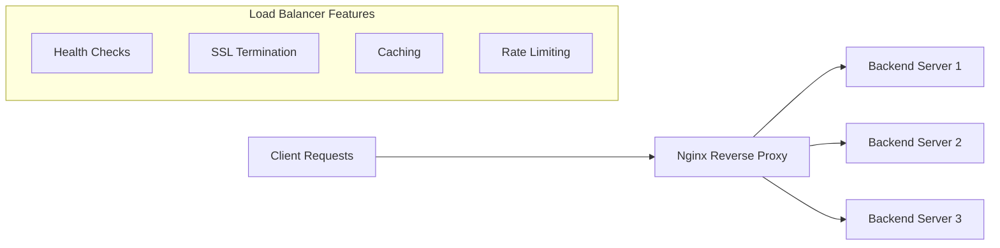
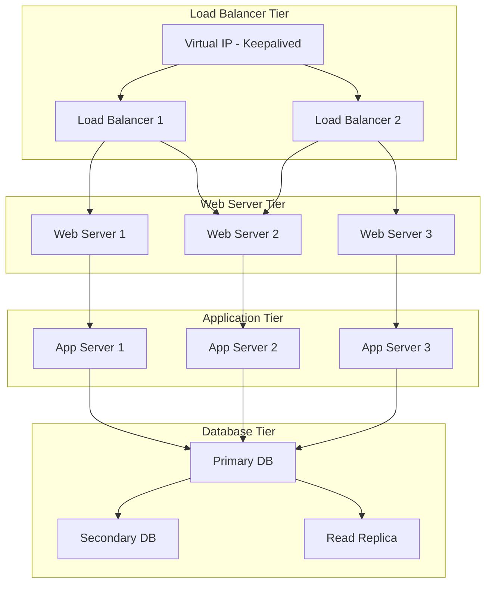
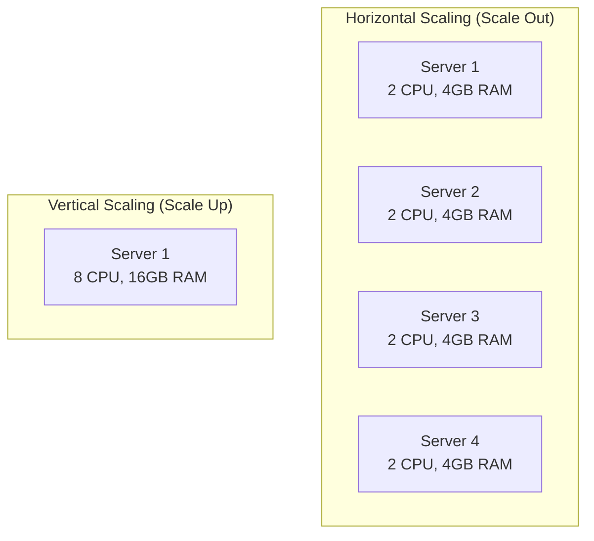

# Advanced Hosting Solutions

Advanced hosting solutions provide high availability, scalability, and performance optimization for production environments. This section covers enterprise-grade hosting architectures and optimization techniques.

## Reverse Proxy and Load Balancing with Nginx

Nginx excels as a reverse proxy and load balancer, providing high performance and advanced traffic management capabilities.

### Nginx Load Balancing Overview

- **[What is a Reverse Proxy vs. Load Balancer? | NGINX](https://www.nginx.com/resources/glossary/reverse-proxy-vs-load-balancer/)**
  
  Comprehensive explanation of reverse proxy and load balancer concepts with Nginx implementation.

### Reverse Proxy Architecture



### Nginx Load Balancer Configuration

#### Basic Load Balancer Setup (`/etc/nginx/nginx.conf`)

```nginx
events {
    worker_connections 1024;
}

http {
    # Upstream backend servers
    upstream backend {
        least_conn;
        server 192.168.1.10:8080 weight=3 max_fails=3 fail_timeout=30s;
        server 192.168.1.11:8080 weight=2 max_fails=3 fail_timeout=30s;
        server 192.168.1.12:8080 weight=1 max_fails=3 fail_timeout=30s;
        server 192.168.1.13:8080 backup;
    }
    
    # Rate limiting
    limit_req_zone $binary_remote_addr zone=api:10m rate=10r/s;
    
    # Caching configuration
    proxy_cache_path /var/cache/nginx levels=1:2 keys_zone=my_cache:10m max_size=10g 
                     inactive=60m use_temp_path=off;
    
    server {
        listen 80;
        server_name api.example.com;
        
        # Redirect HTTP to HTTPS
        return 301 https://$server_name$request_uri;
    }
    
    server {
        listen 443 ssl http2;
        server_name api.example.com;
        
        # SSL Configuration
        ssl_certificate /etc/ssl/certs/api.example.com.pem;
        ssl_certificate_key /etc/ssl/private/api.example.com.key;
        ssl_protocols TLSv1.2 TLSv1.3;
        ssl_ciphers ECDHE-RSA-AES256-GCM-SHA384:ECDHE-RSA-CHACHA20-POLY1305;
        ssl_prefer_server_ciphers off;
        
        # Security headers
        add_header Strict-Transport-Security "max-age=31536000; includeSubDomains" always;
        add_header X-Frame-Options DENY always;
        add_header X-Content-Type-Options nosniff always;
        add_header X-XSS-Protection "1; mode=block" always;
        
        # API endpoints with rate limiting
        location /api/ {
            limit_req zone=api burst=20 nodelay;
            
            # Proxy configuration
            proxy_pass http://backend;
            proxy_set_header Host $host;
            proxy_set_header X-Real-IP $remote_addr;
            proxy_set_header X-Forwarded-For $proxy_add_x_forwarded_for;
            proxy_set_header X-Forwarded-Proto $scheme;
            
            # Timeout settings
            proxy_connect_timeout 30s;
            proxy_send_timeout 30s;
            proxy_read_timeout 30s;
            
            # Caching for GET requests
            proxy_cache my_cache;
            proxy_cache_valid 200 1h;
            proxy_cache_use_stale error timeout http_500 http_502 http_503 http_504;
            add_header X-Cache-Status $upstream_cache_status;
        }
        
        # Static content with aggressive caching
        location ~* \.(jpg|jpeg|png|gif|ico|css|js|pdf)$ {
            expires 1y;
            add_header Cache-Control "public, no-transform";
            proxy_pass http://backend;
        }
        
        # Health check endpoint
        location /health {
            access_log off;
            return 200 "healthy\n";
            add_header Content-Type text/plain;
        }
    }
}
```

### Load Balancing Methods

| Method | Description | Use Case | Configuration |
|--------|-------------|----------|---------------|
| **Round Robin** | Requests distributed sequentially | Balanced server resources | `# default behavior` |
| **Least Connections** | Routes to server with fewest connections | Varying request durations | `least_conn;` |
| **IP Hash** | Routes based on client IP hash | Session persistence | `ip_hash;` |
| **Weighted** | Distributes based on server weights | Different server capacities | `server backend1 weight=3;` |
| **Random** | Random distribution | Simple load distribution | `random;` |

## High Availability Architecture

High availability ensures minimal downtime and maintains service continuity through redundancy and failover mechanisms.

### HA Architecture Overview

- **[High Availability Architecture: Definition & Best Practices | Redis](https://redis.com/blog/high-availability-architecture/)**
  
  Comprehensive guide to designing and implementing high availability systems.

### Multi-Tier HA Architecture



### Keepalived Configuration for HA Load Balancers

#### Primary Load Balancer (`/etc/keepalived/keepalived.conf`)

```conf
! Configuration File for keepalived

global_defs {
    router_id LB_MASTER
    script_user root
    enable_script_security
}

vrrp_script chk_nginx {
    script "/usr/local/bin/check_nginx.sh"
    interval 2
    weight -2
    fall 3
    rise 2
}

vrrp_instance VI_1 {
    state MASTER
    interface eth0
    virtual_router_id 51
    priority 110
    advert_int 1
    authentication {
        auth_type PASS
        auth_pass changeme123
    }
    virtual_ipaddress {
        192.168.1.100/24 dev eth0
    }
    track_script {
        chk_nginx
    }
    notify_master "/usr/local/bin/nginx_master.sh"
    notify_backup "/usr/local/bin/nginx_backup.sh"
    notify_fault "/usr/local/bin/nginx_fault.sh"
}
```

#### Health Check Script (`/usr/local/bin/check_nginx.sh`)

```bash
#!/bin/bash
# Nginx health check script for keepalived

# Check if nginx is running
if ! pgrep nginx > /dev/null; then
    echo "Nginx is not running"
    exit 1
fi

# Check if nginx responds to requests
if ! curl -f http://localhost/health > /dev/null 2>&1; then
    echo "Nginx health check failed"
    exit 1
fi

# Check if upstream backends are available
if ! curl -f http://localhost/api/health > /dev/null 2>&1; then
    echo "Backend health check failed"
    exit 1
fi

echo "All health checks passed"
exit 0
```

## Infrastructure Autoscaling

Autoscaling automatically adjusts resources based on demand, ensuring optimal performance and cost efficiency.

### Autoscaling Concepts

- **[Cloud Autoscaling Explained | Densify](https://www.densify.com/articles/autoscaling)**
  
  Comprehensive guide to autoscaling strategies, benefits, and implementation approaches.

### Autoscaling Strategies

#### Horizontal vs Vertical Scaling



### AWS Auto Scaling Configuration

#### Launch Template Configuration

```json
{
  "LaunchTemplateName": "web-server-template",
  "LaunchTemplateData": {
    "ImageId": "ami-0abcdef1234567890",
    "InstanceType": "t3.medium",
    "KeyName": "my-key-pair",
    "SecurityGroupIds": ["sg-12345678"],
    "UserData": "IyEvYmluL2Jhc2gKYXB0IHVwZGF0ZSAmJiBhcHQgaW5zdGFsbCAteSBuZ2lueA==",
    "IamInstanceProfile": {
      "Name": "EC2-CloudWatch-Role"
    },
    "Monitoring": {
      "Enabled": true
    },
    "TagSpecifications": [
      {
        "ResourceType": "instance",
        "Tags": [
          {
            "Key": "Name",
            "Value": "AutoScaled-WebServer"
          },
          {
            "Key": "Environment",
            "Value": "Production"
          }
        ]
      }
    ]
  }
}
```

#### Auto Scaling Group Configuration

```json
{
  "AutoScalingGroupName": "web-server-asg",
  "LaunchTemplate": {
    "LaunchTemplateName": "web-server-template",
    "Version": "$Latest"
  },
  "MinSize": 2,
  "MaxSize": 10,
  "DesiredCapacity": 3,
  "DefaultCooldown": 300,
  "AvailabilityZones": [
    "us-west-2a",
    "us-west-2b",
    "us-west-2c"
  ],
  "TargetGroupARNs": [
    "arn:aws:elasticloadbalancing:us-west-2:123456789012:targetgroup/web-servers/50dc6c495c0c9188"
  ],
  "HealthCheckType": "ELB",
  "HealthCheckGracePeriod": 300,
  "Tags": [
    {
      "Key": "Environment",
      "Value": "Production",
      "PropagateAtLaunch": true
    }
  ]
}
```

#### Scaling Policies

```json
{
  "PolicyName": "scale-out-policy",
  "AutoScalingGroupName": "web-server-asg",
  "PolicyType": "TargetTrackingScaling",
  "TargetTrackingConfiguration": {
    "TargetValue": 70.0,
    "PredefinedMetricSpecification": {
      "PredefinedMetricType": "ASGAverageCPUUtilization"
    },
    "ScaleOutCooldown": 300,
    "ScaleInCooldown": 300
  }
}
```

### Kubernetes Horizontal Pod Autoscaler

```yaml
apiVersion: autoscaling/v2
kind: HorizontalPodAutoscaler
metadata:
  name: web-app-hpa
spec:
  scaleTargetRef:
    apiVersion: apps/v1
    kind: Deployment
    name: web-app
  minReplicas: 3
  maxReplicas: 100
  metrics:
  - type: Resource
    resource:
      name: cpu
      target:
        type: Utilization
        averageUtilization: 70
  - type: Resource
    resource:
      name: memory
      target:
        type: Utilization
        averageUtilization: 80
  behavior:
    scaleDown:
      stabilizationWindowSeconds: 300
      policies:
      - type: Percent
        value: 10
        periodSeconds: 60
    scaleUp:
      stabilizationWindowSeconds: 0
      policies:
      - type: Percent
        value: 100
        periodSeconds: 15
      - type: Pods
        value: 4
        periodSeconds: 15
      selectPolicy: Max
```

## Performance Tuning

### Nginx Performance Optimization

- **[nginx-tuning README | GitHub](https://github.com/denji/nginx-tuning/blob/master/README.md)**
  
  Comprehensive Nginx performance tuning guide with advanced configuration examples.

#### High-Performance Nginx Configuration

```nginx
# /etc/nginx/nginx.conf - Optimized for high traffic

user nginx;
worker_processes auto;
worker_rlimit_nofile 100000;
error_log /var/log/nginx/error.log warn;
pid /var/run/nginx.pid;

events {
    worker_connections 4000;
    use epoll;
    multi_accept on;
}

http {
    # Basic Settings
    sendfile on;
    tcp_nopush on;
    tcp_nodelay on;
    keepalive_timeout 30;
    keepalive_requests 100000;
    reset_timedout_connection on;
    client_body_timeout 10;
    send_timeout 2;
    client_header_timeout 10;
    client_max_body_size 32m;
    
    # Hide nginx version
    server_tokens off;
    
    # MIME
    include /etc/nginx/mime.types;
    default_type application/octet-stream;
    
    # Logging
    log_format main '$remote_addr - $remote_user [$time_local] "$request" '
                    '$status $body_bytes_sent "$http_referer" '
                    '"$http_user_agent" "$http_x_forwarded_for" '
                    '$request_time $upstream_response_time';
    
    access_log /var/log/nginx/access.log main buffer=32k flush=1m;
    
    # Gzip compression
    gzip on;
    gzip_vary on;
    gzip_min_length 1024;
    gzip_proxied any;
    gzip_comp_level 6;
    gzip_types
        text/plain
        text/css
        text/xml
        text/javascript
        application/json
        application/javascript
        application/xml+rss
        application/atom+xml
        image/svg+xml;
    
    # Brotli compression (if module available)
    brotli on;
    brotli_comp_level 6;
    brotli_types
        text/xml
        image/svg+xml
        application/x-font-ttf
        image/vnd.microsoft.icon
        application/x-font-opentype
        application/json
        font/eot
        application/vnd.ms-fontobject
        application/javascript
        font/otf
        application/xml
        application/xhtml+xml
        text/javascript
        application/x-javascript
        text/$;
    
    # Rate limiting
    limit_req_zone $binary_remote_addr zone=login:10m rate=10r/m;
    limit_req_zone $binary_remote_addr zone=api:10m rate=1r/s;
    
    # File caching
    open_file_cache max=200000 inactive=20s;
    open_file_cache_valid 30s;
    open_file_cache_min_uses 2;
    open_file_cache_errors on;
    
    # Include additional configs
    include /etc/nginx/conf.d/*.conf;
}
```

### Apache Performance Tuning

- **[5 Tips to Boost Apache Web Server Performance | Tecmint](https://www.tecmint.com/apache-performance-tuning/)**
  
  Practical Apache performance optimization techniques and configuration examples.

#### Apache MPM Configuration

```apache
# /etc/apache2/mods-available/mpm_prefork.conf
<IfModule mpm_prefork_module>
    StartServers             8
    MinSpareServers          5
    MaxSpareServers          20
    ServerLimit              256
    MaxRequestWorkers        256
    MaxRequestsPerChild      4000
</IfModule>

# /etc/apache2/mods-available/mpm_worker.conf
<IfModule mpm_worker_module>
    StartServers             4
    MinSpareThreads          25
    MaxSpareThreads          75
    ThreadLimit              64
    ThreadsPerChild          25
    MaxRequestWorkers        400
    MaxRequestsPerChild      0
</IfModule>

# /etc/apache2/mods-available/mpm_event.conf
<IfModule mpm_event_module>
    StartServers             4
    MinSpareThreads          25
    MaxSpareThreads          75
    ThreadLimit              64
    ThreadsPerChild          25
    MaxRequestWorkers        400
    MaxRequestsPerChild      0
    AsyncRequestWorkerFactor 2
</IfModule>
```

#### Apache Performance Modules

```apache
# Enable compression
LoadModule deflate_module modules/mod_deflate.so
<Location />
    SetOutputFilter DEFLATE
    SetEnvIfNoCase Request_URI \
        \.(?:gif|jpe?g|png)$ no-gzip dont-vary
    SetEnvIfNoCase Request_URI \
        \.(?:exe|t?gz|zip|bz2|sit|rar)$ no-gzip dont-vary
    SetEnvIfNoCase Request_URI \
        \.(?:pdf|mov|avi|mp3|mp4|rm)$ no-gzip dont-vary
</Location>

# Enable caching
LoadModule expires_module modules/mod_expires.so
LoadModule headers_module modules/mod_headers.so
<IfModule mod_expires.c>
    ExpiresActive On
    ExpiresByType image/jpg "access plus 1 month"
    ExpiresByType image/jpeg "access plus 1 month"
    ExpiresByType image/gif "access plus 1 month"
    ExpiresByType image/png "access plus 1 month"
    ExpiresByType text/css "access plus 1 month"
    ExpiresByType application/pdf "access plus 1 month"
    ExpiresByType application/javascript "access plus 1 month"
    ExpiresByType application/x-javascript "access plus 1 month"
    ExpiresByType application/x-shockwave-flash "access plus 1 month"
    ExpiresByType image/x-icon "access plus 1 year"
    ExpiresDefault "access plus 2 days"
</IfModule>
```

## Server Sizing Guidelines

Proper server sizing ensures optimal performance and cost efficiency.

### Server Sizing Resources

- **[Server Sizing Guidelines | Quora](https://qr.ae/pvE9iY)**
  
  Practical guidelines for determining appropriate server specifications based on workload requirements.

### Sizing Calculation Framework

#### Web Server Sizing Matrix

| Traffic Level | Concurrent Users | CPU Cores | RAM (GB) | Storage | Network |
|---------------|------------------|-----------|----------|---------|---------|
| **Small** | 100-500 | 2-4 | 4-8 | 50-100 GB SSD | 100 Mbps |
| **Medium** | 500-2000 | 4-8 | 8-16 | 100-500 GB SSD | 1 Gbps |
| **Large** | 2000-10000 | 8-16 | 16-32 | 500-1000 GB SSD | 10 Gbps |
| **Enterprise** | 10000+ | 16+ | 32+ | 1+ TB NVMe | 10+ Gbps |

#### Database Server Sizing

```bash
# Memory calculation for MySQL/MariaDB
# Rule of thumb: 70-80% of available RAM for InnoDB buffer pool

# For 16GB RAM server:
innodb_buffer_pool_size = 12G  # 75% of 16GB

# For 32GB RAM server:
innodb_buffer_pool_size = 24G  # 75% of 32GB

# CPU cores calculation
# Generally: 1 core per 200-300 concurrent connections
```

#### Capacity Planning Script

```bash
#!/bin/bash
# Server capacity planning calculator

echo "=== Server Capacity Planning Calculator ==="

read -p "Expected daily unique visitors: " daily_visitors
read -p "Average page views per visitor: " page_views
read -p "Peak hour percentage (default 15%): " peak_percentage
peak_percentage=${peak_percentage:-15}

# Calculate requests
total_page_views=$((daily_visitors * page_views))
peak_hour_views=$((total_page_views * peak_percentage / 100))
peak_minute_views=$((peak_hour_views / 60))
peak_second_views=$((peak_minute_views / 60))

# Add static resources multiplier (CSS, JS, images)
static_multiplier=5
total_rps=$((peak_second_views * static_multiplier))

echo ""
echo "=== Capacity Requirements ==="
echo "Total daily page views: $total_page_views"
echo "Peak hour page views: $peak_hour_views"
echo "Peak requests per second: $total_rps"

# Server recommendations
if [ $total_rps -lt 50 ]; then
    echo "Recommended: Small server (2-4 CPU, 4-8GB RAM)"
elif [ $total_rps -lt 200 ]; then
    echo "Recommended: Medium server (4-8 CPU, 8-16GB RAM)"
elif [ $total_rps -lt 1000 ]; then
    echo "Recommended: Large server (8-16 CPU, 16-32GB RAM)"
else
    echo "Recommended: Enterprise/Multi-server setup"
fi

echo ""
echo "Additional considerations:"
echo "- Database: Separate server for > 100 RPS"
echo "- CDN: Recommended for > 50 RPS"
echo "- Load balancer: Required for > 500 RPS"
echo "- Caching: Redis/Memcached for > 200 RPS"
```

## Next Steps

After implementing advanced hosting solutions:

- Container Orchestration with Kubernetes
- [Infrastructure as Code](../automation/introduction.md)
- [Advanced Monitoring](../monitoring/introduction.md)

!!! tip "Best Practices"
    - Always implement redundancy for critical services
    - Use Infrastructure as Code for consistent deployments
    - Monitor performance metrics continuously
    - Plan for capacity growth and traffic spikes
    - Implement proper backup and disaster recovery

!!! warning "Production Considerations"
    - Test autoscaling policies thoroughly before production
    - Implement proper security groups and network ACLs
    - Use managed services where appropriate to reduce operational overhead
    - Maintain documentation for all configurations and procedures