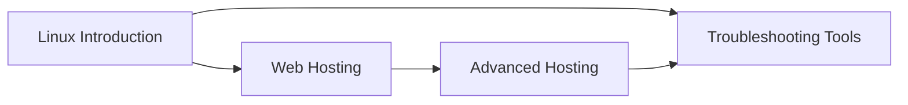

# Linux & Systems

Welcome to the Linux & Systems section! This section covers Linux fundamentals, system administration, and hosting technologies essential for DevOps professionals.

## Learning Objectives

By completing this section, you will:

- Master Linux command line and system administration
- Understand web server configuration and management
- Learn advanced hosting and infrastructure concepts
- Develop troubleshooting and debugging skills
- Understand system performance and monitoring

## Section Contents

### [Linux Introduction](introduction.md)

Learn Linux fundamentals, command line basics, and system administration concepts.

### [Web Hosting](web-hosting.md)

Understand web server technologies, LAMP stack, and hosting management.

### [Advanced Hosting](advanced-hosting.md)

Explore advanced hosting concepts, load balancing, and scaling strategies.

### [Troubleshooting Tools](troubleshooting-tools.md)

Master debugging tools, log analysis, and system troubleshooting techniques.

## Prerequisites

- Basic computer literacy
- Completed Fundamentals section
- Access to a Linux environment (VM, container, or cloud instance)

## Learning Path

## Why This Matters

Linux skills are essential for DevOps because:

- **Server Management**: Most cloud and on-premise servers run Linux
- **Automation**: Shell scripting and command line automation
- **Containerization**: Docker and Kubernetes run on Linux
- **CI/CD**: Build agents and deployment targets are typically Linux
- **Monitoring**: System monitoring and log analysis on Linux systems

Proceed when you are comfortable with these Linux fundamentals.
