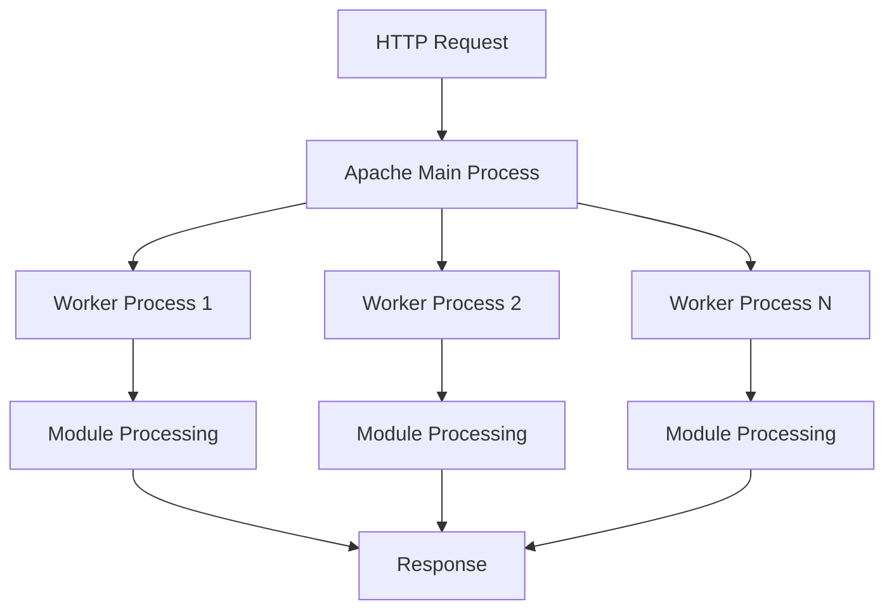

# Self-Managed Web Hosting

Self-managed web hosting gives you complete control over your server environment, enabling custom configurations and optimizations. This section covers setting up and managing your own web servers.

## Apache Web Server Fundamentals

Apache is one of the most popular web servers, powering millions of websites worldwide. Understanding Apache is essential for DevOps engineers managing web applications.

### Apache Basics

- **[Apache Tutorials for Beginners | Guru99](https://www.guru99.com/apache.html)**
  
  Comprehensive tutorial covering Apache installation, configuration, and management.

### Key Apache Concepts

#### Apache Architecture



#### Essential Apache Modules

| Module | Purpose | Use Case |
|--------|---------|----------|
| **mod_rewrite** | URL rewriting and redirection | SEO-friendly URLs, HTTPS redirects |
| **mod_ssl** | SSL/TLS support | HTTPS encryption |
| **mod_security** | Web application firewall | Security filtering |
| **mod_deflate** | Compression | Bandwidth optimization |
| **mod_headers** | HTTP header manipulation | CORS, caching headers |
| **mod_php** | PHP processing | Dynamic content |

### Apache Configuration

#### Main Configuration File (`/etc/apache2/apache2.conf`)

```apache
# Global configuration
ServerRoot /etc/apache2
Timeout 300
KeepAlive On
MaxKeepAliveRequests 100
KeepAliveTimeout 5

# Security settings
ServerTokens Prod
ServerSignature Off

# Performance settings
StartServers 8
MinSpareServers 5
MaxSpareServers 20
ServerLimit 16
MaxRequestWorkers 400
ThreadsPerChild 25

# Directory permissions
<Directory />
    Options FollowSymLinks
    AllowOverride None
    Require all denied
</Directory>

<Directory /var/www/>
    Options Indexes FollowSymLinks
    AllowOverride All
    Require all granted
</Directory>
```

## Virtual Hosts Configuration

Virtual hosts allow hosting multiple websites on a single server, essential for efficient resource utilization.

### Virtual Host Documentation

- **[Apache Virtual Host Documentation](https://httpd.apache.org/docs/2.4/vhosts/)**
  
  Official Apache documentation for virtual host configuration and best practices.

### Name-Based Virtual Hosts

#### Example Configuration (`/etc/apache2/sites-available/example.com.conf`)

```apache
<VirtualHost *:80>
    ServerName example.com
    ServerAlias www.example.com
    DocumentRoot /var/www/example.com/public_html
    
    # Logging
    ErrorLog ${APACHE_LOG_DIR}/example.com_error.log
    CustomLog ${APACHE_LOG_DIR}/example.com_access.log combined
    
    # Security headers
    Header always set X-Frame-Options DENY
    Header always set X-Content-Type-Options nosniff
    Header always set X-XSS-Protection "1; mode=block"
    Header always set Strict-Transport-Security "max-age=63072000; includeSubDomains; preload"
    
    # Directory configuration
    <Directory /var/www/example.com/public_html>
        Options -Indexes +FollowSymLinks
        AllowOverride All
        Require all granted
    </Directory>
    
    # Redirect to HTTPS
    RewriteEngine On
    RewriteCond %{HTTPS} off
    RewriteRule ^(.*)$ https://%{HTTP_HOST}%{REQUEST_URI} [L,R=301]
</VirtualHost>

<VirtualHost *:443>
    ServerName example.com
    ServerAlias www.example.com
    DocumentRoot /var/www/example.com/public_html
    
    # SSL Configuration
    SSLEngine on
    SSLCertificateFile /etc/ssl/certs/example.com.crt
    SSLCertificateKeyFile /etc/ssl/private/example.com.key
    SSLCertificateChainFile /etc/ssl/certs/example.com-chain.crt
    
    # Modern SSL configuration
    SSLProtocol all -SSLv3 -TLSv1 -TLSv1.1
    SSLCipherSuite ECDHE-ECDSA-AES128-GCM-SHA256:ECDHE-RSA-AES128-GCM-SHA256:ECDHE-ECDSA-AES256-GCM-SHA384:ECDHE-RSA-AES256-GCM-SHA384
    SSLHonorCipherOrder off
    SSLSessionTickets off
    
    # HSTS
    Header always set Strict-Transport-Security "max-age=63072000"
    
    # Logging
    ErrorLog ${APACHE_LOG_DIR}/example.com_ssl_error.log
    CustomLog ${APACHE_LOG_DIR}/example.com_ssl_access.log combined
</VirtualHost>
```

### Managing Virtual Hosts

```bash
# Enable a site
sudo a2ensite example.com

# Disable a site
sudo a2dissite example.com

# Test configuration
sudo apache2ctl configtest

# Reload configuration
sudo systemctl reload apache2

# List enabled sites
sudo a2ensite
```

## LAMP Stack Implementation

LAMP (Linux, Apache, MySQL/MariaDB, PHP) is a popular web development stack for dynamic applications.

### LAMP Stack Setup Guide

- **[How To Install LAMP Stack on Debian 11 | DigitalOcean](https://www.digitalocean.com/community/tutorials/how-to-install-linux-apache-mariadb-php-lamp-stack-on-debian-11)**
  
  Step-by-step guide for complete LAMP stack installation and configuration.

### Step-by-Step LAMP Installation

#### 1. Update System Packages

```bash
sudo apt update && sudo apt upgrade -y
```

#### 2. Install Apache Web Server

```bash
# Install Apache
sudo apt install apache2 -y

# Enable and start Apache
sudo systemctl enable apache2
sudo systemctl start apache2

# Configure firewall
sudo ufw allow 'Apache Full'
sudo ufw enable

# Verify installation
systemctl status apache2
```

#### 3. Install MariaDB Database Server

```bash
# Install MariaDB
sudo apt install mariadb-server mariadb-client -y

# Secure MariaDB installation
sudo mysql_secure_installation

# Enable and start MariaDB
sudo systemctl enable mariadb
sudo systemctl start mariadb
```

#### MariaDB Security Configuration

```sql
-- Connect to MariaDB
sudo mysql -u root -p

-- Create application database
CREATE DATABASE webapp_db CHARACTER SET utf8mb4 COLLATE utf8mb4_unicode_ci;

-- Create application user
CREATE USER 'webapp_user'@'localhost' IDENTIFIED BY 'strong_password';

-- Grant privileges
GRANT ALL PRIVILEGES ON webapp_db.* TO 'webapp_user'@'localhost';

-- Flush privileges and exit
FLUSH PRIVILEGES;
EXIT;
```

#### 4. Install PHP and Extensions

```bash
# Install PHP and common extensions
sudo apt install php8.1 php8.1-mysql php8.1-curl php8.1-gd php8.1-xml php8.1-zip php8.1-intl php8.1-mbstring php8.1-bcmath php8.1-json php8.1-tokenizer -y

# Install additional PHP modules for specific applications
sudo apt install php8.1-imagick php8.1-redis php8.1-memcached -y

# Verify PHP installation
php -v
php -m | grep mysql
```

### PHP Configuration Optimization

#### PHP Configuration (`/etc/php/8.1/apache2/php.ini`)

```ini
# Memory and execution limits
memory_limit = 256M
max_execution_time = 300
max_input_time = 300
upload_max_filesize = 64M
post_max_size = 64M

# Error reporting (disable in production)
display_errors = Off
log_errors = On
error_log = /var/log/php_errors.log

# Security settings
expose_php = Off
allow_url_fopen = Off
allow_url_include = Off

# Session security
session.cookie_httponly = 1
session.cookie_secure = 1
session.use_strict_mode = 1

# OPcache for performance
opcache.enable = 1
opcache.memory_consumption = 128
opcache.max_accelerated_files = 10000
opcache.revalidate_freq = 2
```

## WordPress on LAMP Stack

WordPress is the world's most popular CMS, commonly deployed on LAMP stacks.

### WordPress Installation Guide

- **[How To Install WordPress on Ubuntu 22.04 with LAMP Stack | DigitalOcean](https://www.digitalocean.com/community/tutorials/how-to-install-wordpress-on-ubuntu-22-04-with-a-lamp-stack)**
  
  Comprehensive guide for WordPress deployment on LAMP infrastructure.

### WordPress Deployment Steps

#### 1. Prepare Database for WordPress

```sql
-- Create WordPress database
CREATE DATABASE wordpress CHARACTER SET utf8mb4 COLLATE utf8mb4_unicode_ci;

-- Create WordPress user
CREATE USER 'wordpress_user'@'localhost' IDENTIFIED BY 'secure_password';

-- Grant privileges
GRANT ALL ON wordpress.* TO 'wordpress_user'@'localhost';
FLUSH PRIVILEGES;
EXIT;
```

#### 2. Download and Configure WordPress

```bash
# Download WordPress
cd /tmp
wget https://wordpress.org/latest.tar.gz
tar xzvf latest.tar.gz

# Copy WordPress files
sudo cp -a /tmp/wordpress/. /var/www/html/

# Set proper ownership and permissions
sudo chown -R www-data:www-data /var/www/html/
sudo find /var/www/html/ -type d -exec chmod 750 {} \;
sudo find /var/www/html/ -type f -exec chmod 640 {} \;

# Create WordPress configuration
sudo cp /var/www/html/wp-config-sample.php /var/www/html/wp-config.php
```

#### 3. WordPress Configuration (`wp-config.php`)

```php
<?php
// Database settings
define('DB_NAME', 'wordpress');
define('DB_USER', 'wordpress_user');
define('DB_PASSWORD', 'secure_password');
define('DB_HOST', 'localhost');
define('DB_CHARSET', 'utf8mb4');
define('DB_COLLATE', '');

// Security keys (generate at https://api.wordpress.org/secret-key/1.1/salt/)
define('AUTH_KEY',         'your-unique-auth-key');
define('SECURE_AUTH_KEY',  'your-unique-secure-auth-key');
// ... (add all security keys)

// WordPress debugging (disable in production)
define('WP_DEBUG', false);
define('WP_DEBUG_LOG', false);
define('WP_DEBUG_DISPLAY', false);

// File permissions
define('FS_METHOD', 'direct');

// WordPress URLs
define('WP_HOME', 'https://yourdomain.com');
define('WP_SITEURL', 'https://yourdomain.com');

// Security enhancements
define('DISALLOW_FILE_EDIT', true);
define('AUTOMATIC_UPDATER_DISABLED', true);
define('WP_AUTO_UPDATE_CORE', false);

$table_prefix = 'wp_';

if (!defined('ABSPATH')) {
    define('ABSPATH', __DIR__ . '/');
}

require_once ABSPATH . 'wp-settings.php';
?>
```

## Laravel Project Deployment

Laravel is a popular PHP framework that requires specific server configuration for optimal performance.

### Laravel Deployment Guide

- **[How to Deploy Laravel Project with Apache on Ubuntu | DEV Community](https://dev.to/sureshramani/how-to-deploy-laravel-project-with-apache-on-ubuntu-36p3)**
  
  Detailed guide for Laravel application deployment on Apache servers.

### Laravel Server Requirements

#### Required PHP Extensions

```bash
# Install Laravel-specific PHP extensions
sudo apt install php8.1-xml php8.1-mbstring php8.1-curl php8.1-zip php8.1-gd php8.1-mysql php8.1-bcmath php8.1-tokenizer php8.1-json php8.1-fileinfo -y

# Install Composer globally
curl -sS https://getcomposer.org/installer | php
sudo mv composer.phar /usr/local/bin/composer
sudo chmod +x /usr/local/bin/composer
```

### Laravel Virtual Host Configuration

```apache
<VirtualHost *:80>
    ServerName laravel-app.com
    ServerAlias www.laravel-app.com
    DocumentRoot /var/www/laravel-app/public
    
    <Directory /var/www/laravel-app>
        AllowOverride All
        Require all granted
    </Directory>
    
    <Directory /var/www/laravel-app/public>
        Options Indexes MultiViews FollowSymLinks
        AllowOverride All
        Require all granted
    </Directory>
    
    ErrorLog ${APACHE_LOG_DIR}/laravel-app_error.log
    CustomLog ${APACHE_LOG_DIR}/laravel-app_access.log combined
    
    # Redirect to HTTPS
    RewriteEngine On
    RewriteCond %{HTTPS} off
    RewriteRule ^(.*)$ https://%{HTTP_HOST}%{REQUEST_URI} [L,R=301]
</VirtualHost>
```

### Laravel Application Setup

```bash
# Clone Laravel project
cd /var/www
git clone https://github.com/username/laravel-app.git

# Install dependencies
cd laravel-app
composer install --optimize-autoloader --no-dev

# Set environment configuration
cp .env.example .env
php artisan key:generate

# Configure database in .env file
nano .env

# Run migrations
php artisan migrate

# Optimize for production
php artisan config:cache
php artisan route:cache
php artisan view:cache

# Set proper permissions
sudo chown -R www-data:www-data /var/www/laravel-app
sudo chmod -R 755 /var/www/laravel-app
sudo chmod -R 775 /var/www/laravel-app/storage
sudo chmod -R 775 /var/www/laravel-app/bootstrap/cache
```

### Laravel Production Environment (`.env`)

```bash
APP_NAME="Laravel Application"
APP_ENV=production
APP_KEY=base64:your-generated-key
APP_DEBUG=false
APP_URL=https://laravel-app.com

LOG_CHANNEL=stack
LOG_LEVEL=error

DB_CONNECTION=mysql
DB_HOST=127.0.0.1
DB_PORT=3306
DB_DATABASE=laravel_app
DB_USERNAME=laravel_user
DB_PASSWORD=secure_database_password

CACHE_DRIVER=redis
QUEUE_CONNECTION=redis
SESSION_DRIVER=redis

REDIS_HOST=127.0.0.1
REDIS_PASSWORD=null
REDIS_PORT=6379
```

## Web Server File Permissions

Proper file permissions are critical for security and functionality in web hosting environments.

### File Permission Best Practices

- **[Website Files/Folders Permissions on Linux Webserver | Server Fault](https://serverfault.com/a/357109)**
  
  Comprehensive guide to secure file permissions for web applications.

### Recommended Permission Structure

| File Type | Owner | Group | Permissions | Octal | Purpose |
|-----------|-------|-------|-------------|-------|---------|
| **Directories** | www-data | www-data | rwxr-xr-x | 755 | Web accessible directories |
| **Static Files** | www-data | www-data | rw-r--r-- | 644 | HTML, CSS, JS, images |
| **PHP Files** | www-data | www-data | rw-r--r-- | 644 | PHP scripts |
| **Config Files** | www-data | www-data | rw------- | 600 | Sensitive configuration |
| **Upload Dirs** | www-data | www-data | rwxrwx--- | 770 | User upload directories |
| **Cache/Logs** | www-data | www-data | rwxrwx--- | 770 | Writable application data |

### Security Permission Script

```bash
#!/bin/bash
# Secure WordPress/Laravel permissions script

WEBROOT="/var/www/html"
WEB_USER="www-data"
WEB_GROUP="www-data"

echo "Setting secure permissions for web application..."

# Set ownership
sudo chown -R ${WEB_USER}:${WEB_GROUP} ${WEBROOT}

# Set directory permissions
sudo find ${WEBROOT} -type d -exec chmod 755 {} \;

# Set file permissions
sudo find ${WEBROOT} -type f -exec chmod 644 {} \;

# Set writable directories (WordPress specific)
if [ -d "${WEBROOT}/wp-content/uploads" ]; then
    sudo chmod -R 775 ${WEBROOT}/wp-content/uploads
fi

if [ -d "${WEBROOT}/wp-content/cache" ]; then
    sudo chmod -R 775 ${WEBROOT}/wp-content/cache
fi

# Set writable directories (Laravel specific)
if [ -d "${WEBROOT}/storage" ]; then
    sudo chmod -R 775 ${WEBROOT}/storage
fi

if [ -d "${WEBROOT}/bootstrap/cache" ]; then
    sudo chmod -R 775 ${WEBROOT}/bootstrap/cache
fi

# Protect sensitive files
if [ -f "${WEBROOT}/wp-config.php" ]; then
    sudo chmod 600 ${WEBROOT}/wp-config.php
fi

if [ -f "${WEBROOT}/.env" ]; then
    sudo chmod 600 ${WEBROOT}/.env
fi

echo "Permissions set successfully!"
```

## PHP Module Management

Managing PHP modules is essential for application compatibility and performance.

### PHP Module Resources

- **[Install PHP Modules | Rackspace](https://docs.rackspace.com/support/how-to/installing-php-modules/)**
- **[How to Install PHP on Ubuntu 20.04 | LinuxWays](https://linuxways.net/ubuntu/how-to-install-php-on-ubuntu-20-04/)**

### Common PHP Modules

```bash
# Web development essentials
sudo apt install php8.1-curl php8.1-gd php8.1-json php8.1-mbstring php8.1-xml php8.1-zip

# Database connectivity
sudo apt install php8.1-mysql php8.1-pgsql php8.1-sqlite3

# Caching and performance
sudo apt install php8.1-opcache php8.1-redis php8.1-memcached

# Security and encryption
sudo apt install php8.1-openssl php8.1-sodium

# File processing
sudo apt install php8.1-fileinfo php8.1-exif php8.1-imagick

# Development and debugging
sudo apt install php8.1-xdebug php8.1-dev

# Enable modules
sudo phpenmod opcache
sudo phpenmod redis
sudo systemctl restart apache2
```

## Next Steps

After setting up self-managed hosting, explore:

- [Advanced Hosting Solutions](advanced-hosting.md)
- [Container-Based Hosting](../containers/introduction.md)
- [Monitoring Web Applications](../monitoring/introduction.md)

!!! warning "Production Security"
    - Keep all software updated with security patches
    - Implement regular backup strategies
    - Use strong passwords and key-based authentication
    - Enable fail2ban for intrusion prevention
    - Monitor logs for suspicious activity

!!! tip "Performance Optimization"
    - Enable caching mechanisms (Redis, Memcached)
    - Use CDN for static content delivery
    - Optimize database queries and indexes
    - Implement proper monitoring and alerting
    - Regular performance testing and tuning