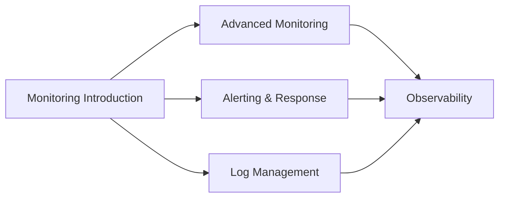

# Monitoring & Observability

Welcome to the Monitoring & Observability section! This section covers monitoring systems, alerting, logging, and observability practices for DevOps environments.

## Learning Objectives

By completing this section, you will:

- Design comprehensive monitoring strategies
- Implement alerting and incident response workflows
- Master log aggregation and analysis
- Understand distributed tracing and observability
- Create effective dashboards and metrics

## Section Contents

### [Monitoring Introduction](introduction.md)

Learn monitoring fundamentals, metrics collection, and observability principles.

## Prerequisites

- Completed Automation & CI/CD section
- Understanding of system administration
- Familiarity with containerized applications
- Basic knowledge of networking and protocols

## Learning Path

## Why This Matters

Monitoring and observability are essential for DevOps because:

- **Reliability**: Detect and resolve issues before they impact users
- **Performance**: Optimize system performance and resource utilization
- **Security**: Monitor for security threats and compliance violations
- **Business Intelligence**: Understand user behavior and system usage
- **Continuous Improvement**: Data-driven decisions for system optimization

With observability in place you can advance to resilience, governance, and platform concerns.
