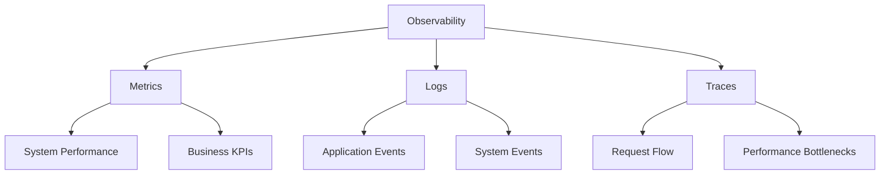
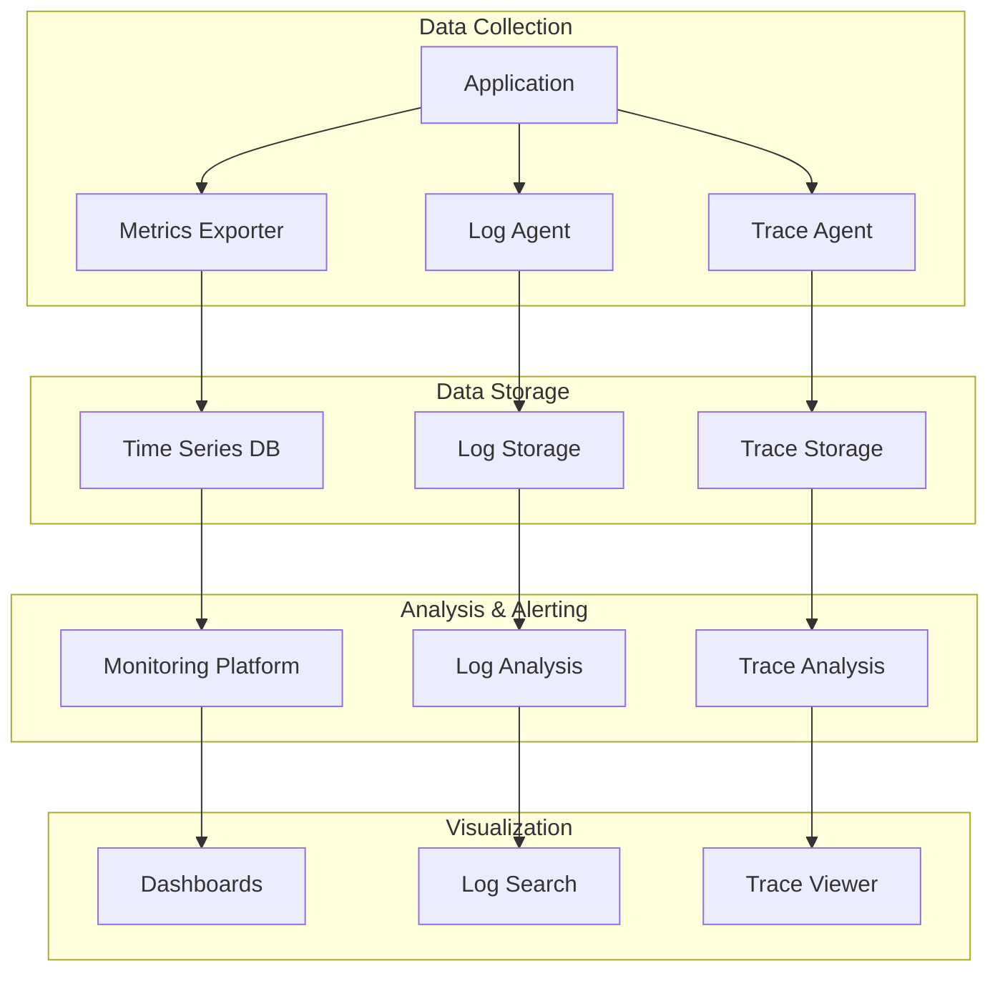

# Continuous Monitoring & Observability

Monitoring and observability are critical for maintaining reliable, performant systems. They provide insights into system behavior, help detect issues early, and enable data-driven decision making.

## Monitoring vs Observability

Understanding the distinction between monitoring and observability is crucial for building effective system visibility.

### Key Resources

- **[Observability vs. monitoring in DevOps | GitLab](https://about.gitlab.com/blog/2022/06/14/observability-vs-monitoring-in-devops/)**
  
  Clear explanation of the differences and complementary nature of monitoring and observability.

- **[DevOps measurement: Monitoring and observability | Google Cloud](https://cloud.google.com/architecture/devops/devops-measurement-monitoring-and-observability)**
  
  Google's comprehensive guide to implementing monitoring and observability in DevOps practices.

### Monitoring vs Observability Comparison

| Aspect | Monitoring | Observability |
|--------|------------|---------------|
| **Focus** | Known problems and metrics | Unknown problems and exploration |
| **Data** | Predefined metrics and alerts | Rich telemetry data (logs, metrics, traces) |
| **Approach** | Reactive ("Is the system working?") | Proactive ("Why is the system behaving this way?") |
| **Questions** | "What is broken?" | "Why is it broken?" |
| **Implementation** | Dashboards, alerts, thresholds | Distributed tracing, structured logging, metrics correlation |

## Continuous Monitoring in DevOps

Continuous monitoring integrates monitoring practices throughout the software development lifecycle.

### Continuous Monitoring Benefits

- **[What is Continuous Monitoring in DevOps? | BrowserStack](https://www.browserstack.com/guide/continuous-monitoring-in-devops)**
  
  Comprehensive guide covering continuous monitoring implementation and benefits.

- **[Monitoring Cheatsheet - Introduction to DevOps | Codecademy](https://www.codecademy.com/learn/introduction-to-dev-ops/modules/monitoring/cheatsheet)**
  
  Quick reference for monitoring concepts and tools.

### The Three Pillars of Observability



#### 1. Metrics
Quantitative measurements of system behavior over time.

**Types of Metrics:**
- **System Metrics**: CPU, memory, disk, network usage
- **Application Metrics**: Response times, error rates, throughput
- **Business Metrics**: User engagement, conversion rates, revenue
- **SLI/SLO Metrics**: Service level indicators and objectives

**Common Metric Patterns:**
```
# Counter - monotonically increasing value
http_requests_total{method="GET", status="200"} 1234

# Gauge - current value that can go up or down
cpu_usage_percent 75.2

# Histogram - distribution of values
http_request_duration_seconds_bucket{le="0.1"} 100
http_request_duration_seconds_bucket{le="0.5"} 250

# Summary - quantiles and totals
api_response_time{quantile="0.95"} 450
```

#### 2. Logs
Structured or unstructured records of events that occurred in the system.

**Log Levels:**
- **ERROR**: Error events that might still allow the application to continue
- **WARN**: Potentially harmful situations
- **INFO**: Informational messages highlighting application progress
- **DEBUG**: Fine-grained informational events for debugging
- **TRACE**: Very detailed information, typically only enabled in development

**Structured Logging Example:**
```json
{
  "timestamp": "2024-01-15T10:30:00Z",
  "level": "INFO",
  "service": "user-api",
  "trace_id": "abc123",
  "span_id": "def456",
  "message": "User login successful",
  "user_id": "user123",
  "ip_address": "192.168.1.100",
  "response_time_ms": 250
}
```

#### 3. Distributed Tracing
Tracks requests as they flow through distributed systems.

**Trace Components:**
- **Trace**: Complete journey of a request
- **Span**: Individual operation within a trace
- **Tags**: Key-value pairs for additional context
- **Baggage**: Cross-process context propagation

## Monitoring Implementation

### Monitoring Stack Architecture



### Popular Monitoring Tools

| Category | Tools | Use Case |
|----------|-------|----------|
| **Metrics** | Prometheus, DataDog, New Relic | System and application metrics |
| **Logs** | ELK Stack, Fluentd, Loki | Log aggregation and analysis |
| **Tracing** | Jaeger, Zipkin, AWS X-Ray | Distributed request tracing |
| **APM** | New Relic, AppDynamics, Dynatrace | Application performance monitoring |
| **Infrastructure** | Nagios, Zabbix, PRTG | Infrastructure monitoring |
| **Visualization** | Grafana, Kibana, Tableau | Data visualization and dashboards |

### Prometheus + Grafana Setup Example

```yaml
# docker-compose.yml for monitoring stack
version: '3.8'

services:
  prometheus:
    image: prom/prometheus:latest
    ports:
      - "9090:9090"
    volumes:
      - ./prometheus.yml:/etc/prometheus/prometheus.yml
    command:
      - '--config.file=/etc/prometheus/prometheus.yml'
      - '--storage.tsdb.path=/prometheus'
      - '--web.console.libraries=/etc/prometheus/console_libraries'
      - '--web.console.templates=/etc/prometheus/consoles'
      - '--web.enable-lifecycle'

  grafana:
    image: grafana/grafana:latest
    ports:
      - "3000:3000"
    environment:
      - GF_SECURITY_ADMIN_PASSWORD=admin
    volumes:
      - grafana-storage:/var/lib/grafana

  node-exporter:
    image: prom/node-exporter:latest
    ports:
      - "9100:9100"
    volumes:
      - /proc:/host/proc:ro
      - /sys:/host/sys:ro
      - /:/rootfs:ro
    command:
      - '--path.procfs=/host/proc'
      - '--path.rootfs=/rootfs'
      - '--path.sysfs=/host/sys'
      - '--collector.filesystem.mount-points-exclude=^/(sys|proc|dev|host|etc)($$|/)'

volumes:
  grafana-storage:
```

```yaml
# prometheus.yml configuration
global:
  scrape_interval: 15s
  evaluation_interval: 15s

rule_files:
  - "alert_rules.yml"

alerting:
  alertmanagers:
    - static_configs:
        - targets:
          - alertmanager:9093

scrape_configs:
  - job_name: 'prometheus'
    static_configs:
      - targets: ['localhost:9090']

  - job_name: 'node-exporter'
    static_configs:
      - targets: ['node-exporter:9100']

  - job_name: 'application'
    static_configs:
      - targets: ['app:8080']
    metrics_path: '/metrics'
    scrape_interval: 30s
```

## Alerting Strategy

### Alert Design Principles

!!! warning "Alerting Best Practices"
    - **Alert on symptoms, not causes**: Focus on user impact
    - **Reduce noise**: Too many alerts lead to alert fatigue
    - **Actionable alerts**: Every alert should require human action
    - **Clear severity levels**: Critical, warning, informational
    - **Proper escalation**: Define escalation paths and timing

### Alert Severity Levels

| Severity | Description | Response Time | Examples |
|----------|-------------|---------------|----------|
| **Critical** | Service down or severely degraded | Immediate (< 5 min) | Site down, data loss, security breach |
| **High** | Significant impact on users | 30 minutes | High error rates, slow response times |
| **Medium** | Potential issues developing | 4 hours | Resource utilization trending up |
| **Low** | Informational | Next business day | Capacity planning alerts |

### Sample Alert Rules (Prometheus)

```yaml
# alert_rules.yml
groups:
- name: system
  rules:
  - alert: HighCPUUsage
    expr: 100 - (avg by(instance) (rate(node_cpu_seconds_total{mode="idle"}[2m])) * 100) > 80
    for: 5m
    labels:
      severity: warning
    annotations:
      summary: "High CPU usage detected"
      description: "CPU usage is above 80% for more than 5 minutes on {{ $labels.instance }}"

  - alert: HighMemoryUsage
    expr: (node_memory_MemTotal_bytes - node_memory_MemAvailable_bytes) / node_memory_MemTotal_bytes * 100 > 90
    for: 3m
    labels:
      severity: critical
    annotations:
      summary: "High memory usage detected"
      description: "Memory usage is above 90% on {{ $labels.instance }}"

- name: application
  rules:
  - alert: HighErrorRate
    expr: rate(http_requests_total{status=~"5.."}[5m]) / rate(http_requests_total[5m]) * 100 > 5
    for: 2m
    labels:
      severity: critical
    annotations:
      summary: "High error rate detected"
      description: "Error rate is above 5% for the last 5 minutes"

  - alert: SlowResponseTime
    expr: histogram_quantile(0.95, rate(http_request_duration_seconds_bucket[5m])) > 1
    for: 5m
    labels:
      severity: warning
    annotations:
      summary: "Slow response time detected"
      description: "95th percentile response time is above 1 second"
```

## SLIs, SLOs, and SLAs

### Service Level Management

**Service Level Indicators (SLIs)**: Quantitative measures of service reliability
**Service Level Objectives (SLOs)**: Target values or ranges for SLIs
**Service Level Agreements (SLAs)**: Contractual agreements about service levels

### Common SLIs

| SLI Type | Measurement | Example |
|----------|-------------|----------|
| **Availability** | Uptime percentage | 99.9% uptime |
| **Latency** | Response time | 95% of requests < 200ms |
| **Throughput** | Requests per second | Handle 1000 RPS |
| **Error Rate** | Error percentage | < 0.1% error rate |
| **Durability** | Data retention | 99.999% data durability |

### Error Budget Calculation

```
Error Budget = 100% - SLO
Example: 99.9% SLO = 0.1% error budget

Monthly downtime allowance (30 days):
30 days × 24 hours × 60 minutes × 0.001 = 43.2 minutes
```

## Deployment Environments

Understanding different deployment environments is crucial for effective monitoring and deployment strategies.

### Environment Types

- **[Production Environment vs Development, Stage, and Production | DEV Community](https://dev.to/flippedcoding/difference-between-development-stage-and-production-d0p)**
  
  Clear explanation of different environment types and their purposes.

- **[Deployment Environment | Wikipedia](https://en.wikipedia.org/wiki/Deployment_environment)**
  
  Comprehensive overview of deployment environment concepts.

### Environment Comparison

| Environment | Purpose | Data | Monitoring Level |
|-------------|---------|------|------------------|
| **Development** | Feature development | Synthetic/minimal | Basic logging |
| **Testing/QA** | Quality assurance | Test datasets | Functional testing |
| **Staging** | Pre-production validation | Production-like data | Full monitoring |
| **Production** | Live user traffic | Real user data | Comprehensive monitoring |

### Environment-Specific Monitoring

```yaml
# Environment-based monitoring configuration
monitoring:
  development:
    metrics: basic
    alerts: none
    retention: 7 days
    
  staging:
    metrics: full
    alerts: team-only
    retention: 30 days
    
  production:
    metrics: comprehensive
    alerts: pager-duty
    retention: 1 year
    sla_monitoring: true
```

## Monitoring Best Practices

### Implementation Guidelines

!!! tip "Monitoring Best Practices"
    - **Start simple**: Begin with basic metrics, expand gradually
    - **Monitor what matters**: Focus on user-impacting metrics
    - **Automate everything**: Use infrastructure as code for monitoring
    - **Regular reviews**: Periodically review and update monitoring
    - **Documentation**: Document what you monitor and why
    - **Testing**: Test your monitoring and alerting systems

### Common Monitoring Pitfalls

!!! danger "Avoid These Mistakes"
    - **Over-monitoring**: Too many metrics without clear purpose
    - **Alert fatigue**: Too many non-actionable alerts
    - **Monitoring drift**: Outdated alerts and dashboards
    - **Single points of failure**: Monitoring system dependencies
    - **Ignoring trends**: Focus only on current values, not trends

## Next Steps

After implementing monitoring and observability:

- [Advanced Alerting Strategies](alerting-advanced.md)
- [Performance Optimization](performance-tuning.md)
- [Incident Response](incident-management.md)

!!! success "DevOps Integration"
    Effective monitoring and observability enable faster incident response, better system understanding, and data-driven improvements. They are essential for maintaining reliable, high-performance systems in production.
