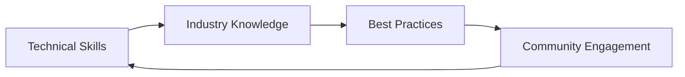

# Resources & References

Welcome to the Resources & References section! This section provides additional learning materials, tools, and references to support your DevOps journey.

## 🎯 Learning Objectives

By exploring this section, you will:

- ✅ Discover valuable learning resources and materials
- ✅ Find recommended books, courses, and tutorials
- ✅ Access useful tools and utilities
- ✅ Connect with the DevOps community
- ✅ Stay updated with industry trends and best practices

## 📚 Section Contents

### [Podcasts](podcast.md)

Discover DevOps podcasts for continuous learning and industry insights.

## 🏁 Additional Resources

- **Books**: Recommended reading list for DevOps professionals
- **Courses**: Online training and certification programs
- **Tools**: Essential DevOps tools and utilities
- **Communities**: DevOps communities and forums
- **Blogs**: Industry blogs and thought leaders

## 📈 Continuous Learning

## 💡 Why This Matters

Continuous learning is crucial for DevOps success because:

- **Technology Evolution**: DevOps tools and practices evolve rapidly
- **Industry Trends**: Stay current with emerging patterns and methodologies
- **Career Growth**: Expand your knowledge and advance your career
- **Problem Solving**: Learn from others' experiences and solutions
- **Innovation**: Discover new approaches and technologies

Keep learning and growing! 🚀