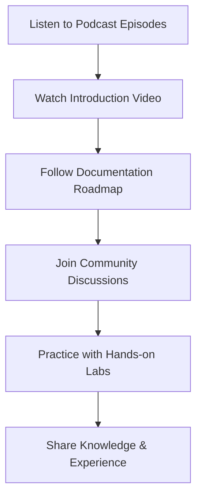

# DevOps on the Go Podcast Resources

Welcome to the DevOps on the Go podcast community! This Arabic podcast provides practical DevOps insights, tutorials, and industry discussions for Arabic-speaking professionals.

## 🎙️ Podcast Information

**DevOps on the Go** is an Arabic podcast focused on DevOps engineering, cloud technologies, and modern software development practices. The podcast aims to make DevOps concepts accessible to Arabic speakers and build a strong regional DevOps community.

### Podcast Host
**Mujahed Al Tahleh** - DevOps Engineer and Technology Enthusiast

## 📱 Listen on All Platforms

### Primary Platforms

| Platform | Link | Description |
|----------|------|-------------|
| **Anchor** | [DevOps on the Go](https://anchor.fm/devops-on-the-go/) | Main hosting platform with full episode archive |
| **Spotify** | [Listen on Spotify](https://open.spotify.com/show/24UfF6aMe0AyUIJeckaEf7) | Popular streaming platform |
| **Apple Podcasts** | [Listen on Apple](https://bit.ly/devops-apple) | iOS and macOS native podcast app |
| **Google Podcasts** | [Listen on Google](https://bit.ly/devops-google) | Android and web-based listening |

### Additional Platforms

- **[Spreaker & All Other Platforms](https://bit.ly/devops-spreaker)**
  
  Access the podcast on Spreaker and various other podcast platforms.

## 🌐 Community & Social Media

### Connect with the Community

| Platform | Link | Purpose |
|----------|------|----------|
| **Facebook Page** | [DevOps on the Go Page](https://bit.ly/devops-fb-page) | Latest updates, announcements, and content |
| **Facebook Group** | [DevOps Geeks](https://bit.ly/devops-geeks) | Community discussions and Q&A |
| **Instagram** | [Follow on Instagram](https://bit.ly/devops-insta) | Behind-the-scenes and quick tips |

## 🎧 All Podcast Episodes

### 📊 Episodes Summary

!!! info "Podcast Statistics"
    - **Total Episodes**: 10+ episodes across 3 seasons
    - **Language**: Arabic (العربية)
    - **Format**: Interview-style and solo discussions
    - **Topics**: DevOps, Cloud, Security, AI, SRE, Project Management

!!! tip "Quick Navigation"
    - **[Season 3 (2024)](#season-3-2024)**: Management, Monitoring, Latest trends
    - **[Season 2 (2024-2025)](#season-2-2024-2025)**: Advanced topics, SRE, DevSecOps, AI
    - **[Season 1 (2021-2022)](#season-1-original-series-2021-2022)**: Fundamentals and foundations

### Season 3 (2024)

#### Episode 1: كيف تقنع الإدارة بتبني DevOps وفوائده لفريقك؟
**Duration**: 1 hr 42 min | **Release Date**: August 11, 2024

في هذه الحلقة نناقش مع عصام الزيناتي أهم التحديات التي تواجه تبني الـ DevOps في المؤسسات، وكيفية إقناع أصحاب القرار بفوائده الحقيقية. نتحدث عن العوائق التي قد تعرقل نجاح التحول، وأهم خطوات صانع القرار قبل البدء، مع تسليط الضوء على دور إدارة التغيير وقياس الأداء باستخدام DORA Metrics لضمان استقرار الأعمال وتحقيق نتائج ملموسة.

**[🎙️ Listen on Spotify](https://open.spotify.com/episode/0egxMioMLNswr87dhAOzxd)**

#### Episode 2: الموسم الثالث- الحلقة-١ | من الخطأ إلى الحل في أقل من دقيقة: كيف تصمّم نظام مراقبة يُنقذك؟
**Duration**: 1 hr 21 min | **Release Date**: July 13, 2024

كيف تصمّم نظام مراقبة يُنقذك قبل أن يشعر العميل بوجود مشكلة؟ في هذه الحلقة الافتتاحية من الموسم الثالث، نستضيف المهندس أحمد جاد (Salesforce - AWS - Amazon) للغوص في عالم المراقبة (Monitoring) والرصد (Observability). ما الفرق بينهما؟ كيف تحدد مؤشرات الأداء؟ متى تطلق التنبيه؟ وما هي إشارات الخطر الأربعة التي يجب أن ترصدها دائمًا؟

**[🎙️ Listen on Spotify](https://open.spotify.com/episode/6V8SljjjGsUPYwOZ2YxT4v)**

### Season 2 (2024-2025)

#### Episode 4: ممارسات DevOps في إدارة المشاريع التقنية: ما علاقتها بال Agile؟
**Duration**: 1 hr 34 min | **Release Date**: February 4, 2024

ما العلاقة بين DevOps ومنهجية Agile؟ هل هما وجهان لعملة واحدة أم أن أحدهما يُكمل الآخر؟ في هذه الحلقة، نأخذك في رحلة مع عبد الوهاب الغامدي، مدير مشاريع تقنية مستقل، لاستكشاف كيف يمكن لممارسات DevOps أن تُحدث نقلة نوعية في إدارة المشاريع التقنية. نناقش إطار عمل CALMS وكيف يبني ثقافة نجاح مستدامة.

**[🎙️ Listen on Spotify](https://open.spotify.com/episode/6zvIt67S68sPwmkS5Jksdb)**

#### Episode 3: Site Reliability Engineer - هل هو الوجه الجديد لمهندس DevOps؟
**Duration**: 1 hr 46 min | **Release Date**: January 9, 2024

في هذه الحلقة، نرجع بالزمن لما قبل ظهور مفهوم DevOps ونحكي عن التحديات التي دفعت العالم التقني نحو ثورة DevOps. نستضيف المهندس أحمد الزعبي، Systems Engineer في AWS، وخبير في Site Reliability Engineering. نركز على تخصص SRE وكيف ظهر كاستجابة لتحديات جديدة، والفرق الحقيقي بينه وبين DevOps. نحكي عن إدارة الحوادث (Incident Management) وأهمية مفاهيم SLA, SLO، وSLI.

**[🎙️ Listen on Spotify](https://open.spotify.com/episode/6rB0TmuK9dVO6cpb97hBnB)**

#### Episode 2: DevSecOps: ضرورة أم ترف للمشاريع التقنية
**Duration**: 1 hr | **Release Date**: December 18, 2024

هل DevOps مسؤول عن الأمان أيضًا؟ في هذه الحلقة نستضيف المهندس زياد أبو لبن لنناقش الفرق بين فريق الأمان وعملية الأمان. نغطي كيف تُنفذ التهديدات السيبرانية الشائعة، أساسيات الأمان قبل نشر التطبيقات، وكيف يتفوق DevSecOps على الحلول التقليدية، مع خطوات عملية لتطبيق DevSecOps في بيئتك.

**[🎙️ Listen on Spotify](https://open.spotify.com/episode/40d2C1yJafTVL1p7mxrgyP)**

#### Episode 1: الذكاء الاصطناعي عامل مساعد أم أساسي للديف أوبس؟
**Duration**: 1 hr 11 min | **Release Date**: November 23, 2024

في هذه الحلقة التي نستهلها بإعلان التعاون مع "DevOps في السيارة"، استعرضنا أسئلة محورية تتعلق بمستقبل DevOps في ظل ثورة الذكاء الاصطناعي التوليدي. ناقشنا احتمالية انتهاء دور DevOps التقليدي، وما إذا كان الذكاء الاصطناعي سيحل محله أم سيساهم في تطويره. تطرقنا إلى تأثير الذكاء الاصطناعي على العمليات الحالية والممارسات المستقبلية.

**[🎙️ Listen on Spotify](https://open.spotify.com/episode/5KDpWJ3EN47hznZF6tcwyU)**

### Season 1 - Original Series (2021-2022)

#### Episode 5: بداية الطريق العملي
**Duration**: 28 min | **Release Date**: November 12, 2022

في هذه الحلقة نمهد الطريق لكل شخص محتار كيف يدخل عالم الديف أوبس ومش متأكد من وين يبدأ. حلقة عملية مليئة بالمراجع والروابط للمواضيع المذكورة.

**[🎙️ Listen on Spotify](https://open.spotify.com/episode/1D0mrwczuGnIY6HDPpQfAW)**

#### Episode 4: التطبيق العملي لمبادئ الديف أوبس
**Duration**: 30 min | **Release Date**: December 16, 2021

استمراراً لتثبيت المفاهيم النظرية والمبادئ الأساسية وربط الجانب النظري بالواقع العملي.

**[🎙️ Listen on Spotify](https://open.spotify.com/episode/7vDD9NLovdbWNYcvpAPoeb)**

#### Episode 3: الديف أوبس مش للمهندسين بس
**Duration**: 10 min | **Release Date**: October 12, 2021

هل صحيح أن الديف أوبس هو تخصص لمهندسي التقنية والتطوير فقط؟ في هذا اللقاء نوضح من هم الأشخاص الذين يحتاجون لتعلم الديف أوبس.

**[🎙️ Listen on Spotify](https://open.spotify.com/episode/5OdOubQPogf54q0ebYx3MK)**

#### Episode 2: مبادئ الديف أوبس وفلسفة الشعار
**Duration**: 32 min | **Release Date**: October 2, 2021

في هذه الحلقة نتناول مبادئ الديف أوبس وفلسفة الشعار حتى نتعمق أكثر بالمفاهيم المتعلقة بالمجال وسبب حاجتنا له.

**[🎙️ Listen on Spotify](https://open.spotify.com/episode/1cFcNOC5R0ekaxGjJznqYu)**

#### Episode 1: اللقاء الأول
**Duration**: 32 min | **Release Date**: September 14, 2021

الحلقة الافتتاحية للبودكاست. نتحدث عن التجربة الشخصية وكيف وصلت لأكون شخص ناجح في مجال الديف أوبس، والهدف هو تحفيز الشباب والمهتمين ليدخلوا في التخصص ونتشارك المعلومات والخبرات معاً.

**[🎙️ Listen on Spotify](https://open.spotify.com/episode/0cKWp6qKUaWOkm6VvGg1bM)**

## 📚 Featured Learning Path: Episode 5

This documentation roadmap is based on **Episode 5** of DevOps on the Go, which provides a comprehensive guide for beginners entering the DevOps field.

### Episode 5 Highlights

- Complete DevOps learning roadmap
- Practical resources and tutorials
- Step-by-step progression guide
- Industry best practices
- Real-world examples and case studies

**Listen to Episode 5**: [DevOps Roadmap Episode](https://anchor.fm/devops-on-the-go/episodes/05-------e1v1eh6)

## 🎯 What You'll Learn

### Core Topics Covered

- **DevOps Fundamentals**: Culture, practices, and principles
- **Cloud Technologies**: AWS, Azure, Google Cloud Platform
- **Containerization**: Docker, Kubernetes, and orchestration
- **CI/CD Pipelines**: Automation and deployment strategies
- **Infrastructure as Code**: Terraform, CloudFormation, Ansible
- **Monitoring & Observability**: Metrics, logging, and alerting
- **Security**: DevSecOps practices and tools

### Target Audience

- **Beginners**: New to DevOps and cloud technologies
- **Developers**: Looking to expand into DevOps practices
- **System Administrators**: Transitioning to modern DevOps
- **Students**: Learning cloud and automation technologies
- **Professionals**: Seeking Arabic content in DevOps

## 🚀 Getting Started

If you're new to DevOps, start with these resources:

### 1. Watch the Introduction Video

**[01 Introduction To DevOps | مقدمة للـ DevOps - By Mujahed Al Tahleh | Arabic](https://www.youtube.com/watch?v=451Ltd2bx28)**

This comprehensive introduction video covers:
- What is DevOps and why it matters
- DevOps culture and practices
- Career opportunities in DevOps
- Getting started with DevOps learning

### 2. Follow the Documentation Roadmap

Use this documentation as your learning guide:
1. [Internet and Web Fundamentals](../concepts/internet-basics.md)
2. [Linux Server Management](../linux/introduction.md)
3. [Containerization with Docker](../containers/introduction.md)
4. [Automation and CI/CD](../automation/introduction.md)
5. [Monitoring and Observability](../monitoring/introduction.md)

### 3. Join the Community

Connect with fellow learners in the Facebook group for:
- Q&A sessions
- Resource sharing
- Project collaboration
- Career advice
- Industry discussions

## 📖 Additional Learning Resources

### Recommended Learning Path

### Complementary Resources

- **Official Documentation**: Always refer to official tool documentation
- **Hands-on Labs**: Practice with cloud free tiers
- **Certification Paths**: AWS, Azure, Google Cloud certifications
- **Open Source Projects**: Contribute to DevOps tools and projects
- **Local Meetups**: Attend DevOps meetups in your area

## 🤝 Contributing to the Community

### Ways to Get Involved

1. **Share Your Experience**: Post about your DevOps journey
2. **Ask Questions**: Help others by asking thoughtful questions
3. **Provide Answers**: Share your knowledge with beginners
4. **Submit Feedback**: Suggest topics for future episodes
5. **Spread the Word**: Share podcast episodes and resources

### Content Suggestions

Help shape future content by suggesting:
- Tool tutorials and comparisons
- Real-world case studies
- Career guidance and tips
- Technical deep-dives
- Industry trend discussions

## 📞 Contact Information

For podcast suggestions, collaboration opportunities, or technical questions:

- **Host**: Mujahed Al Tahleh
- **Primary Platform**: [Anchor](https://anchor.fm/devops-on-the-go/)
- **Community**: [Facebook Group](https://bit.ly/devops-geeks)
- **Social Media**: [Instagram](https://bit.ly/devops-insta)

## 🎉 Thank You!

Thank you for being part of the DevOps on the Go community. Your engagement and enthusiasm drive us to create better content and build a stronger Arabic-speaking DevOps community.

!!! tip "Stay Updated"
    Follow the podcast on your preferred platform and join our social media channels to never miss new episodes and community updates!

!!! success "Join the Movement"
    DevOps is more than technology - it's about culture, collaboration, and continuous improvement. Join us in building a vibrant Arabic DevOps community!
