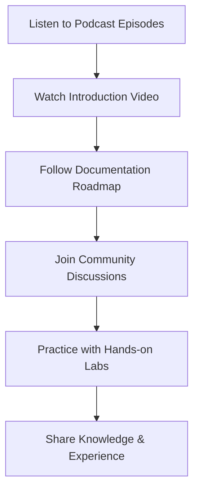

# DevOps on the Go Podcast Resources

Welcome to the DevOps on the Go podcast community! This Arabic podcast provides practical DevOps insights, tutorials, and industry discussions for Arabic-speaking professionals.

## 🎙️ Podcast Information

**DevOps on the Go** is an Arabic podcast focused on DevOps engineering, cloud technologies, and modern software development practices. The podcast aims to make DevOps concepts accessible to Arabic speakers and build a strong regional DevOps community.

### Podcast Host
**Mujahed Al Tahleh** - DevOps Engineer and Technology Enthusiast

## 📱 Listen on All Platforms

### Primary Platforms

| Platform | Link | Description |
|----------|------|-------------|
| **Anchor** | [DevOps on the Go](https://anchor.fm/devops-on-the-go/) | Main hosting platform with full episode archive |
| **Spotify** | [Listen on Spotify](https://bit.ly/devops-spotify) | Popular streaming platform |
| **Apple Podcasts** | [Listen on Apple](https://bit.ly/devops-apple) | iOS and macOS native podcast app |
| **Google Podcasts** | [Listen on Google](https://bit.ly/devops-google) | Android and web-based listening |

### Additional Platforms

- **[Spreaker & All Other Platforms](https://bit.ly/devops-spreaker)**
  
  Access the podcast on Spreaker and various other podcast platforms.

## 🌐 Community & Social Media

### Connect with the Community

| Platform | Link | Purpose |
|----------|------|----------|
| **Facebook Page** | [DevOps on the Go Page](https://bit.ly/devops-fb-page) | Latest updates, announcements, and content |
| **Facebook Group** | [DevOps Geeks](https://bit.ly/devops-geeks) | Community discussions and Q&A |
| **Instagram** | [Follow on Instagram](https://bit.ly/devops-insta) | Behind-the-scenes and quick tips |

## 📚 Featured Episode: Episode 5

This documentation roadmap is based on **Episode 5** of DevOps on the Go, which provides a comprehensive guide for beginners entering the DevOps field.

### Episode 5 Highlights

- Complete DevOps learning roadmap
- Practical resources and tutorials
- Step-by-step progression guide
- Industry best practices
- Real-world examples and case studies

**Listen to Episode 5**: [DevOps Roadmap Episode](https://anchor.fm/devops-on-the-go/episodes/05-------e1v1eh6)

## 🎯 What You'll Learn

### Core Topics Covered

- **DevOps Fundamentals**: Culture, practices, and principles
- **Cloud Technologies**: AWS, Azure, Google Cloud Platform
- **Containerization**: Docker, Kubernetes, and orchestration
- **CI/CD Pipelines**: Automation and deployment strategies
- **Infrastructure as Code**: Terraform, CloudFormation, Ansible
- **Monitoring & Observability**: Metrics, logging, and alerting
- **Security**: DevSecOps practices and tools

### Target Audience

- **Beginners**: New to DevOps and cloud technologies
- **Developers**: Looking to expand into DevOps practices
- **System Administrators**: Transitioning to modern DevOps
- **Students**: Learning cloud and automation technologies
- **Professionals**: Seeking Arabic content in DevOps

## 🚀 Getting Started

If you're new to DevOps, start with these resources:

### 1. Watch the Introduction Video

**[01 Introduction To DevOps | مقدمة للـ DevOps - By Mujahed Al Tahleh | Arabic](https://www.youtube.com/watch?v=451Ltd2bx28)**

This comprehensive introduction video covers:
- What is DevOps and why it matters
- DevOps culture and practices
- Career opportunities in DevOps
- Getting started with DevOps learning

### 2. Follow the Documentation Roadmap

Use this documentation as your learning guide:
1. [Internet and Web Fundamentals](../concepts/internet-basics.md)
2. [Linux Server Management](../linux/introduction.md)
3. [Containerization with Docker](../containers/introduction.md)
4. [Automation and CI/CD](../automation/introduction.md)
5. [Monitoring and Observability](../monitoring/introduction.md)

### 3. Join the Community

Connect with fellow learners in the Facebook group for:
- Q&A sessions
- Resource sharing
- Project collaboration
- Career advice
- Industry discussions

## 📖 Additional Learning Resources

### Recommended Learning Path

### Complementary Resources

- **Official Documentation**: Always refer to official tool documentation
- **Hands-on Labs**: Practice with cloud free tiers
- **Certification Paths**: AWS, Azure, Google Cloud certifications
- **Open Source Projects**: Contribute to DevOps tools and projects
- **Local Meetups**: Attend DevOps meetups in your area

## 🤝 Contributing to the Community

### Ways to Get Involved

1. **Share Your Experience**: Post about your DevOps journey
2. **Ask Questions**: Help others by asking thoughtful questions
3. **Provide Answers**: Share your knowledge with beginners
4. **Submit Feedback**: Suggest topics for future episodes
5. **Spread the Word**: Share podcast episodes and resources

### Content Suggestions

Help shape future content by suggesting:
- Tool tutorials and comparisons
- Real-world case studies
- Career guidance and tips
- Technical deep-dives
- Industry trend discussions

## 📞 Contact Information

For podcast suggestions, collaboration opportunities, or technical questions:

- **Host**: Mujahed Al Tahleh
- **Primary Platform**: [Anchor](https://anchor.fm/devops-on-the-go/)
- **Community**: [Facebook Group](https://bit.ly/devops-geeks)
- **Social Media**: [Instagram](https://bit.ly/devops-insta)

## 🎉 Thank You!

Thank you for being part of the DevOps on the Go community. Your engagement and enthusiasm drive us to create better content and build a stronger Arabic-speaking DevOps community.

!!! tip "Stay Updated"
    Follow the podcast on your preferred platform and join our social media channels to never miss new episodes and community updates!

!!! success "Join the Movement"
    DevOps is more than technology - it's about culture, collaboration, and continuous improvement. Join us in building a vibrant Arabic DevOps community!
